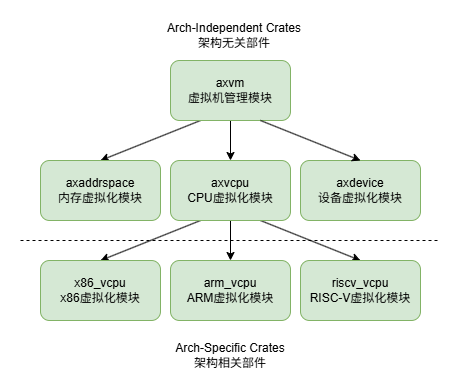

# [AxVM](https://github.com/arceos-hypervisor/axvm)

## 概览

`axvm` crate是AxVisor中为每个虚拟机实例提供资源管理的功能。由AxVisor管理的每个虚拟机实例都会对应一个由`axvm` crate提供的`AxVM`数据结构，并在其中维护该属于虚拟机实例的系统资源。它为虚拟机提供虚拟CPU核心(vCPU)管理，内存虚拟化以及I/O设备仿真,并以统一的框架支持多种架构。

## 设计目标

VMM对物理资源的虚拟可以归结为三个主要任务:处理器虚拟化、内存虚拟化和I/O虚拟化。因此每个`axvm`虚拟机实例都需要对这三方面的资源虚拟化提供支持。

## 总体架构
`axvm`的通过调用 `axvcpu`，`axaddrspace`, 和`axdevice` crate分别实现了上文提到的三个目标。并负责这些资源的初始化和管理。

- `axvcpu` 提供架构无关的vCPU抽象，为上层调度虚拟机实例共享物理资源提供支持。
- `axaddrspace` 通过为虚拟机实例提供物理内存的抽象，实现在不同虚拟机实例之间的内存隔离。
- `axdevice` 则虚拟化的I/O设备接口，让虚拟机可以访问网卡/硬盘等物理硬件设备。





## 实现细节
在本小节中，我们将介绍`axvm`具体的实现细节。首先我们在这里给出`AxVM`的定义，通过观察`AxVM`这个核心数据结构。我们可以对`axvm`的结构有一个整体的认识。

从代码中我们可以看到, `AxVM`数据结构中除了一些表示虚拟机运行状态和保存配置的字段外。主要对应上文中提到的三个模块。`vcpu_list`保存了虚拟机实例的vCPU列表，`devices`保存了虚拟机实例中可以访问到的设备列表，`address_space`保存了虚拟机实例的地址空间，负责虚拟机内存到物理内存的映射。

```rust
/// A Virtual Machine.
pub struct AxVM<H: AxVMHal, U: AxVCpuHal> {
    running: AtomicBool,
    shutting_down: AtomicBool,
    inner_const: AxVMInnerConst<U>,
    inner_mut: AxVMInnerMut<H>,
}

struct AxVMInnerConst<U: AxVCpuHal> {
    id: usize,
    config: AxVMConfig,
    vcpu_list: Box<[AxVCpuRef<U>]>, //虚拟机实例中的vCPU列表
    devices: AxVmDevices, //虚拟机实例中的设备
}

struct AxVMInnerMut<H: AxVMHal> {
    address_space: Mutex<AddrSpace<H::PagingHandler>>, // 虚拟机实例的地址空间
    _marker: core::marker::PhantomData<H>,
}
```

### 虚拟机初始化

`AxVM`数据结构提供了`new(config)`方法进行虚拟机实例的创建和初始化。该方法接受一个配置文件对象，并根据其创建对应的虚拟机实例。下面的是省略了大部分细节的`new()`方法实现。

在初始化过程中，`axvm`会跟据配置文件初始化虚拟机实例的vCPU列表，然后为虚拟机实例配置地址空间（页表）并创建虚拟设备。在流程的最后`axvm`会将vCPU的执行入口设置为操作系统的起始代码,这样当创建出的虚拟机实例被调度时会开始运行Guest操作系统.

以下是`new()`函数的简化版实现，对应了上文中描述的操作。具体代码可以参考`axvm/src/vm.rs`

```rust
pub fn new(config: AxVMConfig) -> AxResult<AxVMRef<H, U>> {
        let result = Arc::new({
            let vcpu_id_pcpu_sets = config.get_vcpu_affinities_pcpu_ids();

            // 初始化vCPU列表并设置根据配置文件设置与物理CPU核心的亲和性
            let mut vcpu_list = Vec::with_capacity(vcpu_id_pcpu_sets.len());

            for (vcpu_id, phys_cpu_set, _pcpu_id) in vcpu_id_pcpu_sets {...}

            // 配置地址空间和页表
            let mut address_space =
                AddrSpace::new_empty(GuestPhysAddr::from(VM_ASPACE_BASE), VM_ASPACE_SIZE)?;
            for mem_region in config.memory_regions() {...}

            // 配置虚拟设备
            // 配置Pass Through 虚拟设备
            for pt_device in config.pass_through_devices() {...}
            // 配置模拟设备
            let devices = axdevice::AxVmDevices::new(AxVmDeviceConfig {
                emu_configs: config.emu_devices().to_vec(),
            });


            // 返回出初始化完成的AxVM数据结构
            Self {
                running: AtomicBool::new(false),
                shutting_down: AtomicBool::new(false),
                inner_const: AxVMInnerConst {
                    id: config.id(),
                    config,
                    vcpu_list: vcpu_list.into_boxed_slice(),
                    devices,
                },
                inner_mut: AxVMInnerMut {
                    address_space: Mutex::new(address_space),
                    _marker: core::marker::PhantomData,
                },
            }
        });

        // 根据配置文件设置vCPU的执行入口
        for vcpu in result.vcpu_list() {
            let entry = if vcpu.id() == 0 {
                result.inner_const.config.bsp_entry()
            } else {
                result.inner_const.config.ap_entry()
            };
            vcpu.setup(
                entry,
                result.ept_root(),
                <AxArchVCpuImpl<U> as AxArchVCpu>::SetupConfig::default(),
            )?;
        }
        Ok(result)
    }
```


### 虚拟机的运行 

`axvm`提供的另一个重要接口为`vm.run_vcpu(vcpu_id)`。AxVisor的VMM通过对对应的vCPU执行`run_vcpu()`实现对虚拟机实例的调度。该函数被调用时，被调度vCPU会首先通过`vcpu.bind()`被绑定到对应的物理CPU核心，将vCPU的寄存器，定时器等状态同步到物理CPU核心中。

绑定完成后，`axvm`会通过`vcpu.run()`让物理CPU核心开始运行对应虚拟机实例的代码。在运行过程中，`axvm`会通过循环捕获虚拟机实例抛出的异常，为虚拟机实例提供运行时支持。对于在虚拟机实例内部就可以处理的异常比如Page Faule，由`axvm`直接处理后并恢复vCPU的执行。而对于单实例无法处理的异常，例如来自设备的外部中断，`axvm`会将异常传递给AxVisor最外层的VMM进行统一处理。

当虚拟机实例关机或需要暂时退出时， `axvm`会调用`vcpu.unbind()`将vCPU和物理CPU核心解绑，并恢复原有的物理CPU上下文。将控制权交还给`AxVisor`。

注意，`axvm`中的`run_vcpu`与`axvisor` crate中的`vcpu_run`是不同的函数。`axvisor`的`vcpu_run`函数是AxVisor调度的基本单元，并会在其内部调用`axvm`提供的的`run_vcpu`函数。

下面是`vcpu_run()`的简化版实现，具体代码可以参考`axvm/src/vm.rs`。

```rust
pub fn run_vcpu(&self, vcpu_id: usize) -> AxResult<AxVCpuExitReason> {
        let vcpu = self.vcpu(vcpu_id)

        // 绑定vCPU到物理CPU核心
        vcpu.bind()?;


        // 循环捕获运行时异常
        let exit_reason = loop {
            let exit_reason = vcpu.run()?; //开始执行被调度的vCPU
            let handled = match &exit_reason {
                AxVCpuExitReason::MmioWrite { addr, width, data } => {
                    self.get_devices()
                        .handle_mmio_write(*addr, (*width).into(), *data as usize);
                    true
                }
                AxVCpuExitReason::IoRead { port: _, width: _ } => true,
               ...
                _ => false,
            };
            // 对于无法在实例内部处理的异常传递给外部AxVisor处理
            if !handled {
                break exit_reason;
            }
        };
        // 虚拟机实例退出后解绑vCPU
        vcpu.unbind()?;
        Ok(exit_reason)
    }
```

### 虚拟机的退出

`axvm`虚拟机实例的退出通过异常机制完成。虚拟机实例退出时会抛出`AxVCpuExitReason::SystemDown`，这个异常会被传递到AxVisor中由其处理。接受到该异常后，AxVisor会调用`axvm`的`shundown()`函数将对应虚拟机实例标记为退出。

另外`axvm`目前并不支持二次初始化。这代表着一旦任意虚拟机实例退出后将无法重新启动。`axvm`对于二次初始化的支持会在未来完成。