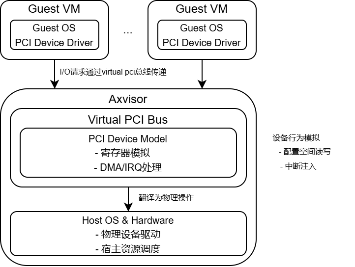

# PCI

PCI（外设组件互连）是一种广泛使用的设备总线标准，用于连接计算机的外设（如网卡、显卡等）与系统通信。CPU可以通过load/store指令来访问PCI设备，PCI设备有如下三种不同内存：

- MMIO
- PCI IO space
- PCI configuration space

配置一个PCI设备通常需要对其BAR（Base Address Register）进行配置并启用设备，遍历每个BAR，检查BAR的内存类型并分配地址，`root.bar_info(bdf, bar)`调用返回一个关于指定设备和BAR的详细信息。从分配器申请地址，根据BAR类型（32位或64位）调用`set_bar_32` 或 `set_bar_64`。

```rust
let info = root.bar_info(bdf, bar).unwrap(); // 获取BAR元数据
if let BarInfo::Memory { address_type, address, size, .. } = info {
    if size > 0 && address == 0 { // 需要分配的未初始化BAR
        let new_addr = allocator
            .as_mut()
            .expect("No memory ranges available for PCI BARs!")
            .alloc(size as _)
            .ok_or(DevError::NoMemory)?;

        if address_type == MemoryBarType::Width32 {
            root.set_bar_32(bdf, bar, new_addr as _);
        } else if address_type == MemoryBarType::Width64 {
            root.set_bar_64(bdf, bar, new_addr);
        }
    }
}
```

检查当前BAR是否占用两个条目，若当前BAR是64位类型，则需递增`bar`两次，跳过下一个索引。

```rust
bar += 1;
if info.takes_two_entries() {
    bar += 1;
}
```

启用设备的IO/内存访问及总线主控

```rust
let (_status, cmd) = root.get_status_command(bdf);
  root.set_command(
    bdf,
    cmd | Command::IO_SPACE | Command::MEMORY_SPACE | Command::BUS_MASTER,
  );
```

**命令寄存器设置**：

- **IO_SPACE**: 允许设备响应IO端口访问。
- **MEMORY_SPACE**: 允许设备响应内存映射访问。
- **BUS_MASTER**: 启用设备作为总线主设备。

# Emulated PCI

设备的虚拟化是通过模拟（Emulation）和直通（Passthrough）技术来实现的。

Emulated PCI正是通过软件模拟PCI设备实现的，这些虚拟设备与真实的硬件PCI设备类似，但并非直接依赖Hardware Devices的支持，而是通过Hypervisor层来模拟和管理，用于在虚拟化环境中为VM提供对物理PCI设备的访问能力。

<div align="center">

</div>

###  **Guest VM层**

- 虚拟PCI设备驱动，Guest VM认为存在真实PCI设备，通过标准PCI驱动发起I/O请求。

### Hypervisor层

- **虚拟PCI总线（Virtual PCI Bus）**
  - 模拟PCI总线拓扑结构，管理虚拟设备的配置空间。
  - 实现PCI枚举过程，向Guest OS暴露虚拟设备列表。
- **PCI设备模型（Device Model）**
  - **寄存器模拟**：对设备寄存器的读写操作进行拦截和模拟。
  - **DMA模拟**：通过虚拟地址转换（GPA→HPA）处理Guest发起的DMA操作。
  - **中断模拟**：将虚拟设备中断映射为虚拟中断。

###  Host OS & Hardware层

- 物理资源交互，对于纯软件模拟设备，由Host用户态程序处理I/O请求。

## 核心机制

- **配置空间模拟**

  PCI设备通过配置空间定义其资源需求（如I/O端口、内存映射地址等），虚拟化时，Axvisor模拟PCI总线的拓扑关系和设备的配置空间，例如，虚拟设备的BAR（基址寄存器） 由Axvisor动态分配，客户机操作系统通过写入BAR来请求资源，Axvisor则映射到宿主机物理地址或虚拟资源。

- **设备发现与枚举**

  GuestOS启动时，会像物理机一样枚举PCI总线以发现设备。Axvisor模拟BIOS/UEFI固件的行为，向GuestOS呈现虚拟PCI总线及挂接的设备。

- **I/O访问与中断处理**

  GuestOS对虚拟设备的I/O端口（PMIO）或内存映射（MMIO）访问会被VMM截获。中断则通过虚拟APIC或注入虚拟中断信号通知GuestOS。