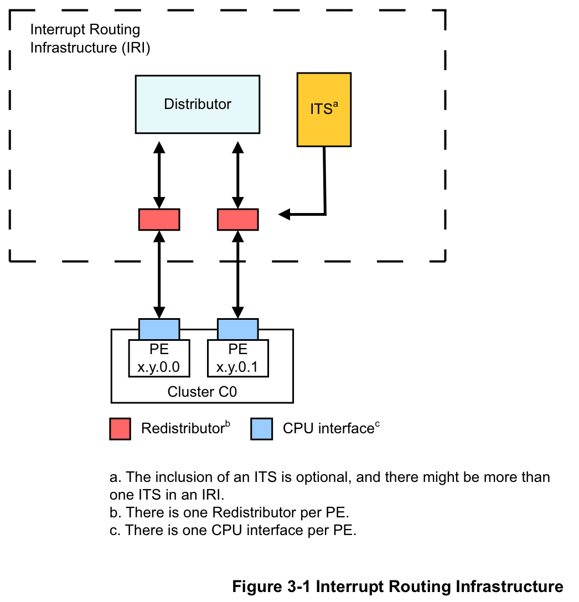
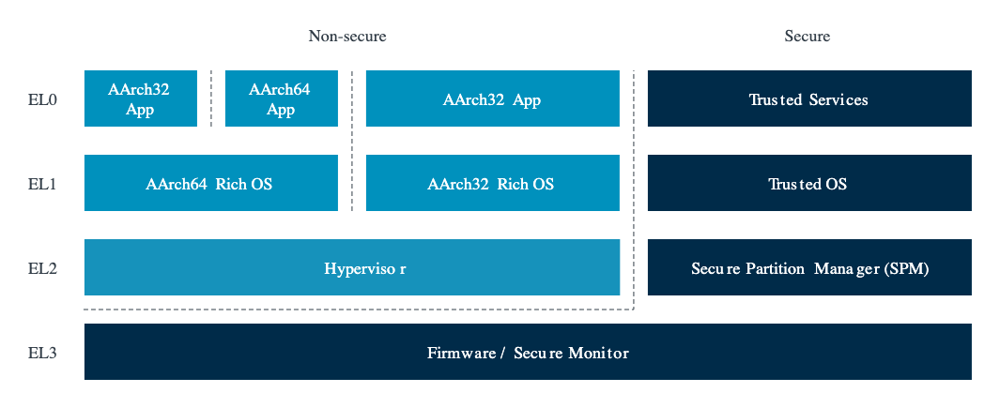
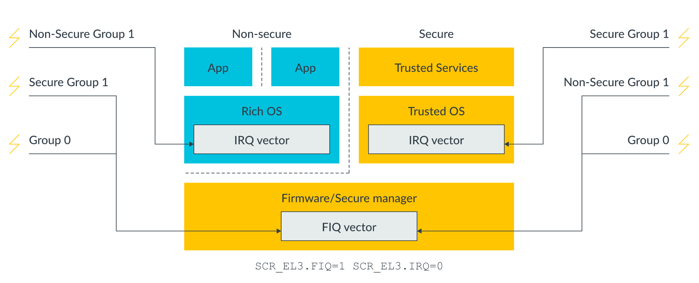
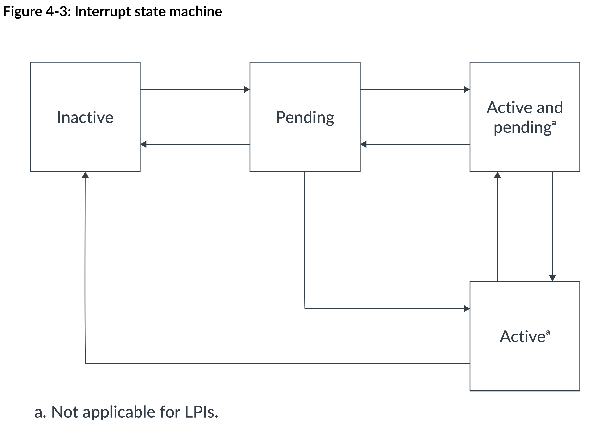
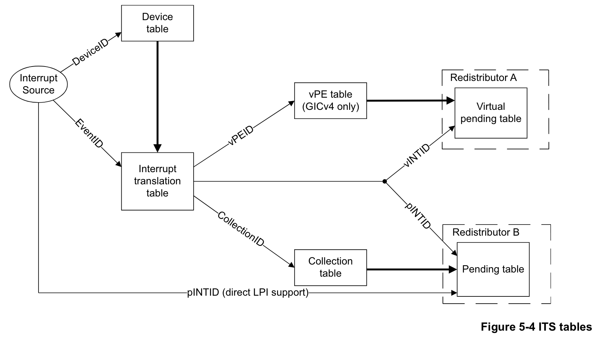
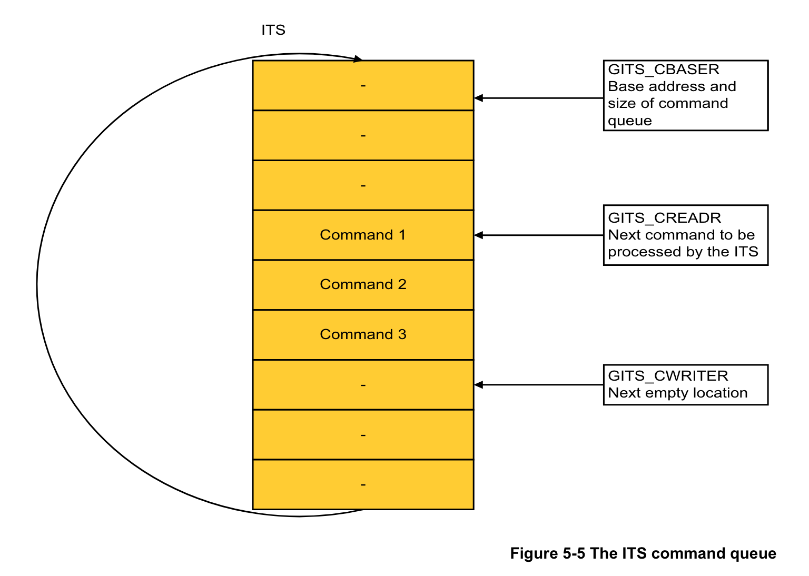

# GICv3 基础知识与基于 GIC 部分直通的虚拟化中断支持

## 0. 前言与基本概念

### 0.0. 前言

GIC（Generic Interrupt Controller）是 ARM 架构中的中断控制器，负责处理中断管理、控制和分发等等。GIC 目前有四个版本，从 GICv1 到 GICv4，GICv3 是目前较为常用的版本。

### 0.1. GIC 的简介和构成



在逻辑上，GICv3 由以下几个主要组件构成：

- Distributor（GICD）：全局共享一个的中断控制器，使用 MMIO 访问，负责处理设备中断（SPI）的分发和管理。GICD 维护着每一个设备中断的优先级、目标 PE 等等信息，并将中断分发给各个 GICR。
- Redistributor（GICR）：每个 Cpu 核心（用术语来说是 PE，Processing Element）自身的中断控制器，负责处理从 GICD/ITS 分发来的中断、核间中断（SGI）以及 PE 私有的设备中断（PPI）。

  GICR 是 MMIO 访问的设备，需要注意每个 PE 的 GICR 是有自己独立的 MMIO 地址范围的。

- Cpu Interface：每个 PE 内部的一套系统寄存器（CSR），命名为 `ICC_*`，使用 `MSR/MRS` 指令访问。用于处理中断的 ACK、EOI 等高频操作。

  GICv3 的 GICR 和 Cpu Interface 共同取代了 GICv2 中的 Cpu Interface（GICC）。GICv3 有可能出于向前兼容的目的保留 GICC 的访问接口，但程序应该尽量使用 GICv3 的标准接口。相比于使用 MMIO 的 GICC，使用 CSR 的新 Cpu Interface 在性能上有着优势。

- Interrupt Translation Service（ITS）：接收基于消息的中断（Message-Signaled Interrupts, MSI），根据其设备 ID 和事件 ID 将 MSI 转换为另一种类型的设备中断（LPI），并将其分发给 GICR。
  
  ITS 是 GICv3 新增的组件，在 GICv2 中并不存在。一个系统中可能存在多个 ITS，每个 ITS 负责处理不同的设备中断。系统中也可能不存在 ITS，在这种情况下，LPI 将直接从设备发送到 GICR。

### 0.2. 中断的分类

GICv3 将中断分为 4 个主要的类别，每个类别的中断有不同的路径，并且有不同的中断号范围：

| 中断类别 | 说明                                                                                    | 中断号范围                         | 路径                        |
| -------- | --------------------------------------------------------------------------------------- | ---------------------------------- | --------------------------- |
| SGI      | Software Generated Interrupts；软件生成的核间中断                                       | 0 – 15                             | 从发送者 GICR 到接收者 GICR |
| PPI      | Private Peripheral Interrupts；PE 私有外设产生的中断，主要是时钟等                      | 16 – 31（扩展使用 1056 – 1119）    | 从设备到 GICR               |
| SPI      | Shared Peripheral Interrupts；一般是普通非 PCIe 设备产生的中断                          | 32 – 1019 （扩展使用 4096 – 5119） | 从设备到 GICD 再到目标 GICR |
| LPI      | Locality-specific Peripheral Interrupts；来自基于消息的中断，主要是 PCIe 设备产生的中断 | 8191 –                             | 从设备到 ITS 再到目标 GICR  |

无论哪种类型的中断，最终都会被分发到 GICR 中进行处理。Cpu 响应这些中断的流程也是基本一致的。

### 0.3. Affinity

GICv3 相比于 GICv2 的另一项重要改进是引入了 Affinity 的概念。Affinity 是 PE 的一个唯一标识符，由 4 个 8 位整数组成，格式为 `<Aff3>.<Aff2>.<Aff1>.<Aff0>`。较小的系统可能使用 `0.0.0.x` 或者 `0.0.x.0` 的编号，而较大的系统可能使用更加复杂的编号，例如 `0.0.{0-3}.{0-3}` 甚至是 `0.{1,3,5,7}.{0-3}.{0-3}`。不要假定 Affinity 的每一节都是连续的，也不要假定 Affinity 的每一节的含义和范围，这完全取决于芯片内部的设计。虽然相近的编号通常意味着 PE 位于同一个簇内，但具体的核心布局仍然需要参考芯片手册或者设备树中的信息。

相比于只支持 8 个目标 ID 的 GICv2，GICv3 支持的 PE 数量大大增加，也允许更加灵活地配置中断的目标。

### 0.4. 中断分组、安全状态与 FIQ

中断分组、安全状态和 FIQ 是 GICv3 中相互交织的几个概念。虽然在实际使用中可以忽视，但是了解这些概念有助于更好地理解 GICv3 的设计，也能避免很多错误。

安全状态（Security State）是 Aarch64 中引入的一个概念，是对异常等级（Exception Level, EL）的一种横向扩展，允许在同一 EL 中区分安全和非安全的状态。一般来说，实现了安全状态的 ARM 处理器会提供至少两个安全状态：Secure 和 Non-secure。Secure 状态下的代码可以访问 Secure 和 Non-secure 的地址空间，而 Non-secure 状态下的代码只能访问 Non-secure 的地址空间。EL0 到 EL2 都分为 Secure 和 Non-secure 两个状态，而 EL3 只存在 Secure 状态。



对于 GICv3 来说，安全状态的概念主要体现在中断的分组上。在支持并开启了安全状态的系统中，GICv3 中的中断可以分为三个组别：

- Group 0：应该在 EL3 处理的中断。
- Group 1 Secure：应该在 Secure EL2 或 Secure EL1 处理的中断。
- Group 1 Non-secure：应该在 Non-secure EL2 或 Non-secure EL1 处理的中断。

每一个中断都可以被配置为这 3 个组别中的一个（除了 LPI，LPI 只能是 Group 1 Non-secure）。每一个组别在 Cpu Interface 中都有单独的一套 CSR（少数公用除外）。中断的组别决定了中断的处理路径，也决定了中断以 IRQ 的方式还是以 FIQ 的方式处理。

FIQ（Fast Interrupt Request）原本是 ARM 处理器中的一个特殊的中断类型，具有更高的优先级和更快的响应时间，在物理上拥有独立于 IRQ 的信号线。在 Aarch64 中，FIQ 和 IRQ 已经没有本质上的区别，但仍然保留了独立的物理通路和单独的控制位，在异常向量表中也有单独的 FIQ 项。GICv3 利用 FIQ 和 IRQ 的区别来区分中断的安全状态。具体来说：

- 当运行在 Secure EL3 时，Group 0/1S/1NS 的中断会以 FIQ 的方式通知。
- 当运行在 Non-secure EL2/EL1/EL0 时，Group 1NS 的中断会以 IRQ 的方式通知，而 Group 0/1S 的中断会以 FIQ 的方式通知。
- 当运行在 Secure EL2/EL1/EL0 时，Group 1S 的中断会以 IRQ 的方式通知，而 Group 0/1NS 的中断会以 FIQ 的方式通知。

也就是说，如果一个中断是应该在当前安全状态和异常等级处理的中断，那么它会以 IRQ 的方式通知；如果是应该在其他安全状态或者 EL3 处理的中断，那么它会以 FIQ 的方式通知。这样的好处是，通过配置 `SCR_EL3` 系统寄存器，可以让 FIQ 进入 EL3 处理，而 IRQ 则进入 EL2/EL1 处理，这样可以实现 Secure/Non-secure 中断分离，同时不产生额外的异常等级切换。



对于不支持安全状态（换而言之，只有一个安全状态）的系统，或者关闭了 GICv3 的安全状态支持（通过设置 `GICD_CTLR` 寄存器的 `DS` 位）的系统，GICv3 仍然可以正常工作。此时只剩下 2 个组别：Group 0 和 Group 1，并且它们的区别不再具有安全的意义，而是纯粹的分类。Group 0 的中断会以 FIQ 的方式通知，而 Group 1 的中断会以 IRQ 的方式通知。

习惯上，不需要支持安全状态的系统应该将所有中断都配置为 Group 1。因为 FIQ 有可能被 EL3 保留自己使用（类似于 GICv2 中的情况），而 Group 1 的中断以 IRQ 的方式通知，可以正确地进入 EL2/EL1 处理。

### 0.5. 中断的状态流转



在 ARM 架构中，一个中断有 4 个可能的状态：

| 状态               | 描述                                             |
| ------------------ | ------------------------------------------------ |
| Inactive           | 中断未被触发，或者已经被处理完毕。               |
| Pending            | 中断被触发，但还没有 PE 处理。                   |
| Active             | 中断正在被 PE 处理。                             |
| Active and Pending | 中断正在被 PE 处理，另一个同样的中断已经被触发。 |

LPI 只有 Pending 和 Inactive 两个状态，Active 和 Active and Pending 状态不适用于 LPI。

## 1. GICv3 的中断配置和处理流程

要正确实现 GICv3 的虚拟化，首先必然要了解 GICv3 的中断配置和处理流程。这一章将简略介绍操作系统启动时应该如何初始化 GICv3，如何配置中断，以及如何处理各种类型的中断。为了简便，这里以不启用安全状态支持的系统为例。

### 1.0. 寻找当前 PE 的 GICR

在 GICv3 中，每个 PE 都有自己的 GICR，并且每个 GICR 都有自己独立的 MMIO 地址范围。因此，在访问当前核心的 GICR 之前，必须要找到当前 PE 的 GICR 地址。具体的做法是，每个 PE 都需要枚举系统中的每个 GICR，判断 `GICR_TYPER` 寄存器中记录的 Affinity 是否和当前 PE 通过读取 `MPIDR_EL1` 系统寄存器得到的 Affinity 相同，如果相同，则可以确定该 GICR 是当前 PE 的 GICR。

每个 GICR 占用连续的 128KiB 地址空间（0x20000）；不同 PE 的 GICR 地址范围可能是一个或者多个连续的块；连续的两个 GICR 的基址差值可能等于 0x20000，也可能大于 0x20000从而产生空洞（例如为了兼容 GICv4 的 256KiB GICR 大小而选择 0x40000）。DTB 中的 `gicv3` 节点会记录每块连续 GICR 地址范围的起始地址和大小，以及连续两个 GICR 的基址差值。同时，`GICR_TYPER` 寄存器中也有一个 `Last` 位，表示当前 GICR 是否是当前这块连续 GICR 地址范围的最后一个 GICR。有了这些信息，Cpu 就可以枚举 GICR 了，Rust 风格伪代码实例如下：

``` rust
fn find_current_gicr_base() -> usize {
    // 读取当前 PE 的 Affinity
    let affinity = read_affinity_from_mpidr_el1();
    // 获取连续 GICR 的基址差值
    let stride = gicr_stride();

    // 遍历每个 GICR 块
    for gicr_block_base in gicr_blocks() {
        let mut gicr_base = gicr_block_base;
        loop {
            // 读取当前 GICR 的 GICR_TYPER 寄存器
            let typer = read_gicr_typer(gicr_base);
            // 提取 GICR_TYPER 中的 Affinity
            let gicr_affinity = extract_affinity_from_gicr_typer(typer);

            if gicr_affinity == affinity {
                // 找到了当前 PE 的 GICR
                return gicr_base;
            }

            if extract_last_from_gicr_typer(typer) {
                // 到达当前 GICR 块的最后一个 GICR
                break;
            }

            // 移动到下一个 GICR
            gicr_base += stride;
        }
    }
}
```

实际上，大多数情况下，GICR 的地址范围是连续的，并且 GICR 之间的基址差值是 0x20000，在这种场景下只需要一个全局的 GICR 基址即可枚举出所有的 GICR。例如如果只想先在 Qemu 上运行，就可以先如此实现。

### 1.1. 设置 GICD 控制寄存器

GICD 控制寄存器（`GICD_CTLR`）用于配置 GICD 的基本行为，其中需要关心的位有：

- 控制 GICD 的安全状态支持的位（`DS` 位）：置位这个位则 GICD 将关闭对安全状态的支持。
- 控制 Affinity 路由的位（`ARE_S`/`ARE_NS` 位）：控制 GICD 使用 Affinity 还是旧有的目标 ID 进行中断路由。当支持安全状态时，Secure 和 Non-secure 状态有两个不同的位来控制 Affinity 路由。
- 控制组别中断的位（`EnableGrp0`/`EnableGrp1S`/`EnableGrp1NS` 位）：控制每一个组别中断的使能状态。每个组别中断的使能状态可以单独配置。

对于不需要支持安全状态的系统来说，应该置位 `DS` 位（当硬件不支持多个安全状态时 `DS` 位会被强制置位），并且置 `EnableGrp1NS` 位使能 Group 1 中断（当然，也可以先不使能，而是将其作为控制中断的开关，不过使用 DAIF 寄存器来控制中断会更方便）。如果要启用 Affinity 路由（推荐），则还需要置 `ARE_S` 位（注意在安全状态支持关闭时，控制 Affinity 路由的是 `ARE_S` 位）。

在修改完 `GICD_CTLR` 寄存器后，应该等待 GICD 的状态同步（通过读取位于 `GICD_CTLR` 寄存器第 31 位的 `RWP` 位来判断，为 1 时表示 GICD 正在同步状态，0 时表示同步完成）。

### 1.2. 通知 GICR Cpu 已启动

在启用高级电源管理功能时，有可能出现 Cpu 和 Cpu Interface 关闭，但 GICR 仍在运行的情况。为了避免 Bug，GICv3 规定在 Cpu 启动和关闭前都需要通知 GICR。具体来说：

- 在 Cpu 启动时，应该将 `GICR_WAKER` 寄存器的 `ProcessorSleep` 位复位，表示当前 Cpu 已经启动。然后需要等待 `GICR_WAKER` 寄存器的 `ChildrenAsleep` 位变为 0。
- 在 Cpu 关闭时，应该将 `GICR_WAKER` 寄存器的 `ProcessorSleep` 位置位，表示当前 Cpu 已经关闭。然后需要等待 `GICR_WAKER` 寄存器的 `ChildrenAsleep` 位变为 1。

显然，这里应该复位 `ProcessorSleep` 位，然后等待 `ChildrenAsleep` 位变为 0。

### 1.3. 配置 SGI、PPI 和 SPI 中断

接下来需要通过 GICR 和 GICD 配置 SGI、PPI 和 SPI 中断。LPI 中断的配置则在后文中单独介绍。

#### 1.3.0. 概述

对 SGI、PPI 和 SPI 中断的配置都是通过读写 GICD 和 GICR 中的寄存器来完成的。下面所述的寄存器（如无特殊说明）在 GICR 和 GICD 中都存在，并且功能和定义都基本一致；GICR 的寄存器用于控制 PPI 和 SGI 中断，GICD 的寄存器用于控制 SPI 中断。这里需要配置的项目包括：

#### 1.3.1. 打开/关闭中断

通过 `ISENABLER` 和 `ICENABLER` 寄存器来打开和关闭中断。

每个中断在这一对寄存器中都有一对对应的位，置位 `ISENABLER` 中的对应位打开中断，置位 `ICENABLER` 中的对应位关闭中断。

#### 1.3.2. 清除 Pending 位

通过 `ICPENDR` 寄存器来清除中断的 Pending 位。

这是由于，在硬件复位时，每个中断的 Pending 位的值是未知的，因此在初始化时需要手动清除 Pending 位。对于每个中断都置位 `ICPENDR` 的对应位即可。

#### 1.3.3. 配置分组

通过 `IGROUPR` 和 `IGRPMODR` 寄存器来配置中断的分组。

在不启用安全状态支持的情况下，需要将所有中断都配置为 Group 1，因此需要将 `IGROUPR` 的所有位都置为 1。`IGRPMODR` 寄存器只有在启用安全状态支持的情况下才有意义，这时可以忽略。

#### 1.3.4. 配置触发方式

通过 `ICFGR` 寄存器来配置每一个中断的触发方式，包括边沿触发和电平触发。

在物理平台中，一个中断应有的触发方式取决于发送中断的物理设备的设计，DTB 中会记录这个信息，操作系统应该按照 DTB 中的信息来配置。

#### 1.3.5. 配置优先级

通过 `IPRIORITYR` 寄存器来设置每一个中断的优先级。优先级的范围是 0 到 255，0 是最高优先级，255 是最低优先级。

需要注意具体的 GICv3 实现可能并不支持全部 256 个值，而是可能仅支持 2、4、8 或者 16 的倍数（亦即 128、64、32 或 16 个优先级）。GICv3 规定了至少支持 16 个优先级，因此在设置优先级时，应该优先使用 16 的倍数 0x00 ~ 0xF0。当前平台具体支持的优先级数量可以通过 `ICC_CTLR_EL1` 寄存器的 `PRIBits` 字段来查询。

#### 1.3.6. 设置目标 PE

SGI 和 PPI 中断不需要设置目标 PE，因为它们是私有的中断，只会发送给当前 PE。如果没有特殊情况，SPI 中断的目标 PE 也不需要设置，因为它们会被 GICD 自动分发到某一个 GICR。只有在需要将 SPI 中断发送到特定的 GICR 时，才需要通过 `GICD_ITARGETSR`/`GICD_IROUTER` 寄存器来设置目标 PE，前者适用于未开启 Affinity 路由的情况，后者适用于开启 Affinity 路由的情况；前者使用用掩码指定目标 PE，后者则使用目标 PE 的 Affinity 值。

### 1.4. 启用系统寄存器接口、关闭 Bypass

在完成 GICD 和 GICR 的配置后，需要启用 GICv3 Cpu Interface 的系统寄存器接口（`ICC_*` 寄存器），并关闭 FIQ 和 IRQ 的 Bypass 功能。

FIQ 和 IRQ 的 Bypass 功能指的是绕过 GICD 和 GICR 内部对中断按组的和单独的使能控制，而直接将 FIQ 和 IRQ 的信号输入到处理器中。关闭 Bypass 功能可以确保 GICv3 的中断控制器能够正确地处理中断。Bypass 功能是可选的，显式地关闭 Bypass 功能可以确保 GICv3 的行为符合预期。

以上两者都可以通过当前 EL 的 `ICC_SRE_ELx` 寄存器来完成，将其 `SRE` 位置位可以启用系统寄存器接口，将 `DIB` 和 `DFB` 位置位可以关闭 FIQ 和 IRQ 的 Bypass 功能。

### 1.5. 启用中断

在完成以上步骤后，就可以启用中断了。在 GICv3 中，能够控制中断的有（作者已经发现的）：

- GICD/GICR 的 `ISENABLER`/`ICENABLER` 寄存器：用于打开和关闭单个中断。上面已经设置过了。
- `GICD_CTLR` 寄存器的 `EnableGrp0/1S/1NS` 位：用于打开和关闭中断组别。上面已经设置过了。
- `ICC_IGRPEN0_EL1`/`ICC_IGRPEN1_EL1` 寄存器：同样用于打开和关闭中断组别。要启用中断，必须将对应寄存器设置为 1。
- `ICC_PMR_EL1` 寄存器：控制着当前 PE 的优先级屏蔽（Priority Mask），只有优先级高于该寄存器值的中断才能被处理。一般来说，应该将其设置为 0xFF（最低优先级），以允许所有中断。
- `DAIF` 寄存器：用于控制中断的使能状态。复位 `F` 位可以使能 FIQ，复位 `I` 位可以使能 IRQ。对于操作系统，推荐使用 `DAIF` 寄存器作为全局的中断控制开关。

按照上文的流程，这里应该将 `ICC_IGRPEN1_EL1` 寄存器设置为 1，然后将 `ICC_PMR_EL1` 寄存器设置为合适的值（例如 0xFF，表明允许所有中断），最后复位 `DAIF` 寄存器的 `I` 位来使能 IRQ。此时，中断就可以进入到 Cpu 当中被处理了。

### 1.6. 中断处理流程

当中断到来时，Cpu 会进入到中断向量表中的对应入口。在上面的配置下，应该会进入到 Current EL 或者 Lower EL 的 IRQ 项之中。当进入中断处理例程后，操作系统应该从 GICR 的 `ICC_IAR1_EL1` 寄存器中读取当前中断的 ID，这个读取的操作也向 GICv3 表示当前中断已经被响应（ACK）。然后，操作系统可以根据中断 ID 来判断当前中断的类型和来源，并进行相应的处理。当处理结束后，操作系统应该将中断 ID 写入到 GICR 的 `ICC_EOIR1_EL1` 寄存器中，表示当前中断已经处理完毕（EOI），然后从中断处理例程中返回。

### 1.7. 配置 LPI 中断

LPI（Locality-specific Peripheral Interrupts）是 GICv3 中新增的一种中断类型，主要用于处理基于消息的中断（MSI），例如 PCIe 设备产生的中断。LPI 中断的处理和配置与 SGI、PPI 和 SPI 中断有所不同，并且相对而言更加复杂。这一节将介绍 LPI 中断的配置和处理流程，以及 ITS 的相关内容。

#### 1.7.0. LPI 和 ITS 的内存区域

由于 LPI 中断数量可能非常高，具体数量也不确定，因此很多具体的 LPI 配置和状态信息无法像其他中断一样直接放到 GICD/GICR 的寄存器中，或是 ITS 的寄存器（`GITS_*`）中，而是要放在操作系统分配的普通内存区域中，再由操作系统将该区域的地址写入到对应的寄存器中供 GICv3 使用。

具体来说，需要分配的内存区域有：

- LPI 相关的区域：
  - LPI 配置表（LPI Configuration Table）：存储每个 LPI 的配置信息，包括优先级和控制位。
  - LPI 等待表（LPI Pending Table）：存储每个 LPI 的 Pending 状态。
- ITS 相关的区域：
  - 设备表（Device Table）：保存设备 ID 和中断翻译表的对应关系。
  - 中断翻译表（Interrupt Translation Table）：保存事件 ID 和中断号以及中断集合号的对应关系。
  - 中断集合表（Interrupt Collection Table）：保存中断集合号和目标 GICR 的对应关系。ITS 本身可能能够存储一定大小的中断集合表，因此在某些情况下，可能不需要分配额外的内存区域给中断集合表。
  - ITS 命令队列（ITS Command Queue）：保存 ITS 命令的环形队列。

以上内存区域的用法和配置方式会在后文中详细介绍。

#### 1.7.1. ITS 的工作流程



如上文所说，ITS 是通过设备表、中断翻译表和中断集合表将 MSI 翻译为 LPI 的。ITS 的工作流程可以参考上图（最上方经过“vPE table”的是 GICv4 中引入的 LPI 虚拟化流程，可以忽略；最下方从中断源直接到 GICR 的是没有 ITS 的情况，也可以忽略），具体来说：

1. 设备发送 MSI 到 ITS。ITS 得到设备 ID 和事件 ID。
2. ITS 根据设备 ID 在设备表中查找对应的中断翻译表地址。
3. ITS 根据事件 ID 在上一步找到的中断翻译表中查找对应的中断号和中断集合号。
4. ITS 根据中断集合号在中断集合表中查找对应的目标 GICR。
5. ITS 将对应的中断号发送给目标 GICR。
6. GICR 根据 LPI 配置表中的信息，处理 LPI。

需要注意的是，设备表、中断翻译表和中断集合表的格式都是实现定义的，也就是说操作系统无法直接访问这些表，只能通过向 ITS 发送命令的方式来配置这些表中存储的映射关系。

#### 1.7.2. ITS 命令队列

由于 ITS 能够接受的命令数量众多，通过普通的寄存器实现配置不太现实，因此 ITS 使用命令队列来接收和处理命令。ITS 命令队列是一个环形队列，放置在 64KiB 对齐的连续内存页中，每条命令占据 32 字节。操作系统申请了对应的内存后，需要将 ITS 命令队列的基址和大小写入到 ITS 的 `GITS_BASER` 寄存器中。ITS 命令队列有两个指针：一个是写指针（`GITS_CWRITER` 寄存器），操作系统向命令队列写入了命令之后，将写指针置于最后一条命令的后一个位置；另一个是读指针（`GITS_CREADER` 寄存器），ITS 处理完一条命令之后，将读指针置于下一条命令的位置。操作系统通过检查读指针是否追上写指针即可判断 ITS 是否已经处理完了所有命令。



关于 ITS 命令的格式和具体的命令内容，可以参考 ARM 官方文档。这里简单介绍一些常用的 ITS 命令：

- `MAPD DeviceID, ITT_addr, Size`：将设备 ID 映射到中断翻译表地址。`ITT_addr` 是中断翻译表的地址，`Size` 代表了事件 ID 的范围。
- `MAPTI DeviceID, EventID, pINTID, ICID`：将设备 ID 和事件 ID 映射到中断号和中断集合号。`pINTID` 是中断号，`ICID` 是中断集合号。
- `MAPI DeviceID, EventID, ICID`：将设备 ID 和事件 ID 映射到中断集合号，使用 EventID 作为中断号。等价于 `MAPTI DeviceID, EventID, EventID, ICID`。
- `MAPC ICID, RDbase`：指定中断集合号和目标 GICR 的映射关系。`RDbase` 是目标 GICR 的基址。
- `INV DeviceID, EventID/INVALL ICID`：确保对应的缓存和 LPI 配置表中的内容一致。
- `SYNC RDbase`：确保和目标 GICR 有关的 ITS 命令的效果已经是全局可见的。

#### 1.7.3. 设置设备表和中断集合表

设备表和中断集合表（以及这里不会介绍的 GICv4 引入的虚拟 PE 表）都属于 ITS 表（ITS Tables）的一种。ITS 提供了 8 个寄存器（`GITS_BASER0` ~ `GITS_BASER7`）来配置 ITS 表的基址和大小。每个 `GITS_BASER<n>` 寄存器中有两个只读的字段，分别表示这个寄存器对应的表类型和每一项的大小。根据表项大小和中断数量，操作系统可以计算出表需要的空间，并分配对应大小的连续内存页，并且将分配的内存页的基址和大小写入到对应的 `GITS_BASER<n>` 寄存器中。

约定上，设备表使用 `GITS_BASER0` 寄存器；中断集合表（如果需要）使用 `GITS_BASER1` 寄存器。在配置之前，操作系统必须清零表中所有字节。完成配置之后，操作系统不需要（也不应该）手动修改设备表和中断集合表的内容，而是通过 ITS 命令来配置。

设备表和中断集合表是每个 ITS 一份的，如果系统中有多个 ITS，那么每个 ITS 都需要分配自己的设备表和中断集合表。

#### 1.7.4. 设置中断翻译表

操作系统应该为每个连接到 ITS 上的设备申请一个中断翻译表，每个设备的中断翻译表的大小取决于设备的事件 ID 的数量以及 `GITS_TYPER` 寄存器中记录的每个事件 ID 占用的字节数。中断翻译表并不是通过 GITS 的寄存器来配置的，而是由操作系统通过 ITS 的 `MAPD` 命令将设备 ID 映射到中断翻译表的地址。

和设备表以及中断集合表一样，在配置之前，操作系统必须清零中断翻译表中的所有字节；在配置之后，操作系统不需要（也不应该）手动修改中断翻译表的内容，而是通过 ITS 命令来配置。

#### 1.7.5. 设置 LPI 配置表

LPI 配置表是一个连续的 4KiB 对齐的内存区域。其具体大小取决于 LPI 的数量，每个 LPI 占用 1 字节，其中高 6 位代表其优先级的高 6 位（优先级的低 2 位固定为 0，也就是说 LPI 的优先级必然是 4 的倍数），最低位代表着 LPI 的使能状态（0 表示禁用，1 表示启用）。

LPI 配置表的地址需要写入到 `GICR_PROPBASER` 寄存器中。LPI 配置表是全局的，可能有硬件允许为不同的 GICR 设置不同的 LPI 配置表，但通常情况下，所有 GICR 都使用同一个 LPI 配置表。操作系统可以直接修改 LPI 配置表中的内容来配置 LPI 的优先级和使能状态。修改之后需要通过 ITS 的 INV/INVALL 命令来处理状态和缓存。

在没有 ITS 的情况下，LPI 配置表依然存在。

#### 1.7.6. 设置 LPI 等待表

LPI 等待表是一个连续的 64KiB 对齐的内存区域。其具体大小取决于 LPI 的数量，每个 LPI 占用 1 个比特位，表示该 LPI 是否处于 Pending 状态。

LPI 等待表的地址需要写入到 `GICR_PENDBASER` 寄存器中。LPI 等待表是每个 GICR 独立的，操作系统需要为每个 GICR 分配独立的 LPI 等待表。操作系统不应该直接修改 LPI 等待表中的内容，而应该让 GICR 全权处理。

和 LPI 配置表一样，LPI 等待表在没有 ITS 的情况下依然存在。

#### 1.7.7. 启用 ITS

在完成 ITS 的配置后，需要启用 ITS。可以通过设置 `GITS_CTLR` 寄存器的 `Enable` 位来启用 ITS。启用 ITS 后，ITS 将开始处理来自设备的 MSI，并将其转换为 LPI。

## 2. 基于 GICv3 的部分直通实现虚拟化

### 2.0. 如何实现 GICv3 虚拟化？

GIC 提供了对 Cpu Interface 的硬件辅助虚拟化支持（包括 GICv2 的 `GICC_*` 寄存器和 GICv3 的 `ICC_*` 寄存器；通过 `GICH/GICV_*` 和 `ICH/ICV_*` 寄存器实现）。然而，Distributor、Redistributor 和 ITS 是没有硬件辅助虚拟化的支持的；如果要实现虚拟化，必须要通过软件进行模拟。根据 ARM 的官方规范文档实现一个纯模拟的 GICv3 并非不可能，但实现起来非常复杂且性能可能有一定的问题。

如果仅需要运行一个 Guest，Hypervisor 完全可以将 Distributor、Redistributor 和 ITS 的访问接口直通给它，让 Guest OS 直接控制硬件 GIC，这样是可以正常工作的。但是如果需要运行多个 Guest，数个 Guest OS 对 Distributor 和 ITS 的访问就会产生冲突。如果能够想办法让不同 Guest OS 对 GICv3 的访问互不干扰，就可以实现 GICv3 的分区直通，这就是 GIC 部分直通（并非此文作者提出）方案的思路。

具体来说，当有如下保证时：

- 每个物理 Cpu 只归属于一个 Guest。
- 每个 Guest 的 GPA 空间和 HPA 空间都是无偏移的对等映射。

Hypervisor 就可以将 Guest 对 GICv3 的访问转发给物理 GICv3，仅做一些较小的拦截和修改：

- Cpu Interface：直接允许 Guest 访问 Cpu Interface 的 CSR（`ICC_*`）。
- Redistributor：允许 Guest 访问 Redistributor 的大部分寄存器。只拦截对 `GICR_PROPBASER` 的访问。
- Distributor：对 Guest 的访问进行筛查，允许 Guest 访问 Distributor 寄存器中它拥有的中断号所对应的部分。
- ITS：拦截 Guest 对 ITS 的访问，对 Guest 向 ITS 发送的命令进行转发。

### 2.1. Cpu Interface 的部分直通

由于 Cpu Interface 是每个 PE 独立的，因此在虚拟化时可以直接允许 Guest 访问 Cpu Interface 的 CSR（`ICC_*`）。注意这里不是让 Guest 访问硬件辅助虚拟化所提供的 `ICV_*` 寄存器，而是直接访问硬件 GICv3 的 `ICC_*` 寄存器。为此需要在 `HCR_EL2` 寄存器中关闭 IRQ 虚拟化（复位 `IMO` 位），并且不要设置 `ICH_HCR_EL2` 寄存器的 `En` 位。

### 2.2. Redistributor 的部分直通

Redistributor 同样是每个 PE 独立的，因此同样也可以直接允许 Guest 访问 Redistributor 的大部分寄存器。需要特殊处理的寄存器有 2 个：

- `GICR_PROPBASER`：因为所有 GICR 的 `GICR_PROPBASER` 寄存器应该都指向同一个 LPI 配置表，所以 Guest 不应该修改这个寄存器的值。Hypervisor 应该在初始化时自己分配 LPI 配置表并写入到每个 GICR 的 `GICR_PROPBASER` 寄存器中。

  然而，这样的做法会导致 Guest 无法修改 LPI 的优先级和使能状态。为了解决这个问题，Hypervisor 可以有两种做法：

  1. 正确但麻烦的做法：在 Guest 设置 `GICR_PROPBASER` 寄存器时，Hypervisor 取消掉 LPI 配置表所在内存页的映射。这样，Guest 对它的 LPI 配置表的修改会引发一个错误，Hypervisor 也就可以将 Guest 的修改同步到自己的 LPI 配置表中。
  2. 偷懒的做法：在 Guest 设置 `GICR_PROPBASER` 寄存器时，Hypervisor 直接忽略这个设置。当 Guest 访问 `GICR_INVLPIR` 寄存器（当 ITS 不存在时用来同步对 LPI 配置表的修改的寄存器）或者发送 `MAPI`/`MAPTI` 命令时，Hypervisor 认为 Guest 一定是要启用对应的 LPI，因此将这个中断号在自己的 LPI 配置表中设置为使能状态。这样的做法显而易见地不正确，但是实践证明可以正确地运行包括 Linux 在内的 Guest OS。

- `GICR_TYPER`：具体地说，是 `GICR_TYPER` 寄存器中的 `Last` 位。`Last` 位表示当前 GICR 是否是连续 GICR 地址范围的最后一个 GICR。如果一个 Guest 的 PE 对应的是物理上的前几个 GICR，那么它就无法正确地停止枚举 GICR。为了解决这个问题，Hypervisor 应该拦截 Guest 对 `GICR_TYPER` 寄存器的访问，在 Guest 自己的最后一个 GICR 中将 `Last` 位置为 1。

对于其他的寄存器，Hypervisor 可以直接将 Guest 的 MMIO 访问转发给物理 GICR。

### 2.3. Distributor 的部分直通

Distributor 的情况比 Cpu Interface 和 Redistributor 要复杂一些。由于 Distributor 是全局的，所有 PE 都共享同一个 Distributor，因此 Hypervisor 需要对 Guest 对 Distributor 的访问进行筛查，具体来说：

- Hypervisor 应该保存一份 SPI 分配表，负责记录每一个 SPI 归属于哪一个 Guest。
- 对于 `IIDR`/`TYPER`/`TYPER2` 等等只读的信息寄存器，Hypervisor 可以直接将 Guest 的 MMIO 访问转发给物理 GICD。
- 对于 `CTLR` 控制寄存器，Hypervisor 应该阻止 Guest 的写操作，只允许读取。
- 对于其他寄存器，Hypervisor 应该根据寄存器的偏移量来判断 Guest 试图访问的中断号，结合 SPI 分配表来判断 Guest 是否有权访问。特别是如果访问的是每个中断仅占用不到一个字节的寄存器，需要计算出 Guest 可以访问哪些位，然后通过掩码来过滤掉 Guest 不允许访问的位。

### 2.4. ITS 的部分直通

在 GICv3 的所有组件中，ITS 的部分直通是最复杂的。原因在于，ITS 的命令队列、设备表和中断集合表都是操作系统分配的普通内存区域，而不是 GICv3 的寄存器。因此，多个 Guest OS 可能会多次尝试设置这些数据结构的地址，导致冲突。另外，多个 Guest OS 同时向 ITS 发送命令也会导致冲突。为了解决这些问题，Hypervisor 需要拦截 Guest 对 ITS 的全部操作，然后向物理 ITS 发出新的功能上等价的命令。

#### 2.4.0. 内存区域处理

正如上面所说，Hypervisor 不能让 Guest 为 ITS 分配命令队列，设备表和中断集合表。因此，Hypervisor 必须自行分配这些内存区域，并将它们的地址写入到 ITS 的寄存器中，然后阻止 Guest 对 `GITS_BASER<n>` 和 `GITS_CBASER` 寄存器的写操作。由于操作系统无需也不能直接访问设备表和中断集合表，忽略操作系统自己分配的内存区域是安全的；不过需要记录下 Guest 写入的 `GITS_CBASER` 寄存器的地址，以便在 ITS 命令转发时使用。

至于中断翻译表，Hypervisor 可以允许 Guest 为每个设备分配自己的中断翻译表，因为中断翻译表是和设备 ID 绑定的，而设备 ID 又是硬件指定而非操作系统可控制的，所以只要不让同一个物理设备同时出现在两个 Guest 的 DTB 中，就可以避免 Guest 之间的冲突。

#### 2.4.1. ITS 命令转发

Hypervisor 需要向 Guest 提供虚拟的 `GITS_CBASER`、`GITS_CWRITER` 和 `GITS_CREADER` 寄存器。Guest 向虚拟 `GITS_CWRITER` 写入值，说明 Guest 向 ITS 命令队列中写入了新的命令；此时 Hypervisor 可以通过虚拟 `GITS_WRITER` 和虚拟 `GITS_READER` 的差值来判断 Guest 写入了多少条命令，然后从 Guest 自行配置的命令队列（虚拟 `GITS_CBASER` 指向的 Guest 物理地址）中读取这些命令，然后将命令转发给物理 ITS。Hypervisor 应该等待物理 ITS 处理完所有命令后，更新虚拟 `GITS_CREADER` 的值为虚拟 `GITS_CWRITER` 的值，表示虚拟 ITS 已经处理完了所有命令。

首先需要注意的是，在以上过程中，应该用锁来避免多个 PE 同时访问物理 ITS 的命令队列，否则仍然会导致冲突。另一点需要注意的是，虽然设备 ID 和事件 ID 不会产生冲突，但是中断集合号是由 Guest OS 自行分配的，因此是可能产生冲突的（例如 Guest A 和 Guest B 都使用了中断集合号 0，分别指向自己的 0 号 GICR）。Hypervisor 应该在转发 ITS 命令时，检查中断集合号是否和其他 Guest 的中断集合号冲突，如果冲突，则需要将中断集合号转换为一个新的中断集合号，并更新 ITS 的中断集合表。

## 3. 参考资料

- [Arm Architecture Reference Manual for A-profile architecture](https://developer.arm.com/documentation/ddi0487/latest/)
- [Arm Generic Interrupt Controller Architecture Specification GIC architecture version 3 and version 4](https://developer.arm.com/documentation/ihi0069/latest/)
- [Arm® Generic Interrupt Controller Architecture version 2.0](https://developer.arm.com/documentation/ihi0048/latest/)
- [Learn the architecture - Generic Interrupt Controller v3 and v4, Overview](https://developer.arm.com/documentation/198123/0302/)
- [Learn the architecture - Generic Interrupt Controller v3 and v4, LPIs](https://developer.arm.com/documentation/102923/0100/)
- [Learn the architecture - Generic Interrupt Controller v3 and v4, Virtualization](https://developer.arm.com/documentation/107627/0102/)
- [Generic Interrupt Controller versions 3 and 4 - OSDev Wiki](https://wiki.osdev.org/Generic_Interrupt_Controller_versions_3_and_4)
- [syswonder/hVisor @ GitHub](https://github.com/syswonder/hvisor/tree/dev)
- [arceos-hypervisor/arm_vgic @ GitHub](https://github.com/arceos-hypervisor/arm_vgic)
