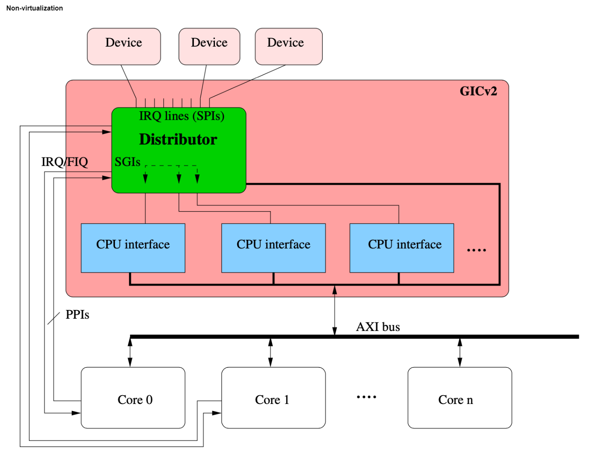
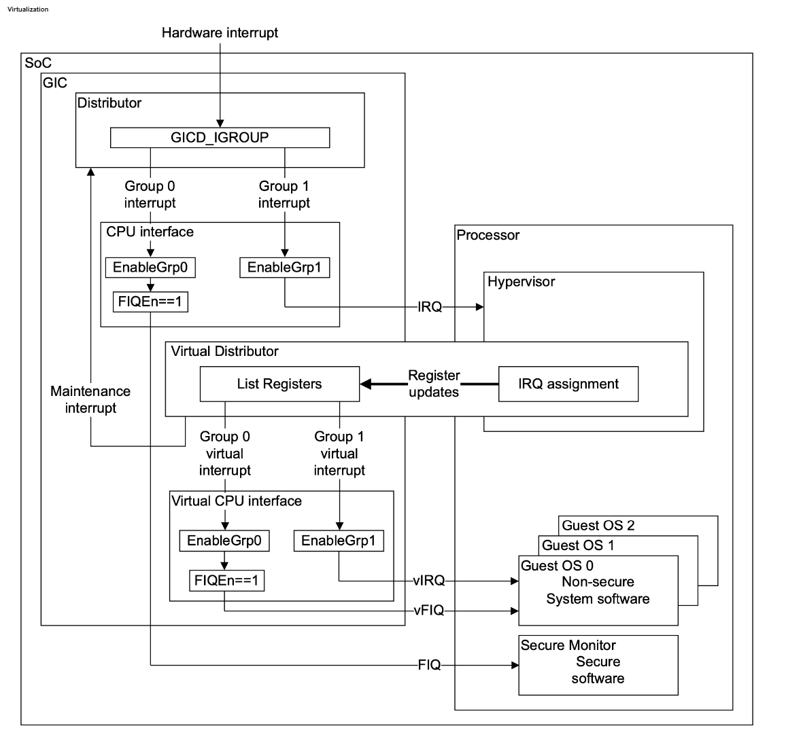
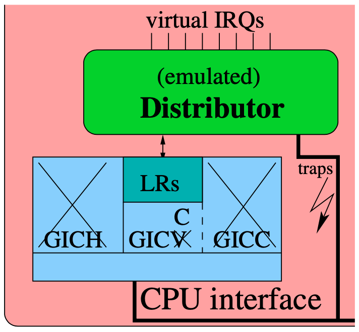
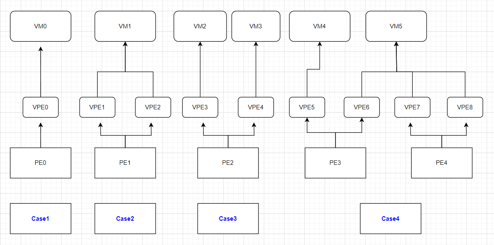
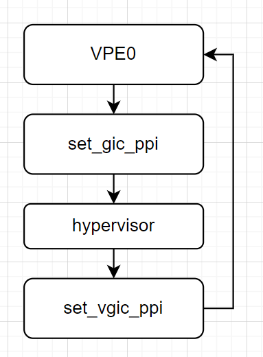
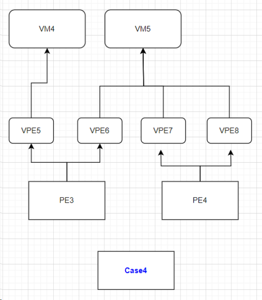

<h2 align="center">Virtual GIC v2 设计文档</h1>

# 一、GICv2介绍


通过上图可以确定，GIC 主要包含 3 部分：Distributor、CPU interfaces 和 Virtual CPU interfaces。Virtual CPU interfaces 包含 Virtual interface control 和 Virtual CPU interface。



- 中断进入 distributor，然后分发到 CPU interface

- 某个 CPU 触发中断后，读 GICC_IAR 拿到中断信息，处理完后写 GICC_EOIR 和 GICC_DIR（如果 GICC_CTLR.EOImodeNS 是 0，则 EOI 的同时也会 DI）

- GICD、GICC 寄存器都是 MMIO 的，device tree 中会给出物理地址

  

## 中断类型

- ### 1. **软件生成中断（Software Generated Interrupts, SGI）**

  - **中断号范围**：0 到 15（共 16 个中断号）
  - **用途**：用于处理器间通信（IPI），允许一个处理器核心向另一个处理器核心发送中断信号。
  - **特点**：每个核心都可以生成和接收这些中断，通常用于任务调度、同步等操作。

  ### 2. **私有外设中断（Private Peripheral Interrupts, PPI）**

  - **中断号范围**：16 到 31（共 16 个中断号）
  - **用途**：用于处理与特定处理器核心直接相关的硬件事件，例如计时器中断、性能监控中断、调试中断等。
  - **特点**：这些中断是每个核心私有的，只有对应的核心会处理这些中断。

  ### 3. **共享外设中断（Shared Peripheral Interrupts, SPI）**

  - **中断号范围**：32 到 1019（共 988 个中断号）
  
  - **用途**：用于处理系统中共享的外设中断，例如来自外部设备、网络接口、存储设备等的中断。
  
  - **特点**：这些中断是所有核心共享的，可以由任何一个核心处理，通常通过中断亲和性（affinity）来决定哪个核心处理该中断。
  
  - SPI默认发送vcpu 0上，同样将中断信号放到vcpu的ap_list字段排队，等待vcpu处理。
  
    

## Distributor 作用
Distributor 主要作用为检测中断源、控制中断源行为和将中断源分发到指定 CPU 接口上（针对每个 CPU 将优先级最高的中断转发到该接口上）。

Distributor 对中断的控制包括：

- 全局启用中断转发到 CPU 接口

- 开启或关闭每一个中断
- 为每个中断设置优先级
- 为每个中断设置目标处理器列表
- 设置每个外设中断触发方式（电平触发、边缘触发）
- 为每个中断设置组
- 将 SGI 转发到一个或多个处理器
- 每个中断状态可见
- 提供软件设置或清除外设中断的挂起状态的一种机制

## 中断 ID
使用 ID 对中断源进行标识。每个 CPU 接口最多可以有 1020 个中断。SPI 和 PPI 中断为每个接口特定的，SPI 为为所有接口共用，因此多处理器系统中实际中断数大于 1020 个。

## CPU Interface
CPU 接口提供一个处理器连接到 GIC 的接口。每一个 CPU 接口都提供一个编程接口：

- 允许向处理器发送中断请求信号
- 确认中断
- 指示中断处理完成
- 为处理器设置中断优先级掩码
- 为处理器定义抢占策略
- 选择最高优先级挂起中断


# 二、中断处理状态机

`GIC` 为每个 `CPU` 接口上每个受支持的中断维护一个状态机。下图显示了此状态机的实例，以及可能的状态转换。


 - Inactive：该中断源处于未激活状态
 - Pending：中断源触发状态，GIC感知到，但还未被分发到PE
 - Active：中断已经被某个PE认领确认
 - Active and pending：这个中断源的一次触发已经被PE确认，同时这个中断源的另一次触发正在pending状态

## 添加挂起状态（A1、A2）

- 对于一个 SGI，发生以下 2 种情况的 1 种：
  - 软件写 **GICD_SGIR** 寄存器，指定目标处理器
  - 目标处理器上软件写 **GICD_SPENDSGIRn** 寄存器

- 对于一个 SPI 或 PPI，发生以下 2 种情况的 1 种：

  - 外设发出一个中断请求信号

  - 软件写 **GICD_ISPENDRn** 寄存器

    

## 删除挂起状态（B1、B2）

- 对于 SGI
  - 目标处理器写 **GICD_CPENDSGIRn** 寄存器
- 对于一个 SPI 或 PPI，发生以下 2 种情况的 1 种：
  - 电平触发类型中断，信号取消
  - 边沿触发类型中断，软件写 GICD_ICPENDRn 寄存器

## 挂起到激活（C）

- 如果中断使能，并且高优先级，软件从 GICC_IAR 寄存器读取时发生状态改变。


## 挂起到激活和挂起（D）

- 对于 SGI，这种转变发生在以下任一情况下：
  - 将 SGI 状态设置为挂起的写入操作与读取 GICC_IAR 几乎同时发生
  - 当多个挂起的 SGI 具有相同 ID 时，并且它们来自同一个源处理器并指向同一个处理器。其中一个 SGI 状态变为激活（C），其他 SGI 状态变为激活和挂起（D）

- 对于 SPI 或 PPI，满足以下所有条件，则发生这种转换
  - 中断开启
  - 软件读取 GICC_IAR，读操作将激活状态添加到中断中。
  - 此外，还应满足以下条件之一：
    - 对于电平触发中断，中断信号保持。通常都是这样，因为外设直到处理器处理完中断后才会取消触发信号。
    - 对于边沿触发中断，是否发生此转换取决于读取 GICC_IAR 的时间（中断再次触发，上一次未处理），读取 **GICC_IAR** 可能会转换到 C，后面可能会转换到 A2。

## 删除激活状态（E1、E2）

- 软件写入 GICC_EOIR 或 GICC_DIR 来停用中断，


# 三、中断虚拟化设计

## 中断虚拟化概要



- HCR_EL2.IMO 设置为 1 后，所有 IRQ 都会 trap 到 Hypervisor 
- Hypervisor 判断该 IRQ 是否需要插入到 vCPU
- 插入 vIRQ 之后，在切换到 VM 之前需要 EOI 物理 IRQ，即 priority drop，降低运行优先级，使之后 VM 运行时能够再次触发该中断
- 回到 VM 后，GIC 在 EL1 触发 vIRQ，这时候 EOI 和 DI 会把 vIRQ 和物理 IRQ 都 deactivate，因此不需要再 trap 到 Hypervisor ，不过如果是 SGI 的话并不会 deactivate，需要 Hypervisor 自己处理。

### Hypervisor interface (GICH)

- GICH base 物理地址在 device tree 中给出
- 控制寄存器：GICH_HCR、GICH_VMCR 等
- List 寄存器：GICH_LRn
- KVM 中，这些寄存器保存在 `struct vgic_cpu` 的 `vgic_v2` 字段，`struct vgic_cpu` 本身放在 `struct kvm_vcpu_arch`，每个 vCPU 一份
- vCPU switch 的时候，需要切换这些寄存器（KVM 在 `vgic-v2-switch.S` 中定义相关切换函数）
- VM 无法访问 GICH 寄存器，因为根本没有映射

### vCPU interface (GICV, GICC in VM's view)

- GICV 也是物理 GIC 上存在的，base 物理地址同样在 device tree 中给出
- KVM 在系统全局的一个结构体（`struct vgic_params vgic_v2_params`）保存了这个物理地址
- 创建 VM 时 Hypervisor 把一个特定的 GPA（KVM 中通过 `ioctl` 设置该地址）映射到 GICV base 物理地址，然后把这个 GPA 作为 GICC base 在 device tree 中传给 VM
- VM 以为自己在访问 GICC，实际上它在访问 GICV
- 目前理解这些 GICV 寄存器在 vCPU switch 的时候是不需要保存的（KVM 里没有保存 GICV 相关的代码），因为它其实在硬件里访问的是 GICH 配置的那些寄存器，比如 LR

### Virtual distributor (GICD in VM's view)

- 实际是内核里的一个结构体（`struct vgic_dist`）
- 在 device tree 中给 VM 一个 GICD base，但实际上没有映射
- VM 访问 GICD 时，trap & emulate，直接返回或设置 `struct vgic_dist` 里的字段（在 `vgic-v2-emul.c` 文件中）
- 每个 VM 一个，而不是每个 vCPU 一个，所以 `struct vgic_dist` 放在 `struct kvm_arch` 里

### VM's view



- 从 device tree 获得 GICD、GICC base 物理地址（实际是 Hypervisor 伪造的地址）
- 配置 GICD 寄存器（实际上 trap 到 Hypervisor ，模拟地读写了内核某 struct 里的数据）
- 执行直到发生中断（中断先到 Hypervisor ，Hypervisor 在 LR 中配置了一个物理 IRQ 到 vIRQ 的映射，并且设置为 pending，回到 VM 之后 GIC 在 VM 的 EL1 触发中断）
- 读 GICC_IAR（经过 stage 2 页表翻译，实际上读了 GICV_IAR，GIC 根据 LR 返回 vIRQ 的信息，vIRQ 状态从 pending 转为 active）
- 写 GICC_EOIR、GICC_DIR（经过 stage 2 页表翻译，实际上写了 GICV_EOIR、GICV_DIR，GIC EOI 并 deactivate 对应的 vIRQ，并 deactivate vIRQ 对应的物理 IRQ）


## VGIC设计

主要以以下4中case进行讨论，其中case4涉及vCPU调度，其他情况不涉及调度：



### VGIC Distributor设计

``` rust
struct VgicDist {
    ...
    nr_spis: usize,           // num of SPIs
    spis: Vec<VgicIrq>,       // store SPI
    dist_iodev: VgicIoDevice, // Distributor I/O设备描述符
    ....
}

impl VgicDist {
    pub fn new() {
        let nr_spis = 256; 
        let mut spis = Vec::new(); 

        // init SPI interrupt
        for _ in 0..nr_spis {
            spis.push(VgicIrq {
                ap_list: RefCell::new(LinkedList::new()),
                vcpu: Some(Box::new(Vcpu {})),
                target_vcpu: Some(Box::new(Vcpu {})),
                intid: 0,
                line_level: false,
                active: false,
                enabled: true,
            });
        }

        let dist_iodev = VgicIoDevice {  };
        VgicDist {
            nr_spis,
            spis,
            dist_iodev,
        }
    }
}

```

VGIC Distributor 主要模拟 nr_spis 个 spis 中断


``` rust
struct VgicIrq {
    /// A linked list header for managing interrupts.
    /// This is used for managing the list of interrupts associated with a VCPU.
    ap_list: RefCell<LinkedList<Box<VgicIrq>>>,
    
    /// For SGIs and PPIs: The VCPU that generated the interrupt.
    /// For SPIs: The VCPU whose `ap_list` this is queued on.
    vcpu: Option<Box<dyn VcpuTrait>>,
    
    /// The VCPU that this interrupt should be sent to, based on the targets register (v2)
    target_vcpu: Option<Box<dyn VcpuTrait>>,
    
    /// The guest-visible interrupt ID.
    intid: u32,
    
    /// Indicates if the interrupt is level-triggered only.
    line_level: bool,
    
    /// Not used for LPIs.
    active: bool,
    
    /// Indicates if the interrupt is enabled.
    enabled: bool,
}
```

- GIC所以只处理SPI类型的中断，原因是其它两类中断的输入就是针对特定一个CPU的，不需要Distributor控制其中断信号的deliver行为；而SPI的目标CPU，是可以用户配置的，因此需要模拟一个Distributor来控制中断deliver的目标，并将Distributor的控制接口暴露给用户。
- target_vcpu结构用来存放用户设置的GIC中断路由信息，如果用户没有设置，那target_vcpu就使用默认的CPU0，后续GIC可能会根据负载均衡策略将中断分发到其它目标CPU上。换句话说，target_vcpu可能不是中断最终投递的CPU，只是一个初始值，而vcpu才是中断最终投递的CPU

### VGIC初始化

1. vgicd-ctrl 寄存器：

​	 - 对于case 1、2 和 3，不需要 IPI 通信。case 4 需要 IPI 通信。

2. vgicd-iid 寄存器，vgicd-type 寄存器：

​	 - 这些寄存器保存 GIC 的一些属性和处理元素（PE）的数量。

 	- 虚拟化提供的 vgicd 应根据 VPE 的数量进行配置。

3. vgicd-isenable 寄存器：

​	 - getenable：直接从结构中读取内容。

​	 - setenable：根据 vtop 和 ptov 设置配置 GIC。对于情况 1、2 和 3，不需要 IPI 通信。情况 4 需要 IPI 通信。

4. 其他 emu 寄存器：

​	 - 其他 vgicd-emu 寄存器与 isenabler 类似。

### SGI软件生成中断

SGI是一种特殊的中断，由软件生成，通常用于在多核系统中实现CPU间通信。SGI的目标CPU由发送者指定，并且SGI可以被路由到一个或多个核上。

在虚拟化环境下，由于多个vCPU可能共享同一个物理CPU，hypervisor需要对SGI进行虚拟化，以确保VM之间的隔离性和透明性。

#### Hypervisor对SGI的拦截

在虚拟化环境中，当VM试图发送SGI时，通常通过修改guest的GIC相关寄存器来触发。VM本身无法直接访问物理的GIC Distributor（GICD）寄存器，因此这些写操作会被hypervisor拦截。

- **vCPU到vCPU的SGI**：VM发送SGI给自己的vCPU或同一个VM中的其他vCPU。

#### SGI的处理与路由

在SGI虚拟化中，hypervisor负责以下操作：

- **拦截和解析SGI**：当VM写入GICD_SGIR寄存器（用于触发SGI），hypervisor会拦截该写操作。它解析出目标vCPU以及SGI的ID。
- **SGI的重定向**：hypervisor根据解析出的SGI信息，将SGI重新路由到目标vCPU，这里应该有有一个接口能够根据vcpu_id注入指定的中断。
  - vCPU活跃：直接发送到指定的vCPU
  - vCPU休眠：唤醒vCPU后，再发送到指定vCPU
- **中断优先级和状态管理**：hypervisor需要维护虚拟中断的优先级和状态（如等待、激活等），以确保VM感知到的中断行为与物理硬件一致。

#### 虚拟GIC的支持

为了让VM能够像使用物理GIC一样处理中断，hypervisor会提供虚拟的GIC接口（vGIC）。vGIC负责模拟GICD和GICC（CPU接口）的寄存器操作，并将这些寄存器映射到VM的地址空间。

虚拟GIC支持VM的SGI管理，包括：

- **虚拟GICD_SGIR寄存器**：VM通过这个寄存器触发SGI，hypervisor在接收到写操作后进行中断重定向。
- **虚拟中断路由表**：hypervisor维护一个虚拟的中断路由表List Registers，用来追踪SGI应该被路由到哪个vCPU。


### PPI 私有外设中断

PPI通常用于管理特定于处理器的外设中断。在GICv2中，每个核心都有其专属的PPI，通常包括定时器中断和其他本地外设中断。在虚拟化环境中，hypervisor需要虚拟化这些中断，以便每个VM能够透明地访问和使用它们。

##### VM发起PPI请求

当VM中的vCPU需要处理PPI时，通常是通过对GIC的寄存器进行操作。例如，vCPU可能会读取或清除某个PPI的状态，这一操作需要经过hypervisor的拦截。

##### Hypervisor拦截请求

- **拦截操作**：Hypervisor监测对PPI相关寄存器的访问请求，特别是GIC的PPI寄存器。
- **解析请求**：Hypervisor解析该请求以确定哪个vCPU或VM正在进行操作，并根据需要处理这些请求。

##### PPI的路由和分发

- **管理PPI状态**：Hypervisor需要维护每个VM的PPI状态，确保在VM运行时，PPI的状态能够正确反映在对应的vCPU上。
- **中断注入**：当PPI中断发生时，hypervisor负责将中断注入到对应的vCPU中。对于PPI，hypervisor可以直接向目标vCPU发送中断请求，而不需要重定向。

##### 目标vCPU处理中断

- **vCPU处理PPI**：一旦PPI被触发，目标vCPU会进入中断处理程序，执行相应的处理逻辑。
- **状态恢复**：处理完成后，vCPU会清除PPI中断状态，并恢复执行状态。

##### Hypervisor的清理工作

- **状态管理**：Hypervisor在处理完PPI中断后，负责清理中断状态和相关的寄存器，确保后续中断请求的正确性。
- 

### SPI 共享外设中断

在虚拟化环境中，SPI（Shared Peripheral Interrupt，共享外设中断）是一种用于处理多个处理器核心共享外设的中断。与SGI和PPI不同，SPI是针对共享设备的中断，允许多个CPU响应同一外设生成的中断。hypervisor在虚拟化SPI时需要确保VM之间的隔离，同时提供对共享外设的正确中断管理。

SPI通常用于系统中那些可以被多个处理器访问的外设，例如网络适配器、存储控制器等。在GICv2中，SPI由GIC的Distributor（GICD）管理，允许多个处理器核接收来自同一外设的中断。在虚拟化环境中，hypervisor需要将SPI虚拟化为适合多个VM使用的形式。

##### VM发起SPI请求

当外设生成中断时，它将通过物理GIC将SPI传递给相应的处理器核心。在虚拟化环境中，物理中断首先会传递到hypervisor。

##### Hypervisor的拦截和管理

- **拦截中断**：Hypervisor拦截来自外设的SPI请求，并识别该中断的目标VM（如果已映射）。
- **中断映射**：Hypervisor维护一个中断映射表，将物理中断与VM中的虚拟中断进行关联。

##### SPI的路由和重定向

- **目标VM识别**：Hypervisor通过中断映射表确定SPI应该路由到哪个VM的vCPU。
- **中断注入**：Hypervisor将SPI注入到目标VM的对应vCPU中，以触发中断处理。

##### 目标vCPU处理中断

- **处理SPI中断**：目标vCPU接收到中断请求后，执行相应的中断处理程序。此过程包括保存上下文、执行处理逻辑以及清除中断状态。
- **状态恢复**：处理完成后，vCPU需要恢复到正常执行状态，并清除中断标志。

##### Hypervisor的清理工作

- **状态更新**：Hypervisor在处理完SPI中断后，更新中断的状态，以反映当前的处理中断情况。



#### List Register


对于有虚拟化扩展的 GIC，Hypervisor使用 List Registers 来维护高优先级虚拟中断的一些上下文信息。

``` c
struct gich_lr {
    uint32_t vid : 10;  // virq 中断号
    uint32_t pid : 10;  // 此 field 根据 hw 值不同而不同
                        // hw=1，表示此虚拟中断关联了一个物理中断，此 pid 为实际的 physical irq 中断号
                        // hw=0，bit19表示是否 signal eoi，给 maintenance interrupt 使用，不做讨论
                                 //bit12-10，如果这是一个 sgi 中断，即 virtual interrupt id < 15，那么此位域表示 requesting cpu id

    uint32_t resv : 3;  // 保留
    uint32_t pr : 5;    // 该virtual integrrupt 的优先级
    uint32_t state : 2; // 指示该中断的状态，invalid、pending、active、pending and active
    uint32_t grp1 : 1;  // 表示该 virtual integrrupt 是否是 group 1 virtual integrrupt
                        // 0 表示这是一个 group 0 virtual interrupt，表示安全虚拟中断，可配置是按照 virq 还是 vfiq 发送给 vcpu
                        // 1 表示这是一个 group 1 virtual interrupt，表示非安全虚拟中断，该中断以 virq 的形式触发，而不是 vfiq

    uint32_t hw : 1;    // 该虚拟中断是否关联了一个硬件物理中断
                        // 0 表示否，这是 triggered in software，当 deactivated 的时候不会通知 distributor
                        // 1 表示是，那么 deactivate 这个虚拟中断也会向对应的物理中断也执行 deactivate 操作
                        // 而具体的 deactivate 操作，如果 gicv_ctlr.eoimode=0，写 gicv_eoir 寄存器表示 drop priority 和 deactive 操作同时进行 
                        // 如果 gicv_ctlr.eoimode=1，写 gicv_eoir 寄存器表示 drop priority，写 GICV_DIR 表示 deactive
};
```

### VGIC 寄存器虚拟化

有的寄存器是单个32位长，有的寄存器是多个32位长，所以使用宏来定义各个寄存器，提供直观的访问方式

``` rust
// Macro to define GIC register enums
macro_rules! generate_gic_registers {
    (
        // Single register definitions
        singles {
            $(
                $single_name:ident = $single_offset:expr // Single register name and offset
            ),* $(,)?
        }
        // Range register definitions
        ranges {
            $(
                $range_name:ident = {
                    offset: $range_offset:expr, // Range register base offset
                    size: $range_size:expr // Number of registers in the range
                }
            ),* $(,)?
        }
    ) => {
        #[derive(Debug, Clone, Copy, PartialEq)]
        pub enum GicRegister {
            // Generate single register variants
            $(
                $single_name, // Single register variant
            )*
            // Generate range register variants (with index)
            $(
                $range_name(u32), // Range register variant with index
            )*
        }

        impl GicRegister {

            // Convert address to register enum
            pub fn from_addr(addr: u32) -> Option<Self> {
                match addr {
                    // Match single registers
                    $(
                        addr if addr == $single_offset => Some(Self::$single_name), // Single register match
                    )*
                    // Match range registers
                    $(
                        addr if addr >= $range_offset && addr < $range_offset + ($range_size * 4) => {
                            let idx = (addr - $range_offset) / 4; // Calculate index
                            if idx < $range_size {
                                Some(Self::$range_name(idx)) // Range register match
                            } else {
                                None
                            }
                        },
                    )*
                    _ => None, // No match
                }
            }
        }
    };
}

// Use the macro to generate specific register definitions
generate_gic_registers! {
    singles {
        // Distributor Control Register
        GicdCtlr = 0x0000,
        // Distributor Type Register
        GicdTyper = 0x0004,
        // Distributor Implementer Identification Register
        GicdIidr = 0x0008,
        // Distributor Status Register
        GicdStatusr = 0x0010,
    }
    ranges {
        // Interrupt Group Register
        GicdIgroupr = {
            offset: 0x0080,
            size: 32
        },
        // Interrupt Enable Set Register
        GicdIsenabler = {
            offset: 0x0100,
            size: 32
        },
        // Interrupt Enable Clear Register
        GicdIcenabler = {
            offset: 0x0180,
            size: 32
        },
        // Interrupt Pending Set Register
        GicdIspendr = {
            offset: 0x0200,
            size: 32
        },
        GicdIcpendr = {
            offset: 0x0280,
            size: 32
        },
        // Interrupt Active Set Register
        GicdIsactiver = {
            offset: 0x0300,
            size: 32
        },
        // Interrupt Active Clear Register
        GicdIcactiver = {
            offset: 0x0380,
            size: 32
        },
        // Interrupt Priority Register
        GicdIpriorityr = {
            offset: 0x0400,
            size: 256
        },
        // Interrupt Target Register
        GicdItargetsr = {
            offset: 0x0800,
            size: 256
        },
        // Interrupt Configuration Register
        GicdIcfgr = {
            offset: 0x0c00,
            size: 64
        },
        // PPI Status Register
        GicdPpisr = {
            offset: 0x0d00,
            size: 32
        },
        // SPI Status Register
        GicdSpisr = {
            offset: 0x0d04,
            size: 32
        },
        // Non-Secure Access Control Register
        GicdNsacr = {
            offset: 0x0e00,
            size: 32
        },
        // Software Generated Interrupt Register
        GicdSgir = {
            offset: 0x0f00,
            size: 32
        },
        // Pending Software Generated Interrupt Register
        GicdCpendsgir = {
            offset: 0x0f10,
            size: 32
        },
        // Software Generated Interrupt Pending Register
        GicdSpendsgir = {
            offset: 0x0f20,
            size: 32
        },
    }
}

// 访问寄存器的方法
match GicRegister::from_addr(addr as u32) {
    Some(reg) => match reg {
        GicRegister::GicdCtlr => Ok(self.vgicd.lock().ctrlr as usize),
        GicRegister::GicdTyper => Ok(self.vgicd.lock().typer as usize),
        GicRegister::GicdIidr => Ok(self.vgicd.lock().iidr as usize),
        GicRegister::GicdStatusr => self.read_statusr(),
        GicRegister::GicdIgroupr(idx) => self.read_igroupr(idx),
        GicRegister::GicdIsenabler(idx) => Ok(self.vgicd.lock().vgicd_isenabler_read(idx)),
        GicRegister::GicdIcenabler(idx) => self.read_icenabler(idx),
        GicRegister::GicdIspendr(idx) => self.read_ispendr(idx),
        _ => {
            error!("Read register address: {addr:#x}");
        }
    },
    None => {
        error!("Invalid read register address: {addr:#x}");
    }
}

```

### KVM关于VGIC的设计

``` c
kvm_vm_ioctl
	kvm_vm_ioctl_irq_line
	    irq_type = (irq >> KVM_ARM_IRQ_TYPE_SHIFT) & KVM_ARM_IRQ_TYPE_MASK;	/* SPI 类型 */
    	vcpu_idx = (irq >> KVM_ARM_IRQ_VCPU_SHIFT) & KVM_ARM_IRQ_VCPU_MASK;	/* vcpu_idx: 0*/
    	irq_num = (irq >> KVM_ARM_IRQ_NUM_SHIFT) & KVM_ARM_IRQ_NUM_MASK;		/* 中断号：32+7 = 39 */
    	
   	case KVM_ARM_IRQ_TYPE_CPU:	/* 发往特定CPU上的快速中断 */
        if (irqchip_in_kernel(kvm))
            return -ENXIO;

        if (vcpu_idx >= nrcpus)
            return -EINVAL;

        vcpu = kvm_get_vcpu(kvm, vcpu_idx);	/* 根据cpuid取出vcpu结构体*/
        if (!vcpu)
            return -EINVAL;

        if (irq_num > KVM_ARM_IRQ_CPU_FIQ)
            return -EINVAL;
		/* 立即投递到cpu的中断状态字段，然后kick cpu进行处理
		 * 由于是快速中断，KVM直接更新的irq_lines字段，没有将中断信号放到vgic_cpu的ap_list上排队
		 */
        return vcpu_interrupt_line(vcpu, irq_num, level);		
    case KVM_ARM_IRQ_TYPE_PPI:	/* CPU私有类型的中断 */
        if (!irqchip_in_kernel(kvm))
            return -ENXIO;

        if (vcpu_idx >= nrcpus)
            return -EINVAL;

        vcpu = kvm_get_vcpu(kvm, vcpu_idx);	/* 根据cpuid取出vcpu结构体 */
        if (!vcpu)
            return -EINVAL;

        if (irq_num < VGIC_NR_SGIS || irq_num >= VGIC_NR_PRIVATE_IRQS)
            return -EINVAL;
		/* 非快速中断，取出目的vcpu后，将中断信号放到vcpu的ap_list字段排队，等待vcpu处理 */
        return kvm_vgic_inject_irq(kvm, vcpu->vcpu_id, irq_num, level, NULL);	
    case KVM_ARM_IRQ_TYPE_SPI:
        if (!irqchip_in_kernel(kvm))
            return -ENXIO;

        if (irq_num < VGIC_NR_PRIVATE_IRQS)
            return -EINVAL;
		/* 非快速中断，SPI默认发送vcpu 0上，同样将中断信号放到vcpu的ap_list字段排队，等待vcpu处理 */
        return kvm_vgic_inject_irq(kvm, 0, irq_num, level, NULL);
    }

```