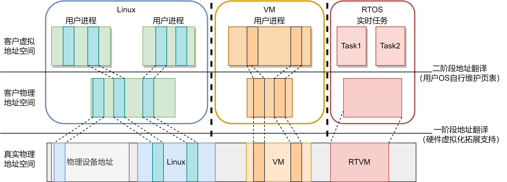

# axaddrspace

## 介绍

内存虚拟化由[axaddrspace](https://github.com/arceos-hypervisor/axaddrspace)实现，该模块与架构无关，负责管理和映射客户虚拟机的二级地址空间（GPA -> HPA）




## 系统架构

### 模块组织

```
axaddrspace/
    ├── src/
    │   ├── address_space/   
    |   |   ├── backend
    |   |   |    ├── alloc.rs   - 动态分配映射实现
    |   |   |    ├── linear.rs  - 线性映射实现
    |   |   └── ├── mod.rs     - 模块入口
    |   └── ├── mod.rs     - 客户机物理地址空间管理模块
    │   ├── npt/
    │   |   ├── arch/
    │   |   |   ├── aarch64.rs   - ARMv8 架构下嵌套页表管理
    │   |   |   ├── mod.rs       - 模块入口
    │   │   |   ├── riscv.rs     - riscv页表管理
    │   │   └── ├── x86_64.rs    - x86_64 架构扩展页表管理
    │   └── ├── mod.rs       - 模块入口
    │   ├── addr.rs      - 地址类型定义
    │   └── lib.rs       - 库入口点
```


### 关键数据结构


客户机物理地址空间结构体

```rust
pub struct AddrSpace<H: PagingHandler> {
  va_range: GuestPhysAddrRange,  //地址空间范围
  areas: MemorySet<Backend<H>>,  //内存区域集合
  pt: PageTable<H>,              //嵌套页表实例
}
```

该结构体使用了一个泛型类型参数<H>，该参数受page_table_multiarch模块中PagingHandler trait的约束。

## 核心功能实现

### 功能代码

定义一个统一内存映射后端枚举类型 `Backend<H>`，用于抽象不同策略的物理内存管理方式。通过泛型参数 `H: PagingHandler` 实现对不同页表操作接口的兼容，允许后端适配不同架构的页表实现（如x86_64的EPT、ARM的Stage-2页表）。

```rust
pub enum Backend<H: PagingHandler> {
  /// Linear mapping backend.
  Linear {
    /// `vaddr - paddr`.
    pa_va_offset: usize,
  },
  /// Allocation mapping backend.
  Alloc {
    populate: bool,
    _phantom: core::marker::PhantomData<H>,
  },
}
```

当前支持两种内存映射后端策略：

1. Linear（线性映射）**`物理地址 = 虚拟地址 - pa_va_offset`**

2. Alloc（动态分配映射）：通过全局分配器动态获取物理帧，支持两种模式：
   - **预分配模式 (`populate=true`)**: 立即分配所有物理帧，无缺页开销
   - **按需分配模式 (`populate=false`)**: 延迟分配，通过缺页异常触发分配


文件alloc.rs实现了动态分配映射:

| 方法                | 功能描述                                 |
| ------------------- | :--------------------------------------- |
| `new_alloc`         | 创建后端实例，指定是否预分配             |
| `map_alloc`         | 建立客户机虚拟地址到动态分配物理帧的映射 |
| `unmap_alloc`       | 解除映射并释放关联的物理帧               |
| `handle_page_fault` | 处理缺页异常，为未映射的地址分配物理帧   |

文件linear.rs实现了线性映射，功能有：

```
impl<H: PagingHandler> Backend<H> {
    // 创建线性映射后端实例
    pub const fn new_linear(pa_va_offset: usize) -> Self
    // 执行线性映射
    pub(crate) fn map_linear(...) -> bool 
    // 解除线性映射
    pub(crate) fn unmap_linear(...) -> bool

}
```


axaddrspace通过使用`page_table_multiarch`的泛型页表框架和`page_table_entry`的标准接口定义，实现了支持x86、ARM、RISC-V的嵌套页表管理的多架构兼容。

### 依赖注入

`AddrSpace`结构体表示虚拟机的内存区域和二级地址映射，依赖于泛型类型`PagingHandler`处理页表相关操作。`axaddrspace`由`axvm`的`AxVM`结构体拥有和管理，而`AxVM`依赖于定义在`axvm`的`hal.rs`中的`AxVMHal` trait。

实际上，`PagingHandler`是`AxVMHal` trait的一个关联类型：

```
// 底层软件（内核或虚拟机监控程序）必须实现的接口
pub trait AxVMHal: Sized {
    type PagingHandler: page_table_multiarch::PagingHandler;
    // 将虚拟地址转换为对应的物理地址
    fn virt_to_phys(vaddr: HostVirtAddr) -> HostPhysAddr;
    // 获取当前时间（纳秒）
    fn current_time_nanos() -> u64;
	// ...
}
```

`AxVMHal`由`vmm-app`中的`AxVMHalImpl`实现，其关联类型`PagingHandler`依赖于ArceOS的`axhal`模块提供的`PagingHandlerImpl`：

```
pub struct AxVMHalImpl;

impl AxVMHal for AxVMHalImpl {
    type PagingHandler = axhal::paging::PagingHandlerImpl;
    fn virt_to_phys(vaddr: VirtAddr) -> PhysAddr {
        axhal::mem::virt_to_phys(vaddr)
    }
    fn current_time_nanos() -> u64 {
        axhal::time::monotonic_time_nanos()
    }
	// ...
}
```

当前设计通过Rust的泛型类型（Trait）及其关联类型机制实现了依赖注入。