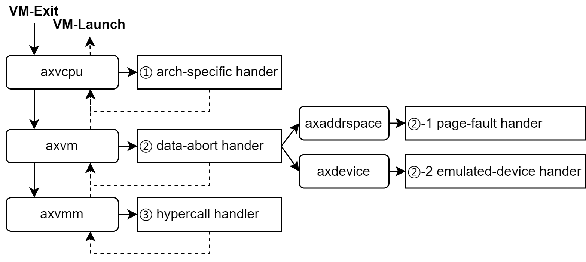

# [Multilayer VM-Exit handling mechanism](https://github.com/orgs/arceos-hypervisor/discussions/19)

## VM-Exits

As we all know, VM-Exits are curtial for getting guest VM's running states and interacting with Guest VMs. 

VM-Exits are used for device emulation and vCPU scheduling.

VM-Exits in x86_64, aarch64 and riscv64 follow the same design logic but share a slightly different implementation.



## Inner-VCpu handling

Under x86_64, some VM-Exit items are architecture specific (e.g. `VmxExitReason::CR_ACCESS`, `VmxExitReason::CPUID`).
In our current design, these VM-Exits are handled by [`VmxVcpu`] itself through `builtin_vmexit_handler`, while other VM-Exit types are returned by `vcpu.run()` and leaves whoever called `vcpu.run()` to handle.

```Rust
impl<H: AxVMHal> VmxVcpu<H> {
    /// Handle vm-exits than can and should be handled by [`VmxVcpu`] itself.
    ///
    /// Return the result or None if the vm-exit was not handled.
    fn builtin_vmexit_handler(&mut self, exit_info: &VmxExitInfo) -> Option<AxResult> {
        // Following vm-exits are handled here:
        // - interrupt window: turn off interrupt window;
        // - xsetbv: set guest xcr;
        // - cr access: just panic;
        match exit_info.exit_reason {
            VmxExitReason::INTERRUPT_WINDOW => Some(self.set_interrupt_window(false)),
            VmxExitReason::PREEMPTION_TIMER => Some(self.handle_vmx_preemption_timer()),
            VmxExitReason::XSETBV => Some(self.handle_xsetbv()),
            VmxExitReason::CR_ACCESS => Some(self.handle_cr()),
            VmxExitReason::CPUID => Some(self.handle_cpuid()),
            _ => None,
        }
    }
}
```

Besides, `VmxExitReason::IoRead/IoWrite` and  `VmxExitReason::MsrRead/MsrWrite` are also x86_64 specific, but these VM-Exits are relavant to Port I/O or Msr device emulation, make them more suitable to be handled outside the `vcpu.run()`.

## Inner-VM handling

Since VM structure in `axvm` is responsible for VM's resource management like emulated devices and address space (`axaddrspace`). I prefer leaving device emulation related and page-fault related (data abort) VM-Exits inside `axvm`. 

That is, providing a `run_vcpu()` function in VM structure, and consolidate the device emulation-related VM-exit handling into `vm.run_vcpu()`. 

```Rust
impl<H: AxVMHal> AxVM<H> {
    pub fn run_vcpu(&self, vcpu_id: usize) -> AxResult<AxVCpuExitReason> {
        let vcpu = self
            .vcpu(vcpu_id)
            .ok_or_else(|| ax_err_type!(InvalidInput, "Invalid vcpu_id"))?;

        vcpu.bind()?;

        let exit_reason = loop {
            let exit_reason = vcpu.run()?;

            trace!("{exit_reason:#x?}");
            let handled = match &exit_reason {
                AxVCpuExitReason::MmioRead { addr: _, width: _ } => true,
                AxVCpuExitReason::MmioWrite {
                    addr: _,
                    width: _,
                    data: _,
                } => true,
                AxVCpuExitReason::IoRead { port: _, width: _ } => true,
                AxVCpuExitReason::IoWrite {
                    port: _,
                    width: _,
                    data: _,
                } => true,
                AxVCpuExitReason::NestedPageFault { addr, access_flags } => self
                    .inner_mut
                    .address_space
                    .lock()
                    .handle_page_fault(*addr, *access_flags),
                _ => false,
            };
            if !handled {
                break exit_reason;
            }
        };

        vcpu.unbind()?;
        Ok(exit_reason)
    }
}
```

Thus, consolidate the device emulation operations into the `axvm` module, so that the `vmm-app` only needs to pass in configuration files to create emulated device instances as needed, without having to be concerned with the specific runtime behavior of the emulated devices, as well as the address space.

Of course, this is on the condition that these VM-Exits do not trigger the scheduling of the vCPU.

## (Outer-VM)vmm-app handling

We reuse `axtask` to implement runtime management and scheduling of vCPUs. 

This logic is implemented in the vmm-app because the VMM naturally needs to be concerned with vCPU scheduling, and it consolidates the dependency on ArceOS's `axtask` within the `vmm-app`. 

For VM-Exits that were not handled by the previous two layers, they will be get from the return value of `vcpu::run()` and processed here, including the handling of hypercalls (handling this within the VMM also seems quite reasonable) and any (if-any) VM-Exit types that require vCPU scheduling or vCPU exit.

```Rust
        let mut task = TaskInner::new(
            || {
                let curr = axtask::current();

                let vm = curr.task_ext().vm.clone();
                let vcpu = curr.task_ext().vcpu.clone();
                let vm_id = vm.id();
                let vcpu_id = vcpu.id();

                info!("VM[{}] Vcpu[{}] waiting for running", vm.id(), vcpu.id());
                wait_for(vm_id, || vm.running());

                info!("VM[{}] Vcpu[{}] running...", vm.id(), vcpu.id());

                loop {
                    match vm.run_vcpu(vcpu_id) {
                        // match vcpu.run() {
                        Ok(exit_reason) => match exit_reason {
                            AxVCpuExitReason::Hypercall { nr, args } => {
                                debug!("Hypercall [{}] args {:x?}", nr, args);
                            }
                            AxVCpuExitReason::FailEntry {
                                hardware_entry_failure_reason,
                            } => {
                                warn!(
                                    "VM[{}] VCpu[{}] run failed with exit code {}",
                                    vm_id, vcpu_id, hardware_entry_failure_reason
                                );
                            }
                            AxVCpuExitReason::ExternalInterrupt { vector } => {
                                debug!("VM[{}] run VCpu[{}] get irq {}", vm_id, vcpu_id, vector);
                            }
                            AxVCpuExitReason::Halt => {
                                debug!("VM[{}] run VCpu[{}] Halt", vm_id, vcpu_id);
                                wait(vm_id)
                            }
                            AxVCpuExitReason::Nothing => {}
                            _ => {
                                warn!("Unhandled VM-Exit");
                            }
                        },
                        Err(err) => {
                            warn!("VM[{}] run VCpu[{}] get error {:?}", vm_id, vcpu_id, err);
                            wait(vm_id)
                        }
                    }
                }
            },
            format!("VCpu[{}]", vcpu.id()),
            KERNEL_STACK_SIZE,
        );
```

## End

Now this is only a draft.
