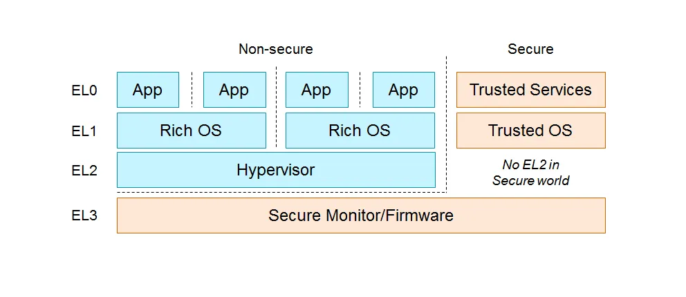

- [aarch64](https://github.com/arceos-hypervisor/arm_vcpu)

# arm_vcpu

## ARM 虚拟化简介

ARM 的硬件辅助虚拟化技术叫做 ARM-V (Virtualization) 技术，从 ARMv8 开始比较好的支持这种硬件辅助虚拟化技术。类似 X86 根/非根模式，ARM 引入多个异常级来控制资源访问权限。宿主机上 VMM 运行在 EL2 层，客户机操作系统运行在 EL1 层，应用程序运行在 EL0 层。

ARMv8 的异常级分为 4 级（EL0~EL3），权限也是从低到高。同时也分了两个 CPU 运行状态（Non-secure 和 Secure），顾名思义为了安全和非安全的运行态，此处不扩展。每一级运行的内容如下图所示：



运行在不同异常级最大的区别就是能够访问的寄存器组不同，同时也影响了某些硬件行为（比如对页表的 lookup）。运行在高异常级时可以访问低异常级的寄存器组，反之不行。
为了切换到更高的异常级（主动触发某个异常级的异常），需要主动执行特殊的指令：
• Supervisor Call (SVC)。一般由 EL0 切换到 EL1 的指令，会进入 EL1 的异常向量表。
• Hypervisor Call (HVC) 。Non-secure EL1 切换到 EL2 的指令，会进入到 EL2 的异常向量表。
• Secure monitor Call (SMC) 。切换到 EL3 的指令，只有在 EL1、EL2 执行有效。

## 项目概述

arm_vcpu 是 axvisor 项目的重要组成部分，特别为 ARM 架构设计的虚拟 CPU 实现。该项目提供了在 ARM64 架构上实现虚拟机（VM）的底层组件，使操作系统或 hypervisor 能够创建和管理虚拟 CPU，进而运行客户操作系统。

## 核心组件结构

### 主要模块

项目包含以下核心模块：

- **context_frame**: 定义了 ARM64 CPU 上下文帧结构
- **exception**: 处理异常和 VM 退出
- **exception_utils**: 提供异常处理的工具函数
- **pcpu**: 物理 CPU 相关功能的实现
- **smc**: 安全监视器调用实现
- **vcpu**: 虚拟 CPU 的核心实现

### 核心数据结构

#### Aarch64ContextFrame (src/context_frame.rs)

```rust
pub struct Aarch64ContextFrame {
    pub gpr: [u64; 31],      // 通用寄存器
    pub sp_el0: u64,         // EL0 栈指针
    pub elr: u64,            // 异常链接寄存器
    pub spsr: u64,           // 保存的程序状态寄存器
}
```

这个结构体代表了一个完整的 ARM64 CPU 上下文，包含了 CPU 的通用寄存器、栈指针、返回地址和状态标志。当发生 VM 切换时，这些寄存器需要保存和恢复。

#### GuestSystemRegisters (src/context_frame.rs)

```rust
pub struct GuestSystemRegisters {
    // 通用定时器相关寄存器
    pub cntvoff_el2: u64,
    cntp_cval_el0: u64,
    ...
    // 虚拟ID寄存器
    vpidr_el2: u32,
    pub vmpidr_el2: u64,

    // EL1/EL0 寄存器
    pub sp_el0: u64,
    sp_el1: u64,
    ...

    // Hypervisor上下文
    pub hcr_el2: u64,
    pub vttbr_el2: u64,
    ...
}
```

这个结构体包含了客户虚拟机的系统寄存器状态，包括定时器寄存器、CPU ID、异常控制、内存管理等。这些寄存器在 VM 进入/退出时需要保存和恢复。

#### Aarch64VCpu (src/vcpu.rs)

```rust
pub struct Aarch64VCpu<H: AxVCpuHal> {
    ctx: TrapFrame,
    host_stack_top: u64,
    guest_system_regs: GuestSystemRegisters,
    mpidr: u64,
    _phantom: PhantomData<H>,
}
```

Aarch64VCpu 是实现虚拟 CPU 的核心结构体，包含了虚拟 CPU 的完整状态：

- `ctx`: 保存客户 VM 的 CPU 上下文
- `host_stack_top`: 主机栈顶指针，用于 VM 退出时恢复主机上下文
- `guest_system_regs`: 客户系统寄存器状态
- `mpidr`: 多处理器 ID 寄存器值

## 关键功能实现

### VCPU 初始化和运行

VCPU 的初始化在 `Aarch64VCpu::new()` 方法中实现，设置初始化 CPU 寄存器和系统状态：

```rust
fn new(config: Self::CreateConfig) -> AxResult<Self> {
    let mut ctx = TrapFrame::default();
    ctx.set_argument(config.dtb_addr);

    Ok(Self {
        ctx,
        host_stack_top: 0,
        guest_system_regs: GuestSystemRegisters::default(),
        mpidr: config.mpidr_el1,
        _phantom: PhantomData,
    })
}
```

VCPU 的运行在 `run()` 方法中实现：

```rust
fn run(&mut self) -> AxResult<AxVCpuExitReason> {
    let exit_reson = unsafe {
        // 保存主机 SP_EL0 到上下文中
        save_host_sp_el0();
        self.restore_vm_system_regs();
        self.run_guest()
    };

    let trap_kind = TrapKind::try_from(exit_reson as u8).expect("Invalid TrapKind");
    self.vmexit_handler(trap_kind)
}
```

### 异常处理机制

异常处理是通过异常向量表和处理函数实现的。异常向量表在 `exception.S` 中定义：

```assembly
.section .text
.p2align 11
.global exception_vector_base_vcpu
exception_vector_base_vcpu:
    // current EL, with SP_EL0
    INVALID_EXCP_EL2 0 0
    ...
    // lower EL, aarch64
    HANDLE_LOWER_SYNC_VCPU
    HANDLE_LOWER_IRQ_VCPU
    ...
```

同步异常处理在 `handle_exception_sync` 函数中实现：

```rust
pub fn handle_exception_sync(ctx: &mut TrapFrame) -> AxResult<AxVCpuExitReason> {
    match exception_class() {
        Some(ESR_EL2::EC::Value::DataAbortLowerEL) => {
            let elr = ctx.exception_pc();
            let val = elr + exception_next_instruction_step();
            ctx.set_exception_pc(val);
            handle_data_abort(ctx)
        }
        Some(ESR_EL2::EC::Value::HVC64) => {
            // 处理超级调用
            ...
        }
        ...
    }
}
```

### VM 进入/退出流程

VM 进入是通过 `run_guest()` 函数实现的：

```rust
unsafe fn run_guest(&mut self) -> usize {
    unsafe {
        core::arch::asm!(
            // 保存主机上下文
            save_regs_to_stack!(),
            "mov x9, sp",
            "mov x10, x11",
            // 保存当前主机栈顶到 Aarch64VCpu 结构中
            "str x9, [x10]",
            "mov x0, x11",
            "b context_vm_entry",
            in("x11") &self.host_stack_top as *const _ as usize,
            options(nostack)
        );
    }

    // 返回值，实际返回值是在 x0 中，当 return_run_guest 返回时
    0
}
```

VM 退出是通过 `vmexit_handler()` 函数处理的：

```rust
fn vmexit_handler(&mut self, exit_reason: TrapKind) -> AxResult<AxVCpuExitReason> {
    unsafe {
        // 保存客户系统寄存器
        self.guest_system_regs.store();

        // 保存客户 SP_EL0 到 Aarch64VCpu 结构中
        self.ctx.sp_el0 = self.guest_system_regs.sp_el0;

        // 恢复主机的 SP_EL0
        restore_host_sp_el0();
    }

    match exit_reason {
        TrapKind::Synchronous => handle_exception_sync(&mut self.ctx),
        TrapKind::Irq => Ok(AxVCpuExitReason::ExternalInterrupt {
            vector: H::irq_fetch() as _,
        }),
        _ => panic!("Unhandled exception {:?}", exit_reason),
    }
}
```

### 物理 CPU 初始化

物理 CPU 初始化在 `Aarch64PerCpu::new()` 和 `hardware_enable()` 方法中实现：

```rust
fn hardware_enable(&mut self) -> AxResult {
    // 首先保存原始异常向量表基址
    unsafe { ORI_EXCEPTION_VECTOR_BASE.write_current_raw(VBAR_EL2.get() as usize) }

    // 设置当前 VBAR_EL2 为本 crate 中定义的 exception_vector_base_vcpu
    VBAR_EL2.set(exception_vector_base_vcpu as usize as _);

    // 启用虚拟化功能
    HCR_EL2.modify(
        HCR_EL2::VM::Enable
            + HCR_EL2::RW::EL1IsAarch64
            + HCR_EL2::IMO::EnableVirtualIRQ
            + HCR_EL2::FMO::EnableVirtualFIQ
            + HCR_EL2::TSC::EnableTrapEl1SmcToEl2,
    );

    Ok(())
}
```

## 关键机制解析

### 上下文切换机制

上下文切换是虚拟化的核心机制，包括以下步骤：

1. **VM 进入时**:

   - 保存主机上下文（通用寄存器、栈指针）
   - 加载客户 VM 上下文和系统寄存器
   - 通过 `eret` 指令切换到 VM 执行

2. **VM 退出时**:
   - 通过异常向量捕获退出事件
   - 保存客户 VM 上下文和系统寄存器
   - 恢复主机上下文
   - 返回 VM 退出原因

### 内存管理

虚拟 CPU 的内存管理主要通过 `EPT` (Extended Page Table) 或 ARM 中的第二阶段地址转换实现：

```rust
fn set_ept_root(&mut self, ept_root: HostPhysAddr) -> AxResult {
    debug!("set vcpu ept root:{:#x}", ept_root);
    self.guest_system_regs.vttbr_el2 = ept_root.as_usize() as u64;
    Ok(())
}
```

内存访问异常由 `handle_data_abort` 处理：

```rust
fn handle_data_abort(context_frame: &mut TrapFrame) -> AxResult<AxVCpuExitReason> {
    let addr = exception_fault_addr()?;
    let access_width = exception_data_abort_access_width();
    let is_write = exception_data_abort_access_is_write();
    let reg = exception_data_abort_access_reg();
    let reg_width = exception_data_abort_access_reg_width();

    // ...

    if is_write {
        return Ok(AxVCpuExitReason::MmioWrite {
            addr,
            width,
            data: context_frame.gpr(reg) as u64,
        });
    }
    Ok(AxVCpuExitReason::MmioRead {
        addr,
        width,
        reg,
        reg_width,
    })
}
```

### 中断和异常处理

中断和异常处理通过异常向量表和对应的处理函数实现。系统提供了以下主要异常处理路径：

1. **同步异常处理**：处理客户 VM 的指令执行异常
2. **中断处理**：处理物理中断并将其路由到适当的目标（主机或客户 VM）
3. **SMC 调用处理**：安全监控器调用的处理

## 附 1：参考资料

ARM 官方虚拟化手册：

- [Introduction to virtualization](https://developer.arm.com/documentation/102142/0100/Introduction-to-virtualization)
- [Armv8-A virtualization](https://developer.arm.com/-/media/Arm%20Developer%20Community/PDF/Learn%20the%20Architecture/Armv8-A%20virtualization.pdf?revision=a765a7df-1a00-434d-b241-357bfda2dd31)
