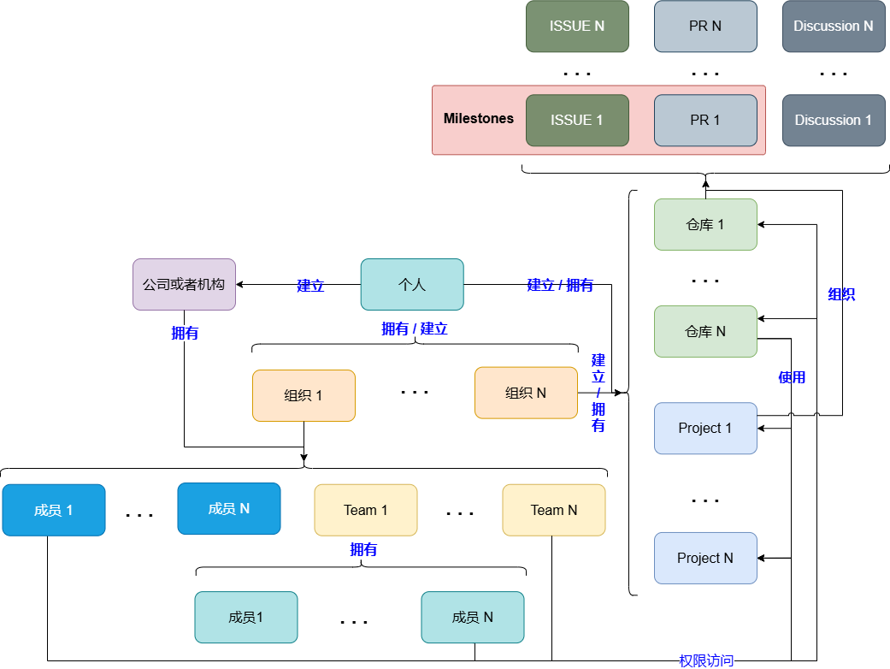

# 简介

AxVisor 的开发以 Github 的 Project 和 Milestones 作为开发任务和目标的管理及跟踪工具。Github 的组织结构框图如下图所示。

## GitHub Project

GitHub Project 是一个看板（Kanban）风格的任务管理工具，与 Issues、Pull Requests (PR)、仓库深度集成。Project 属于个人或者组织，不同的仓库可以共用同一个，它可以将不同仓库的 Issues 组织在一起提供管理。

## Milestones

GitHub 的 Milestone 主要用于指定仓库的 Issues 和 Pull Requests (PRs) 的版本或阶段管理。每个仓库的 Milestones 是独立的，它只能组织当前仓库里的各个 Issues 来提供管理。

## Issues

Issues 是 Project 和 Milestones 管理的基本单元，其分为了不同的类型，可以是 Task 也可以是 BUG。GitHub Project 和 Milestone 通过组织管理各个 Issues 的方式来提供开发任务和目标的管理及跟踪。

# AxVisor 开发

AxVisor 的开发目前主要涉及 [axvisor](https://github.com/arceos-hypervisor/axvisor) 和 [doc](https://github.com/arceos-hypervisor/doc) 这两个仓库，他们共用 [ArceOS Hypervisor Tasks](https://github.com/orgs/arceos-hypervisor/projects/3) 这个 Project 来组织所有的开发任务。而 [axvisor](https://github.com/arceos-hypervisor/axvisor) 和 [doc](https://github.com/arceos-hypervisor/doc) 中各有自己的 Milestone 来追踪阶段目标。

## 开发任务

两个仓库中的每个 Issue 都是一个开发的任务（以任务类型区分），其会有一个或多个人员负责开发跟进。

1. Issues 的内容描述基本开发情况

2. 以在 Issues 中评论的形式记录遇到问题

## 任务完成

每当完成一个 Issue 之后，要求在 Issue 中以评论的形式列出相关 Commit 的 HASH 作为自己任务的记录，然后关闭 Issue 即可

