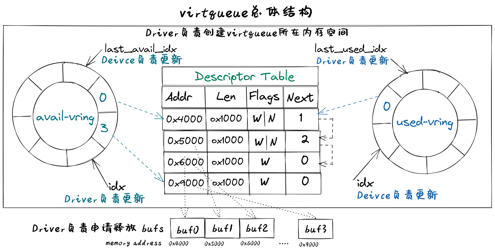

# Virtio-Device

## virtio设备的基本组成结构
virtio设备代表了一类I/O通用设备，为了让设备驱动能够管理和使用设备。在程序员的眼里，I/O设备基本组成结构包括如下恩利：
- 呈现模式：设备一般通过寄存器、内存或特定I/O指令等方式让设备驱动能看到和访问到设备；
- 特征描述：让设备驱动能够了解设备的静态特性（可通过软件修改），从而决定是否或如何使用该设备；
- 状态表示：让设备驱动能够了解设备的当前动态状态，从而确定如何进行设备管理或I/O数据传输；
- 交互机制：交互包括事件通知和数据传输；对于事件通知，让设备驱动及时获知设备的状态变化的机制（可基于中断等机制），以及让设备及时获得设备驱动发出的I/O请求（可基于寄存器读写等机制）；对于数据传输，让设备驱动能处理设备给出的数据，以及让设备能处理设备驱动给出的数据，如（可基于DMA或virtqueue等机制）。
virtio设备具体定义了设备驱动和设备之间的接口，包括设备呈现模式、设备状态域、特征位、通知、设备配置空间、虚拟队列等，覆盖了上述的基本接口描述。
## virtio设备的基本组成要素
virtio设备的基本组成要素如下：
- 设备状态域（Device status field）
- 特征位（Feature bits）
- 通知（Notifications）
- 设备配置空间（Device Configuration space）
- 一个或多个虚拟队列（virtqueue）
其中的设备特征位和设备配置空间属于virtio设备的特征描述；设备状态域属于virtio设备初始化时的状态表示；通知和虚拟队列属于virtio设备的交互机制，也包含virtio设备运行时的状态表示。
## virtio设备的呈现模式
virtio设备的基本组成要素如下：
- 设备状态域（Device status field）
- 特征位（Feature bits）
- 通知（Notifications）
- 设备配置空间（Device Configuration space）
- 一个或多个虚拟队列（virtqueue）
其中的设备特征位和设备配置空间属于virtio设备的特征描述；设备状态域属于virtio设备初始化时的状态表示；通知和虚拟队列属于virtio设备的交互机制，也包含virtio设备运行时的状态表示。
## virtio设备的特征描述
virtio设备特征描述包括设备特征位和设备配置空间。  
**特征位**  
特征位用于表示VirtIO设备具有的各种特性和功能。其中bit0 – 23是特定设备可以使用的feature bits， bit24 – 37预给队列和feature协商机制，bit38以上保留给未来其他用途。驱动程序与设备对设备特性进行协商，形成一致的共识，这样才能正确的管理设备。  
**设备配置空间**  
设备配置空间通常用于配置不常变动的设备参数（属性），或者初始化阶段需要设置的设备参数。设备的特征位中包含表示配置空间是否存在的bit位，并可通过在特征位的末尾添加新的bit位来扩展配置空间。
设备驱动程序在初始化virtio设备时，需要根据virtio设备的特征位和配置空间来了解设备的特征，并对设备进行初始化。
## virtio设备状态表示
virtio设备状态表示包括在设备初始化过程中用到的设备状态域，以及在设备进行I/O传输过程中用到的I/O数据访问状态信息和I/O完成情况等。  
**设备状态域**
设备状态域包含对设备初始化过程中virtio设备的6种状态：
- ACKNOWLEDGE（1）：驱动程序发现了这个设备，并且认为这是一个有效的virtio设备；
- DRIVER (2) : 驱动程序知道该如何驱动这个设备；
- FAILED (128) : 由于某种错误原因，驱动程序无法正常驱动这个设备；
- FEATURES_OK (8) : 驱动程序认识设备的特征，并且与设备就设备特征协商达成一致；
- DRIVER_OK (4) : 驱动程序加载完成，设备可以正常工作了；
- DEVICE_NEEDS_RESET (64) ：设备触发了错误，需要重置才能继续工作。
在设备驱动程序对virtio设备初始化的过程中，需要经历一系列的初始化阶段，这些阶段对应着设备状态域的不同状态。  
**I/O传输状态**  
设备驱动程序控制virtio设备进行I/O传输过程中，会经历一系列过程和执行状态，包括 I/O请求状态、 I/O处理状态、 I/O完成状态、I/O错误状态、 I/O后续处理状态等。设备驱动程序在执行过程中，需要对上述状态进行不同的处理。
virtio设备进行I/O传输过程中，设备驱动会指出 I/O请求队列的当前位置状态信息，这样设备能查到I/O请求的信息，并根据 I/O请求进行I/O传输；而设备会指出 I/O完成队列的当前位置状态信息，这样设备驱动通过读取 I/O完成数据结构中的状态信息，就知道设备是否完成I/O请求的相应操作，并进行后续事务处理。
比如，virtio_blk设备驱动发出一个读设备块的I/O请求，并在某确定位置给出这个I/O请求的地址，然后给设备发出’kick’通知(读或写相关I/O寄存器映射的内存地址)，此时处于I/O请求状态；设备在得到通知后，此时处于 I/O处理状态，它解析这个I/O请求，完成这个I/O请求的处理，即把磁盘块内容读入到内存中，并给出读出的块数据的内存地址，再通过中断通知设备驱动，此时处于 I/O完成状态；如果磁盘块读取发生错误，此时处于 I/O错误状态；设备驱动通过中断处理例程，此时处于 I/O后续处理状态，设备驱动知道设备已经完成读磁盘块操作，会根据磁盘块数据所在内存地址，把数据传递给文件系统进行进一步处理；如果设备驱动发现磁盘块读错误，则会进行错误恢复相关的后续处理。
## virtio设备交互机制
virtio设备交互机制包括基于Notifications的事件通知和基于virtqueue虚拟队列的数据传输。事件通知是指设备和驱动程序必须通知对方，它们有数据需要对方处理。数据传输是指设备和驱动程序之间进行I/O数据（如磁盘块数据、网络包）传输。  
**Notification通知**  
驱动程序和设备在交互过程中需要相互通知对方：驱动程序组织好相关命令/信息要通知设备去处理I/O事务，设备处理完I/O事务后，要通知驱动程序进行后续事务，如回收内存，向用户进程反馈I/O事务的处理结果等。
驱动程序通知设备可用``门铃 doorbell``机制，即采用PIO或MMIO方式访问设备特定寄存器，QEMU进行拦截再通知其模拟的设备。设备通知驱动程序一般用中断机制，即在QEMU中进行中断注入，让CPU响应并执行中断处理例程，来完成对I/O执行结果的处理。  
**virtqueue虚拟队列**  
在virtio设备上进行批量数据传输的机制被称为虚拟队列（virtqueue），virtio设备的虚拟队列（virtqueue）可以由各种数据结构（如数组、环形队列等）来具体实现。每个virtio设备可以拥有零个或多个virtqueue，每个virtqueue占用多个物理页，可用于设备驱动程序给设备发I/O请求命令和相关数据（如磁盘块读写请求和读写缓冲区），也可用于设备给设备驱动程序发I/O数据（如接收的网络包）。  
## virtqueue虚拟队列
virtio协议中一个关键部分是virtqueue，在virtio规范中，virtqueue是virtio设备上进行批量数据传输的机制和抽象表示。在设备驱动实现和Qemu中virtio设备的模拟实现中，virtqueue是一种数据结构，用于设备和驱动程序中执行各种数据传输操作。
操作系统在Qemu上运行时，virtqueue是 virtio 驱动程序和 virtio 设备访问的同一块内存区域。
当涉及到 virtqueue 的描述时，有很多不一致的地方。有将其与vring（virtio-rings或VRings）等同表示，也有将二者分别单独描述为不同的对象。我们将在这里单独描述它们，因为vring是virtqueues的主要组成部分，是达成virtio设备和驱动程序之间数据传输的数据结构， vring本质是virtio设备和驱动程序之间的共享内存，但 virtqueue 不仅仅只有vring。
virtqueue由三部分组成（如下图所示）：
- 描述符表 Descriptor Table：描述符表是描述符为组成元素的数组，每个描述符描述了一个内存buffer 的address/length。而内存buffer中包含I/O请求的命令/数据（由virtio设备驱动填写），也可包含I/O完成的返回结果（由virtio设备填写）等。
- 可用环 Available Ring：一种vring，记录了virtio设备驱动程序发出的I/O请求索引，即被virtio设备驱动程序更新的描述符索引的集合，需要virtio设备进行读取并完成相关I/O操作；
- 已用环 Used Ring：另一种vring，记录了virtio设备发出的I/O完成索引，即被virtio设备更新的描述符索引的集合，需要vrtio设备驱动程序进行读取并对I/O操作结果进行进一步处理。

**描述符表 Descriptor Table**  
描述符表用来指向virtio设备I/O传输请求的缓冲区（buffer）信息，由 Queue Size 个Descriptor（描述符）组成。描述符中包括buffer的物理地址 – addr字段，buffer的长度 – len字段，可以链接到 next Descriptor 的next指针（用于把多个描述符链接成描述符链）。buffer所在物理地址空间需要设备驱动程序在初始化时分配好，并在后续由设备驱动程序在其中填写IO传输相关的命令/数据，或者是设备返回I/O操作的结果。多个描述符（I/O操作命令，I/O操作数据块，I/O操作的返回结果）形成的描述符链可以表示一个完整的I/O操作请求。  
**可用环 Available Ring**  
可用环在结构上是一个环形队列，其中的条目（item）仅由驱动程序写入，并由设备读出。可用环中的条目包含了一个描述符链的头部描述符的索引值。可用环用头指针（idx）和尾指针（last_avail_idx）表示其可用条目范围。virtio设备通过读取可用环中的条目可获取驱动程序发出的I/O操作请求对应的描述符链，然后virtio设备就可以进行进一步的I/O处理了。描述符指向的缓冲区具有可读写属性，可读的缓冲区用于Driver发送数据，可写的缓冲区用于接收数据。
比如，对于virtio-blk设备驱动发出的一个读I/O操作请求包含了三部分内容，由三个buffer承载，需要用到三个描述符 ：（1） “读磁盘块”，（2）I/O操作数据块 – “数据缓冲区”，（3）I/O操作的返回结果 –“结果缓冲区”）。这三个描述符形成的一个完成的I/O请求链，virtio-blk从设备可通过读取第一个描述符指向的缓冲区了解到是“读磁盘块”操作，这样就可把磁盘块数据通过DMA操作放到第二个描述符指向的“数据缓冲区”中，然后把“OK”写入到第三个描述符指向的“结果缓冲区”中。   
**已用环 Used Ring**  
已用环在结构上是一个环形队列，其中的的条目仅由virtio设备写入，并由驱动程序读出。已用环中的条目也一个是描述符链的头部描述符的索引值。已用环也有头指针（idx）和尾指针（last_avail_idx）表示其已用条目的范围。
比如，对于virtio-blk设备驱动发出的一个读I/O操作请求（由三个描述符形成的请求链）后，virtio设备完成相应I/O处理，即把磁盘块数据写入第二个描述符指向的“数据缓冲区”中，可用环中对应的I/O请求条目“I/O操作的返回结果”的描述符索引值移入到已用环中，把“OK”写入到第三个描述符指向的“结果缓冲区”中，再在已用环中添加一个已用条目，即I/O操作完成信息；然后virtio设备通过中断机制来通知virtio驱动程序，并让virtio驱动程序读取已用环中的描述符，获得I/O操作完成信息，即磁盘块内容。
上面主要说明了virqueue中的各个部分的作用。对如何基于virtqueue进行I/O操作的过程还缺乏一个比较完整的描述。我们把上述基于virtqueue进行I/O操作的过程小结一下，大致需要如下步骤：  
1. 初始化过程：（驱动程序执行）  
1.1 virtio设备驱动在对设备进行初始化时，会申请virtqueue（包括描述符表、可用环、已用环）的内存空间；  
1.2 并把virtqueue中的描述符、可用环、已用环三部分的物理地址分别写入到virtio设备中对应的控制寄存器（即设备绑定的特定内存地址）中。至此，设备驱动和设备就共享了整个virtqueue的内存空间。  
2. I/O请求过程：（驱动程序执行）  
2.1 设备驱动在发出I/O请求时，首先把I/O请求的命令/数据等放到一个或多个buffer中；  
2.2 然后在描述符表中分配新的描述符（或描述符链）来指向这些buffer；  
2.3 再把描述符（或描述符链的首描述符）的索引值写入到可用环中，更新可用环的idx指针；  
2.4 驱动程序通过kick机制（即写virtio设备中特定的通知控制寄存器）来通知设备有新请求；  
3. I/O完成过程：（设备执行）  
3.1 virtio设备通过kick机制（知道有新的I/O请求，通过访问可用环的idx指针，解析出I/O请求；  
3.2 根据I/O请求内容完成I/O请求，并把I/O操作的结果放到I/O请求中相应的buffer中；  
3.3 再把描述符（或描述符链的首描述符）的索引值写入到已用环中，更新已用环的idx指针；  
3.4 设备通过再通过中断机制来通知设备驱动程序有I/O操作完成；  
4. I/O后处理过程：（驱动程序执行）  
4.1 设备驱动程序读取已用环的idx信息，读取已用环中的描述符索引，获得I/O操作完成信息。  