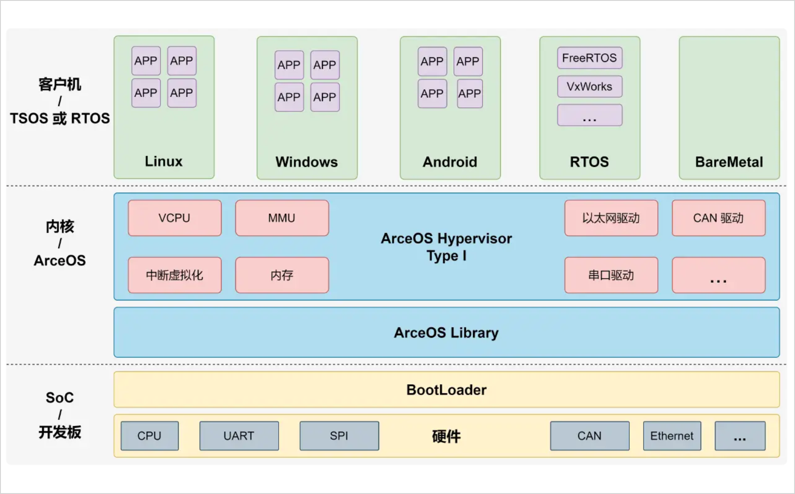

## 概述

AxVisor 是一个基于 [ArceOS](https://github.com/arceos-org/arceos) 框架实现的 Hypervisor（也叫 Virtual Machine Manager，VMM）。其目标是利用 ArceOS 提供的基础操作系统功能作为基础实现一个统一的模块化 Hypervisor。

**统一**是指使用同一套代码同时支持 x86_64、AArch64 、RISC-V LoongArch 这四种架构，以最大化复用架构无关代码，简化代码开发和维护成本。

**模块化**则是指 Hypervisor 的功能被分解为多个模块，每个模块实现一个特定的功能，模块之间通过标准接口进行通信，以实现功能的解耦和复用。
