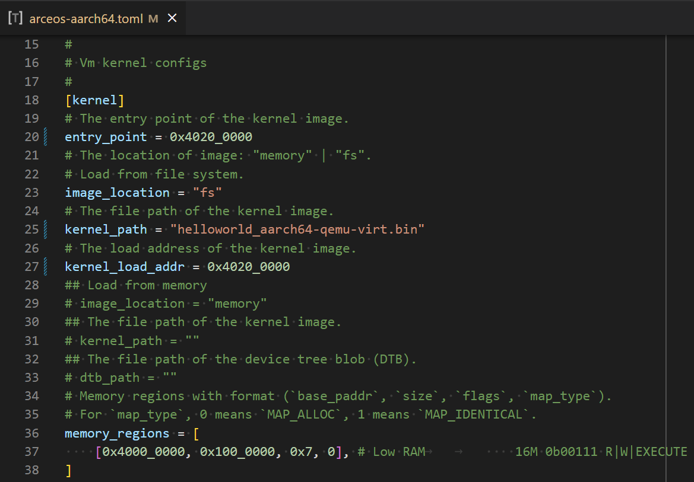
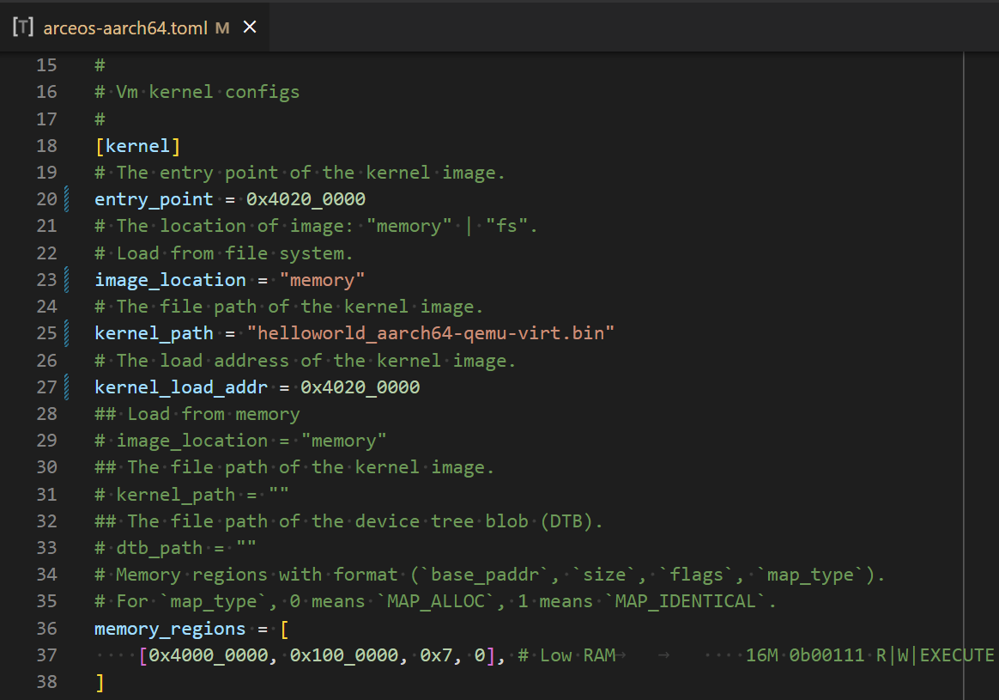
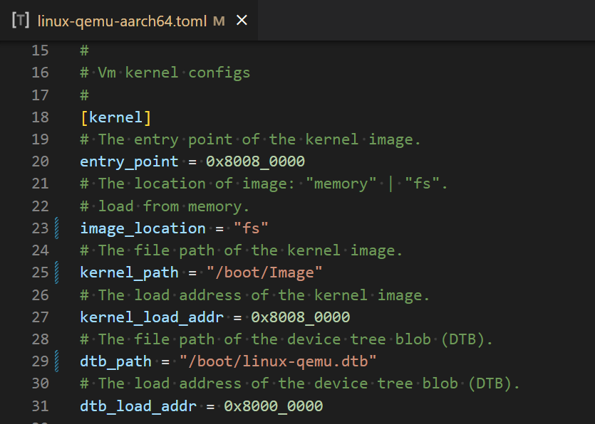
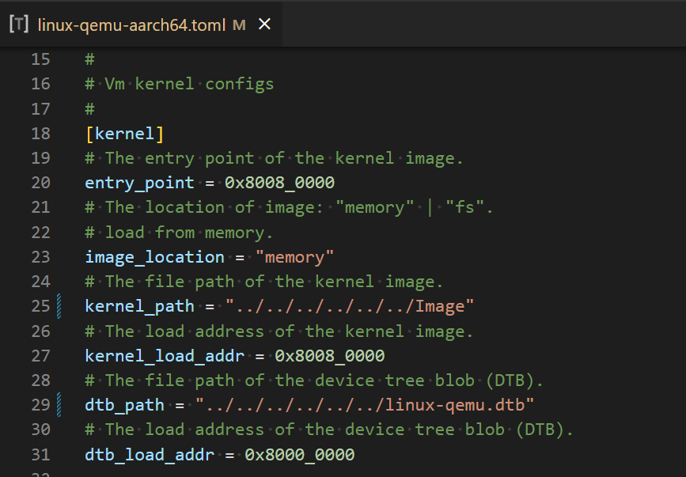

# Run AxVisor on QEMU AArch64

目前，在 QEMU AArch64 平台上已经对独立运行 ArceOS 和 Linux 以及同时运行 ArceOS + Linux 的情况进行了验证。

## ArceOS

### 准备 ArceOS 镜像

1. 获取 ArceOS 主线代码 `git clone https://github.com/arceos-org/arceos.git  `

2. 在 `arceos` 源码目录中执行 `make PLATFORM=aarch64-qemu-virt SMP=1 A=examples/helloworld` 获得 `examples/helloworld/helloworld_aarch64-qemu-virt.bin`

### 从文件系统加载运行

获取 AxVisor 主线代码 `git clone git@github.com:arceos-hypervisor/axvisor.git`，然后在 `axvisor` 源码目录中执行如下步骤：

1. 制作一个磁盘镜像文件，并将 ArceOS 客户机镜像放到磁盘镜像文件系统中

   1. 使用 `make disk_img` 命令生成一个空的 FAT32 磁盘镜像文件 `disk.img`

   2. 手动挂载 `disk.img`，然后将ArceOS 客户机镜像复制到该文件系统中即可

      ```bash
      $ mkdir -p tmp
      $ sudo mount disk.img tmp
      $ sudo cp /path/to/helloworld_aarch64-qemu-virt.bin tmp/
      $ sudo umount tmp
      ```

2. 修改对应的 `./configs/vms/arceos-aarch64.toml` 文件中的配置项
   
   - `image_location="fs"` 表示从文件系统加载
   - `kernel_path` 指出内核镜像在文件系统中的路径
   - `entry_point` 指出内核镜像的入口地址。必须与上面构建的 ArceOS 内核镜像的入口地址一致
   - `kernel_load_addr` 指出内核镜像的加载地址。默认与 `entry_point` 一致
   - 其他

3. 执行 `make ACCEL=n ARCH=aarch64 LOG=info VM_CONFIGS=configs/vms/arceos-aarch64.toml FEATURES=page-alloc-64g APP_FEATURES=fs run` 构建 AxVisor，并在 QEMU 中启动。
   ```plaintext
          d8888                            .d88888b.   .d8888b.
         d88888                           d88P" "Y88b d88P  Y88b
        d88P888                           888     888 Y88b.
       d88P 888 888d888  .d8888b  .d88b.  888     888  "Y888b.
      d88P  888 888P"   d88P"    d8P  Y8b 888     888     "Y88b.
     d88P   888 888     888      88888888 888     888       "888
    d8888888888 888     Y88b.    Y8b.     Y88b. .d88P Y88b  d88P
   d88P     888 888      "Y8888P  "Y8888   "Y88888P"   "Y8888P"

   arch = aarch64
   platform = aarch64-qemu-virt-hv
   target = aarch64-unknown-none-softfloat
   build_mode = release
   log_level = info
   smp = 1

   [  0.026671 0 axruntime:130] Logging is enabled.
   [  0.030603 0 axruntime:131] Primary CPU 0 started, dtb = 0x48000000.
   [  0.032814 0 axruntime:133] Found physcial memory regions:
   [  0.037037 0 axruntime:135]   [PA:0x40080000, PA:0x400f7000) .text (READ | EXECUTE | RESERVED)
   [  0.042297 0 axruntime:135]   [PA:0x400f7000, PA:0x4010e000) .rodata (READ | RESERVED)
   [  0.043895 0 axruntime:135]   [PA:0x4010e000, PA:0x40114000) .data .tdata .tbss .percpu (READ | WRITE | RESERVED)
   [  0.045030 0 axruntime:135]   [PA:0x40114000, PA:0x40154000) boot stack (READ | WRITE | RESERVED)
   [  0.045793 0 axruntime:135]   [PA:0x40154000, PA:0x4037a000) .bss (READ | WRITE | RESERVED)
   [  0.046483 0 axruntime:135]   [PA:0x4037a000, PA:0xc0000000) free memory (READ | WRITE | FREE)
   [  0.047186 0 axruntime:135]   [PA:0x9000000, PA:0x9001000) mmio (READ | WRITE | DEVICE | RESERVED)
   [  0.047848 0 axruntime:135]   [PA:0x9040000, PA:0x9041000) mmio (READ | WRITE | DEVICE | RESERVED)
   [  0.048408 0 axruntime:135]   [PA:0x9100000, PA:0x9101000) mmio (READ | WRITE | DEVICE | RESERVED)
   [  0.049346 0 axruntime:135]   [PA:0x8000000, PA:0x8020000) mmio (READ | WRITE | DEVICE | RESERVED)
   [  0.051424 0 axruntime:135]   [PA:0x80a0000, PA:0x9000000) mmio (READ | WRITE | DEVICE | RESERVED)
   [  0.054944 0 axruntime:135]   [PA:0xa000000, PA:0xa004000) mmio (READ | WRITE | DEVICE | RESERVED)
   [  0.056959 0 axruntime:135]   [PA:0x10000000, PA:0x3eff0000) mmio (READ | WRITE | DEVICE | RESERVED)
   [  0.060560 0 axruntime:135]   [PA:0x4010000000, PA:0x4020000000) mmio (READ | WRITE | DEVICE | RESERVED)
   [  0.061472 0 axruntime:210] Initialize global memory allocator...
   [  0.062434 0 axruntime:211]   use TLSF allocator.
   [  0.078002 0 axmm:72] Initialize virtual memory management...
   [  0.216673 0 axruntime:150] Initialize platform devices...
   [  0.218110 0 axhal::platform::aarch64_common::gic:67] Initialize GICv2...
   [  0.221323 0 axtask::api:73] Initialize scheduling...
   [  0.226226 0 axtask::api:79]   use FIFO scheduler.
   [  0.228036 0 axdriver:152] Initialize device drivers...
   [  0.229797 0 axdriver:153]   device model: static
   [  0.238770 0 virtio_drivers::device::blk:59] config: 0x1000e000
   [  0.241120 0 virtio_drivers::device::blk:64] found a block device of size 65536KB
   [  0.244094 0 axdriver::bus::pci:104] registered a new Block device at 00:02.0: "virtio-blk"
   [  0.315513 0 axfs:41] Initialize filesystems...
   [  0.316784 0 axfs:44]   use block device 0: "virtio-blk"
   [  0.412744 0 fatfs::dir:139] Is a directory
   [  0.532571 0 fatfs::dir:139] Is a directory
   [  0.678550 0 fatfs::dir:139] Is a directory
   [  0.800224 0 fatfs::dir:139] Is a directory
   [  0.833608 0 axruntime:176] Initialize interrupt handlers...
   [  0.835091 0 axruntime:188] Primary CPU 0 init OK.


          d8888            888     888  d8b
         d88888            888     888  Y8P
        d88P888            888     888
       d88P 888  888  888  Y88b   d88P  888  .d8888b    .d88b.   888d888
      d88P  888  `Y8bd8P'   Y88b d88P   888  88K       d88""88b  888P"
     d88P   888    X88K      Y88o88P    888  "Y8888b.  888  888  888
    d8888888888  .d8""8b.     Y888P     888       X88  Y88..88P  888
   d88P     888  888  888      Y8P      888   88888P'   "Y88P"   888


   by AxVisor Team

   [  0.844266 0:2 axvisor:21] Starting virtualization...
   [  0.847236 0:2 axvisor:22] Hardware support: true
   [  0.851891 0:4 axvisor::vmm::timer:101] Initing HV Timer...
   [  0.853759 0:4 axvisor::hal:117] Hardware virtualization support enabled on core 0
   [  0.891982 0:2 axvisor::vmm::config:33] Creating VM[1] "arceos"
   [  0.895635 0:2 axvm::vm:114] Setting up memory region: [0x40000000~0x41000000] READ | WRITE | EXECUTE
   [  0.915957 0:2 axvm::vm:166] Setting up passthrough device memory region: [0x8000000~0x8050000] -> [0x8000000~0x8050000]
   [  0.921497 0:2 axvm::vm:166] Setting up passthrough device memory region: [0x9000000~0x9001000] -> [0x9000000~0x9001000]
   [  0.925821 0:2 axvm::vm:166] Setting up passthrough device memory region: [0x9010000~0x9011000] -> [0x9010000~0x9011000]
   [  0.928866 0:2 axvm::vm:166] Setting up passthrough device memory region: [0x9030000~0x9031000] -> [0x9030000~0x9031000]
   [  0.931846 0:2 axvm::vm:166] Setting up passthrough device memory region: [0xa000000~0xa004000] -> [0xa000000~0xa004000]
   [  0.936781 0:2 axvm::vm:202] VM[1] created
   [  0.938588 0:2 axvm::vm:217] VM[1] vcpus set up
   [  0.940546 0:2 axvisor::vmm::config:40] VM[1] created success, loading images...
   [  0.943211 0:2 axvisor::vmm::images::fs:116] Loading VM images from filesystem
   [  0.997938 0:2 axvisor::vmm:35] Setting up vcpus...
   [  0.999510 0:2 axvisor::vmm::vcpus:219] Initializing VM[1]'s 1 vcpus
   [  1.001594 0:2 axvisor::vmm::vcpus:250] Spawning task for VM[1] VCpu[0]
   [  1.004343 0:2 axvisor::vmm::vcpus:262] VCpu task Task(5, "VM[1]-VCpu[0]") created cpumask: [0, ]
   [  1.009453 0:2 axvisor::vmm:43] VMM starting, booting VMs...
   [  1.012226 0:2 axvm::vm:284] Booting VM[1]
   [  1.013603 0:2 axvisor::vmm:49] VM[1] boot success
   [  1.015686 0:2 axvisor::vmm:60] a VM exited, current running VM count: 1
   [  1.018355 0:5 axvisor::vmm::vcpus:283] VM[1] VCpu[0] waiting for running
   [  1.020426 0:5 axvisor::vmm::vcpus:286] VM[1] VCpu[0] running...

          d8888                            .d88888b.   .d8888b.
         d88888                           d88P" "Y88b d88P  Y88b
        d88P888                           888     888 Y88b.
       d88P 888 888d888  .d8888b  .d88b.  888     888  "Y888b.
      d88P  888 888P"   d88P"    d8P  Y8b 888     888     "Y88b.
     d88P   888 888     888      88888888 888     888       "888
    d8888888888 888     Y88b.    Y8b.     Y88b. .d88P Y88b  d88P
   d88P     888 888      "Y8888P  "Y8888   "Y88888P"   "Y8888P"

   arch = aarch64
   platform = aarch64-qemu-virt
   target = aarch64-unknown-none-softfloat
   build_mode = release
   log_level = warn
   smp = 1

   Hello, world!
   [  1.042124 0:5 axvisor::vmm::vcpus:351] VM[1] run VCpu[0] SystemDown
   [  1.043404 0:5 axvm::vm:306] Shutting down VM[1]
   [  1.044071 0:5 axvisor::vmm::vcpus:366] VM[1] VCpu[0] shutting down because of VM shutdown
   [  1.045588 0:5 axvisor::vmm::vcpus:372] VM[1] VCpu[0] last VCpu exiting, decreasing running VM count
   [  1.048335 0:5 axvisor::vmm::vcpus:385] VM[1] VCpu[0] exiting...
   [  1.050766 0:2 axvisor::vmm:60] a VM exited, current running VM count: 0
   [  1.056315 0:2 axvisor:28] VMM shutdown
   [  1.058493 0:2 axhal::platform::aarch64_common::psci:98] Shutting down...
   ```

### 从内存加载运行

获取 AxVisor 主线代码 `git clone git@github.com:arceos-hypervisor/axvisor.git`，然后在 `axvisor` 源码目录中执行如下步骤：

1. 修改对应的 `./configs/vms/arceos-aarch64.toml` 中的配置项
   
   - `image_location="memory"` 配置项
   - `kernel_path` 指定内核镜像在工作空间中的相对/绝对路径
   - `entry_point` 指出内核镜像的入口地址。必须与上面构建的 ArceOS 内核镜像的入口地址一致
   - `kernel_load_addr` 指出内核镜像的加载地址。默认与 `entry_point` 一致
   - 其他

2. 执行 `make ACCEL=n ARCH=aarch64 LOG=info VM_CONFIGS=configs/vms/arceos-aarch64.toml FEATURES=page-alloc-64g run` 构建 AxVisor，并在 QEMU 中启动。
   ```plaintext
          d8888                            .d88888b.   .d8888b.
         d88888                           d88P" "Y88b d88P  Y88b
        d88P888                           888     888 Y88b.
       d88P 888 888d888  .d8888b  .d88b.  888     888  "Y888b.
      d88P  888 888P"   d88P"    d8P  Y8b 888     888     "Y88b.
     d88P   888 888     888      88888888 888     888       "888
    d8888888888 888     Y88b.    Y8b.     Y88b. .d88P Y88b  d88P
   d88P     888 888      "Y8888P  "Y8888   "Y88888P"   "Y8888P"

   arch = aarch64
   platform = aarch64-qemu-virt-hv
   target = aarch64-unknown-none-softfloat
   build_mode = release
   log_level = info
   smp = 1

   [  0.021736 0 axruntime:130] Logging is enabled.
   [  0.025410 0 axruntime:131] Primary CPU 0 started, dtb = 0x48000000.
   [  0.027128 0 axruntime:133] Found physcial memory regions:
   [  0.028879 0 axruntime:135]   [PA:0x40080000, PA:0x400d8000) .text (READ | EXECUTE | RESERVED)
   [  0.031793 0 axruntime:135]   [PA:0x400d8000, PA:0x400f2000) .rodata (READ | RESERVED)
   [  0.036048 0 axruntime:135]   [PA:0x400f2000, PA:0x400f8000) .data .tdata .tbss .percpu (READ | WRITE | RESERVED)
   [  0.038951 0 axruntime:135]   [PA:0x400f8000, PA:0x40138000) boot stack (READ | WRITE | RESERVED)
   [  0.040153 0 axruntime:135]   [PA:0x40138000, PA:0x4035e000) .bss (READ | WRITE | RESERVED)
   [  0.042131 0 axruntime:135]   [PA:0x4035e000, PA:0xc0000000) free memory (READ | WRITE | FREE)
   [  0.043906 0 axruntime:135]   [PA:0x9000000, PA:0x9001000) mmio (READ | WRITE | DEVICE | RESERVED)
   [  0.045526 0 axruntime:135]   [PA:0x9040000, PA:0x9041000) mmio (READ | WRITE | DEVICE | RESERVED)
   [  0.047555 0 axruntime:135]   [PA:0x9100000, PA:0x9101000) mmio (READ | WRITE | DEVICE | RESERVED)
   [  0.051030 0 axruntime:135]   [PA:0x8000000, PA:0x8020000) mmio (READ | WRITE | DEVICE | RESERVED)
   [  0.056637 0 axruntime:135]   [PA:0x80a0000, PA:0x9000000) mmio (READ | WRITE | DEVICE | RESERVED)
   [  0.060144 0 axruntime:135]   [PA:0xa000000, PA:0xa004000) mmio (READ | WRITE | DEVICE | RESERVED)
   [  0.062063 0 axruntime:135]   [PA:0x10000000, PA:0x3eff0000) mmio (READ | WRITE | DEVICE | RESERVED)
   [  0.063681 0 axruntime:135]   [PA:0x4010000000, PA:0x4020000000) mmio (READ | WRITE | DEVICE | RESERVED)
   [  0.066328 0 axruntime:210] Initialize global memory allocator...
   [  0.068462 0 axruntime:211]   use TLSF allocator.
   [  0.077102 0 axmm:72] Initialize virtual memory management...
   [  0.226528 0 axruntime:150] Initialize platform devices...
   [  0.228998 0 axhal::platform::aarch64_common::gic:67] Initialize GICv2...
   [  0.234025 0 axtask::api:73] Initialize scheduling...
   [  0.238040 0 axtask::api:79]   use FIFO scheduler.
   [  0.239553 0 axruntime:176] Initialize interrupt handlers...
   [  0.244411 0 axruntime:188] Primary CPU 0 init OK.


          d8888            888     888  d8b
         d88888            888     888  Y8P
        d88P888            888     888
       d88P 888  888  888  Y88b   d88P  888  .d8888b    .d88b.   888d888
      d88P  888  `Y8bd8P'   Y88b d88P   888  88K       d88""88b  888P"
     d88P   888    X88K      Y88o88P    888  "Y8888b.  888  888  888
    d8888888888  .d8""8b.     Y888P     888       X88  Y88..88P  888
   d88P     888  888  888      Y8P      888   88888P'   "Y88P"   888


   by AxVisor Team

   [  0.263070 0:2 axvisor:21] Starting virtualization...
   [  0.264035 0:2 axvisor:22] Hardware support: true
   [  0.268266 0:4 axvisor::vmm::timer:101] Initing HV Timer...
   [  0.270992 0:4 axvisor::hal:117] Hardware virtualization support enabled on core 0
   [  0.324476 0:2 axvisor::vmm::config:33] Creating VM[1] "arceos"
   [  0.328098 0:2 axvm::vm:114] Setting up memory region: [0x40000000~0x41000000] READ | WRITE | EXECUTE
   [  0.335931 0:2 axvm::vm:166] Setting up passthrough device memory region: [0x8000000~0x8050000] -> [0x8000000~0x8050000]
   [  0.338925 0:2 axvm::vm:166] Setting up passthrough device memory region: [0x9000000~0x9001000] -> [0x9000000~0x9001000]
   [  0.341417 0:2 axvm::vm:166] Setting up passthrough device memory region: [0x9010000~0x9011000] -> [0x9010000~0x9011000]
   [  0.344477 0:2 axvm::vm:166] Setting up passthrough device memory region: [0x9030000~0x9031000] -> [0x9030000~0x9031000]
   [  0.348120 0:2 axvm::vm:166] Setting up passthrough device memory region: [0xa000000~0xa004000] -> [0xa000000~0xa004000]
   [  0.352530 0:2 axvm::vm:202] VM[1] created
   [  0.354438 0:2 axvm::vm:217] VM[1] vcpus set up
   [  0.356409 0:2 axvisor::vmm::config:40] VM[1] created success, loading images...
   [  0.359031 0:2 axvisor::vmm::images:26] Loading VM[1] images from memory
   [  0.376919 0:2 axvisor::vmm:35] Setting up vcpus...
   [  0.380177 0:2 axvisor::vmm::vcpus:219] Initializing VM[1]'s 1 vcpus
   [  0.383394 0:2 axvisor::vmm::vcpus:250] Spawning task for VM[1] VCpu[0]
   [  0.388556 0:2 axvisor::vmm::vcpus:262] VCpu task Task(5, "VM[1]-VCpu[0]") created cpumask: [0, ]
   [  0.394718 0:2 axvisor::vmm:43] VMM starting, booting VMs...
   [  0.396902 0:2 axvm::vm:284] Booting VM[1]
   [  0.398535 0:2 axvisor::vmm:49] VM[1] boot success
   [  0.399462 0:2 axvisor::vmm:60] a VM exited, current running VM count: 1
   [  0.402424 0:5 axvisor::vmm::vcpus:283] VM[1] VCpu[0] waiting for running
   [  0.409453 0:5 axvisor::vmm::vcpus:286] VM[1] VCpu[0] running...

          d8888                            .d88888b.   .d8888b.
         d88888                           d88P" "Y88b d88P  Y88b
        d88P888                           888     888 Y88b.
       d88P 888 888d888  .d8888b  .d88b.  888     888  "Y888b.
      d88P  888 888P"   d88P"    d8P  Y8b 888     888     "Y88b.
     d88P   888 888     888      88888888 888     888       "888
    d8888888888 888     Y88b.    Y8b.     Y88b. .d88P Y88b  d88P
   d88P     888 888      "Y8888P  "Y8888   "Y88888P"   "Y8888P"

   arch = aarch64
   platform = aarch64-qemu-virt
   target = aarch64-unknown-none-softfloat
   build_mode = release
   log_level = warn
   smp = 1

   Hello, world!
   [  0.432406 0:5 axvisor::vmm::vcpus:351] VM[1] run VCpu[0] SystemDown
   [  0.434339 0:5 axvm::vm:306] Shutting down VM[1]
   [  0.436329 0:5 axvisor::vmm::vcpus:366] VM[1] VCpu[0] shutting down because of VM shutdown
   [  0.438751 0:5 axvisor::vmm::vcpus:372] VM[1] VCpu[0] last VCpu exiting, decreasing running VM count
   [  0.441505 0:5 axvisor::vmm::vcpus:385] VM[1] VCpu[0] exiting...
   [  0.446299 0:2 axvisor::vmm:60] a VM exited, current running VM count: 0
   [  0.449252 0:2 axvisor:28] VMM shutdown
   [  0.452352 0:2 axhal::platform::aarch64_common::psci:98] Shutting down...
   ```

## NimbOS

### 准备 NimbOS 镜像

[NimbOS](https://github.com/arceos-hypervisor/nimbos  ) 仓库的 [release](https://github.com/arceos-hypervisor/nimbos/releases/  ) 页面已经编译生成了可以直接运行的 NimbOS 二进制镜像文件压缩包：

* 不带 `_usertests` 后缀的 NimbOS 二进制镜像包中编译的 NimbOS 启动后会进入 NimbOS 的 shell，本示例启动的就是这个 NimbOS
* 带 `usertests` 后缀的 NimbOS 二进制镜像压缩包中编译的 NimbOS 启动后会自动运行用户态测例用于测试，这个镜像用于 AxVisor 的CI测试，见 [setup-nimbos-guest-image/action.yml](https://github.com/arceos-hypervisor/axvisor/blob/master/.github/workflows/actions/setup-nimbos-guest-image/action.yml  )

### 从文件系统加载运行

获取 AxVisor 主线代码 `git clone git@github.com:arceos-hypervisor/axvisor.git`，然后在 `axvisor` 源码目录中执行如下步骤：

1. 制作一个磁盘镜像文件，并将客户机镜像放到文件系统中

   1. 使用 `make disk_img` 命令生成一个空的 FAT32 磁盘镜像文件 `disk.img`

   2. 手动挂载 `disk.img`，然后拉取并解压二进制镜像

      ```bash
      $ mkdir -p tmp
      $ sudo mount disk.img tmp
      $ wget https://github.com/arceos-hypervisor/nimbos/releases/download/v0.7/aarch64.zip  
      $ unzip aarch64.zip # 得到 nimbos.bin
      $ sudo mv nimbos.bin tmp/nimbos-aarch64.bin
      $ sudo umount tmp
      ```

2. 直接使用 [`configs/vms/nimbos-aarch64.toml`](https://github.com/arceos-hypervisor/axvisor/blob/master/configs/vms/nimbos-aarch64.toml  ) 文件中的配置项
   - `image_location="fs"` 表示从文件系统加载
   - `kernel_path` 指出内核镜像在文件系统中的路径
   - `entry_point` 指出内核镜像的入口地址
   - `kernel_load_addr` 指出内核镜像的加载地址

3. 执行 `make ACCEL=n ARCH=aarch64 LOG=info VM_CONFIGS=configs/vms/nimbos-aarch64.toml FEATURES=page-alloc-64g APP_FEATURES=fs defconfig` 创建 `.axconfig.toml` 配置文件

4. 执行 `make ACCEL=n ARCH=aarch64 LOG=info VM_CONFIGS=configs/vms/nimbos-aarch64.toml FEATURES=page-alloc-64g APP_FEATURES=fs run` 构建 AxVisor，并在 QEMU 中启动。

   ```plaintext
          d8888                            .d88888b.   .d8888b.
         d88888                           d88P" "Y88b d88P  Y88b
        d88P888                           888     888 Y88b.
       d88P 888 888d888  .d8888b  .d88b.  888     888  "Y888b.
      d88P  888 888P"   d88P"    d8P  Y8b 888     888     "Y88b.
     d88P   888 888     888      88888888 888     888       "888
    d8888888888 888     Y88b.    Y8b.     Y88b. .d88P Y88b  d88P
   d88P     888 888      "Y8888P  "Y8888   "Y88888P"   "Y8888P"

   arch = aarch64
   platform = aarch64-qemu-virt-hv
   target = aarch64-unknown-none-softfloat
   build_mode = release
   log_level = info
   smp = 1

   [  0.017358 0 axruntime:130] Logging is enabled.
   [  0.020237 0 axruntime:131] Primary CPU 0 started, dtb = 0x48000000.
   [  0.022423 0 axruntime:133] Found physcial memory regions:
   [  0.024923 0 axruntime:135]   [PA:0x40080000, PA:0x400f7000) .text (READ | EXECUTE | RESERVED)
   [  0.028044 0 axruntime:135]   [PA:0x400f7000, PA:0x4010e000) .rodata (READ | RESERVED)
   [  0.030818 0 axruntime:135]   [PA:0x4010e000, PA:0x40114000) .data .tdata .tbss .percpu (READ | WRITE | RESERVED)
   [  0.033700 0 axruntime:135]   [PA:0x40114000, PA:0x40154000) boot stack (READ | WRITE | RESERVED)
   [  0.038044 0 axruntime:135]   [PA:0x40154000, PA:0x4037a000) .bss (READ | WRITE | RESERVED)
   [  0.038980 0 axruntime:135]   [PA:0x4037a000, PA:0xc0000000) free memory (READ | WRITE | FREE)
   [  0.039887 0 axruntime:135]   [PA:0x9000000, PA:0x9001000) mmio (READ | WRITE | DEVICE | RESERVED)
   [  0.041603 0 axruntime:135]   [PA:0x9040000, PA:0x9041000) mmio (READ | WRITE | DEVICE | RESERVED)
   [  0.045329 0 axruntime:135]   [PA:0x9100000, PA:0x9101000) mmio (READ | WRITE | DEVICE | RESERVED)
   [  0.047721 0 axruntime:135]   [PA:0x8000000, PA:0x8020000) mmio (READ | WRITE | DEVICE | RESERVED)
   [  0.050294 0 axruntime:135]   [PA:0x80a0000, PA:0x9000000) mmio (READ | WRITE | DEVICE | RESERVED)
   [  0.053455 0 axruntime:135]   [PA:0xa000000, PA:0xa004000) mmio (READ | WRITE | DEVICE | RESERVED)
   [  0.055847 0 axruntime:135]   [PA:0x10000000, PA:0x3eff0000) mmio (READ | WRITE | DEVICE | RESERVED)
   [  0.058813 0 axruntime:135]   [PA:0x4010000000, PA:0x4020000000) mmio (READ | WRITE | DEVICE | RESERVED)
   [  0.061287 0 axruntime:210] Initialize global memory allocator...
   [  0.062252 0 axruntime:211]   use TLSF allocator.
   [  0.067413 0 axmm:72] Initialize virtual memory management...
   [  0.229795 0 axruntime:150] Initialize platform devices...
   [  0.230852 0 axhal::platform::aarch64_common::gic:67] Initialize GICv2...
   [  0.233016 0 axtask::api:73] Initialize scheduling...
   [  0.235781 0 axtask::api:79]   use FIFO scheduler.
   [  0.239722 0 axdriver:152] Initialize device drivers...
   [  0.241492 0 axdriver:153]   device model: static
   [  0.252691 0 virtio_drivers::device::blk:59] config: 0x1000e000
   [  0.254267 0 virtio_drivers::device::blk:64] found a block device of size 65536KB
   [  0.256890 0 axdriver::bus::pci:104] registered a new Block device at 00:02.0: "virtio-blk"
   [  0.351956 0 axfs:41] Initialize filesystems...
   [  0.353143 0 axfs:44]   use block device 0: "virtio-blk"
   [  0.452998 0 fatfs::dir:139] Is a directory
   [  0.557418 0 fatfs::dir:139] Is a directory
   [  0.677986 0 fatfs::dir:139] Is a directory
   [  0.911611 0 fatfs::dir:139] Is a directory
   [  0.967468 0 axruntime:176] Initialize interrupt handlers...
   [  0.970658 0 axruntime:188] Primary CPU 0 init OK.


          d8888            888     888  d8b
         d88888            888     888  Y8P
        d88P888            888     888
       d88P 888  888  888  Y88b   d88P  888  .d8888b    .d88b.   888d888
      d88P  888  `Y8bd8P'   Y88b d88P   888  88K       d88""88b  888P"
     d88P   888    X88K      Y88o88P    888  "Y8888b.  888  888  888
    d8888888888  .d8""8b.     Y888P     888       X88  Y88..88P  888
   d88P     888  888  888      Y8P      888   88888P'   "Y88P"   888


   by AxVisor Team

   [  0.990150 0:2 axvisor:21] Starting virtualization...
   [  0.992917 0:2 axvisor:22] Hardware support: true
   [  0.999955 0:4 axvisor::vmm::timer:101] Initing HV Timer...
   [  1.005799 0:4 axvisor::hal:117] Hardware virtualization support enabled on core 0
   [  1.081310 0:2 axvisor::vmm::config:33] Creating VM[1] "nimbos"
   [  1.087214 0:2 axvm::vm:114] Setting up memory region: [0x40000000~0x41000000] READ | WRITE | EXECUTE
   [  1.102990 0:2 axvm::vm:166] Setting up passthrough device memory region: [0x8000000~0x8050000] -> [0x8000000~0x8050000]
   [  1.107111 0:2 axvm::vm:166] Setting up passthrough device memory region: [0x9000000~0x9001000] -> [0x9000000~0x9001000]
   [  1.111516 0:2 axvm::vm:166] Setting up passthrough device memory region: [0x9010000~0x9011000] -> [0x9010000~0x9011000]
   [  1.112354 0:2 axvm::vm:166] Setting up passthrough device memory region: [0x9030000~0x9031000] -> [0x9030000~0x9031000]
   [  1.113297 0:2 axvm::vm:166] Setting up passthrough device memory region: [0xa000000~0xa004000] -> [0xa000000~0xa004000]
   [  1.114584 0:2 axvm::vm:202] VM[1] created
   [  1.115408 0:2 axvm::vm:217] VM[1] vcpus set up
   [  1.116129 0:2 axvisor::vmm::config:40] VM[1] created success, loading images...
   [  1.116955 0:2 axvisor::vmm::images::fs:116] Loading VM images from filesystem
   [  1.591307 0:2 axvisor::vmm:35] Setting up vcpus...
   [  1.593441 0:2 axvisor::vmm::vcpus:219] Initializing VM[1]'s 1 vcpus
   [  1.595262 0:2 axvisor::vmm::vcpus:250] Spawning task for VM[1] VCpu[0]
   [  1.597567 0:2 axvisor::vmm::vcpus:262] VCpu task Task(5, "VM[1]-VCpu[0]") created cpumask: [0, ]
   [  1.600783 0:2 axvisor::vmm:43] VMM starting, booting VMs...
   [  1.603577 0:2 axvm::vm:284] Booting VM[1]
   [  1.604905 0:2 axvisor::vmm:49] VM[1] boot success
   [  1.606867 0:2 axvisor::vmm:60] a VM exited, current running VM count: 1
   [  1.610160 0:5 axvisor::vmm::vcpus:283] VM[1] VCpu[0] waiting for running
   [  1.615593 0:5 axvisor::vmm::vcpus:286] VM[1] VCpu[0] running...

   NN   NN  iii               bb        OOOOO    SSSSS
   NNN  NN       mm mm mmmm   bb       OO   OO  SS
   NN N NN  iii  mmm  mm  mm  bbbbbb   OO   OO   SSSSS
   NN  NNN  iii  mmm  mm  mm  bb   bb  OO   OO       SS
   NN   NN  iii  mmm  mm  mm  bbbbbb    OOOO0    SSSSS
                 ___    ____    ___    ___
                |__ \  / __ \  |__ \  |__ \
                __/ / / / / /  __/ /  __/ /
               / __/ / /_/ /  / __/  / __/
              /____/ \____/  /____/ /____/

   arch = aarch64
   platform = qemu-virt-arm
   build_mode = release
   log_level = warn

   Initializing kernel heap at: [0xffff0000401100e0, 0xffff0000405100e0)
   Initializing frame allocator at: [PA:0x40511000, PA:0x48000000)
   Mapping .text: [0xffff000040080000, 0xffff000040094000)
   Mapping .rodata: [0xffff000040094000, 0xffff00004009b000)
   Mapping .data: [0xffff00004009b000, 0xffff00004010a000)
   Mapping .bss: [0xffff00004010e000, 0xffff000040511000)
   Mapping boot stack: [0xffff00004010a000, 0xffff00004010e000)
   Mapping physical memory: [0xffff000040511000, 0xffff000048000000)
   Mapping MMIO: [0xffff000009000000, 0xffff000009001000)
   Mapping MMIO: [0xffff000008000000, 0xffff000008020000)
   Initializing drivers...
   Initializing task manager...
   /**** APPS ****
   cyclictest
   exit
   fantastic_text
   forktest
   forktest2
   forktest_simple
   forktest_simple_c
   forktree
   hello_c
   hello_world
   matrix
   poweroff
   sleep
   sleep_simple
   stack_overflow
   thread_simple
   user_shell
   usertests
   yield
   **************/
   Running tasks...
   test kernel task: pid = TaskId(2), arg = 0xdead
   test kernel task: pid = TaskId(3), arg = 0xbeef
   Rust user shell
   >> 
   ```

### 从内存中加载运行

参考别的 guest VM 的运行指导，修改对应的 `./configs/vms/nimbos-aarch64.toml` 中的配置项即可：
   * 将 `image_location` 配置项修改为 `image_location="memory"`
   * 并设置 `kernel_path` 为 nimbos 二进制内核镜像在工作空间中的相对/绝对路径


## Linux

### 准备 Linux 镜像

1. 获取 Linux 主线代码 `git clone git@github.com:arceos-hypervisor/linux-6.2.0.git`

2. 在 Linux 源码目录中执行 `make ARCH=arm64 CROSS_COMPILE=aarch64-linux-gnu- defconfig`，再执行 `make ARCH=arm64 CROSS_COMPILE=aarch64-linux-gnu- -j$(nproc)` 以获取 `Image`

### 从文件系统加载运行

获取 AxVisor 主线代码 `git clone git@github.com:arceos-hypervisor/axvisor.git`，**（axvisor通过fs启动linux暂未合并主线，若想尝试可切换至dev/dyn分支）**，然后在 `axvisor` 源码目录中执行如下步骤：

1. 执行 `dtc -I dts -O dtb -o linux-qemu.dtb configs/vms/linux-qemu.dts` 编译 Linux 客户机需要使用的设备树文件 `linux-qemu.dtb`

2. 执行 `make ubuntu_img ARCH=aarch64` 制作一个简单的根文件系统镜像 `disk.img` 作为 Linux 客户机启动之后的文件系统，然后手动挂载 `disk.img`，然后将 Image 和 linux-qemu.dtb 复制到该文件系统中

      ```bash
      $ mkdir -p tmp
      $ sudo mount disk.img tmp
      $ sudo cp /path/to/Image tmp/boot/
      $ sudo cp linux-qemu.dtb tmp/boot/
      $ sudo umount tmp
      ```

3. 修改对应的 `./configs/vms/linux-qemu-aarch64.toml` 文件中的配置项
   
   - `image_location="fs"` 表示从文件系统加载
   - `kernel_path` 指出内核镜像在文件系统中的路径
   - `entry_point` 指出内核镜像的入口地址
   - `kernel_load_addr` 指出内核镜像的加载地址
   - 其他

4. 执行 `make ARCH=aarch64 VM_CONFIGS=configs/vms/linux-qemu-aarch64.toml LOG=info NET=y FEATURES=page-alloc-64g,bus-mmio,ext4fs BUS=mmio APP_FEATURES=fs MEM=8g BLK=y run` 构建 AxVisor，并在 QEMU 中启动。
   ```palintext
          d8888                            .d88888b.   .d8888b.
         d88888                           d88P" "Y88b d88P  Y88b
        d88P888                           888     888 Y88b.
       d88P 888 888d888  .d8888b  .d88b.  888     888  "Y888b.
      d88P  888 888P"   d88P"    d8P  Y8b 888     888     "Y88b.
     d88P   888 888     888      88888888 888     888       "888
    d8888888888 888     Y88b.    Y8b.     Y88b. .d88P Y88b  d88P
   d88P     888 888      "Y8888P  "Y8888   "Y88888P"   "Y8888P"

   arch = aarch64
   platform = aarch64-qemu-virt-hv
   target = aarch64-unknown-none-softfloat
   build_mode = release
   log_level = info
   smp = 1

   [  0.013162 0 axruntime:138] Logging is enabled.
   [  0.015679 0 axruntime:139] Primary CPU 0 started, dtb = 0x0.
   [  0.016604 0 axruntime:141] Found physcial memory regions:
   [  0.017544 0 axruntime:143]   [PA:0x40080000, PA:0x40106000) .text (READ | EXECUTE | RESERVED)
   [  0.018877 0 axruntime:143]   [PA:0x40106000, PA:0x4011b000) .rodata (READ | RESERVED)
   [  0.019466 0 axruntime:143]   [PA:0x4011b000, PA:0x40121000) .data .tdata .tbss .percpu (READ | WRITE | RESERVED)
   [  0.020087 0 axruntime:143]   [PA:0x40121000, PA:0x40161000) boot stack (READ | WRITE | RESERVED)
   [  0.020666 0 axruntime:143]   [PA:0x40161000, PA:0x40389000) .bss (READ | WRITE | RESERVED)
   [  0.021225 0 axruntime:143]   [PA:0x40389000, PA:0xc0000000) free memory (READ | WRITE | FREE)
   [  0.021842 0 axruntime:143]   [PA:0x9000000, PA:0x9001000) mmio (READ | WRITE | DEVICE | RESERVED)
   [  0.022416 0 axruntime:143]   [PA:0x9040000, PA:0x9041000) mmio (READ | WRITE | DEVICE | RESERVED)
   [  0.022988 0 axruntime:143]   [PA:0x9100000, PA:0x9101000) mmio (READ | WRITE | DEVICE | RESERVED)
   [  0.023525 0 axruntime:143]   [PA:0x8000000, PA:0x8020000) mmio (READ | WRITE | DEVICE | RESERVED)
   [  0.024022 0 axruntime:143]   [PA:0x80a0000, PA:0x9000000) mmio (READ | WRITE | DEVICE | RESERVED)
   [  0.024570 0 axruntime:143]   [PA:0xa000000, PA:0xa004000) mmio (READ | WRITE | DEVICE | RESERVED)
   [  0.025100 0 axruntime:143]   [PA:0x10000000, PA:0x3eff0000) mmio (READ | WRITE | DEVICE | RESERVED)
   [  0.025616 0 axruntime:143]   [PA:0x4010000000, PA:0x4020000000) mmio (READ | WRITE | DEVICE | RESERVED)
   [  0.026345 0 axruntime:224] Initialize global memory allocator...
   [  0.026857 0 axruntime:225]   use TLSF allocator.
   [  0.033519 0 axmm:72] Initialize virtual memory management...
   [  0.504984 0 axruntime:158] Initialize platform devices...
   [  0.505498 0 axhal::platform::aarch64_common::gic:67] Initialize GICv2...
   [  0.507939 0 axtask::api:73] Initialize scheduling...
   [  0.510938 0:2 axtask::api:79]   use FIFO scheduler.
   [  0.511810 0:2 axdriver:172] Initialize device drivers...
   [  0.512378 0:2 axdriver:173]   device model: static
   [  0.514269 0:2 virtio_drivers::device::blk:59] config: 0xa003f00
   [  0.515180 0:2 virtio_drivers::device::blk:64] found a block device of size 131072KB
   [  0.517593 0:2 axdriver::bus::mmio:12] registered a new Block device at [PA:0xa003e00, PA:0xa004000): "virtio-blk"
   [  0.520378 0:2 axfs:41] Initialize filesystems...
   [  0.521220 0:2 axfs:44]   use block device 0: "virtio-blk"
   [  0.522481 0:2 axfs::fs::ext4fs:32] Got Disk size:134217728, position:0
   [  0.524183 0:2 lwext4_rust::blockdev:92] New an Ext4 Block Device
   [  0.529566 0:2 lwext4_rust::ulibc:30] [lwext4] "%s"
   [  0.530555 0:2 lwext4_rust::ulibc:30] [lwext4] "l: %d   "
   [  0.530947 0:2 lwext4_rust::ulibc:30] [lwext4] "[info]  sblock features_incompatible:\n"
   [  0.531805 0:2 lwext4_rust::ulibc:30] [lwext4] "%s"
   [  0.532208 0:2 lwext4_rust::ulibc:30] [lwext4] "l: %d   "
   [  0.532594 0:2 lwext4_rust::ulibc:30] [lwext4] "filetype\n"
   [  0.533054 0:2 lwext4_rust::ulibc:30] [lwext4] "%s"
   [  0.533502 0:2 lwext4_rust::ulibc:30] [lwext4] "l: %d   "
   [  0.533893 0:2 lwext4_rust::ulibc:30] [lwext4] "recover\n"
   [  0.534400 0:2 lwext4_rust::ulibc:30] [lwext4] "%s"
   [  0.534766 0:2 lwext4_rust::ulibc:30] [lwext4] "l: %d   "
   [  0.535195 0:2 lwext4_rust::ulibc:30] [lwext4] "extents\n"
   [  0.535701 0:2 lwext4_rust::ulibc:30] [lwext4] "%s"
   [  0.536078 0:2 lwext4_rust::ulibc:30] [lwext4] "l: %d   "
   [  0.536482 0:2 lwext4_rust::ulibc:30] [lwext4] "64bit\n"
   [  0.536939 0:2 lwext4_rust::ulibc:30] [lwext4] "%s"
   [  0.537339 0:2 lwext4_rust::ulibc:30] [lwext4] "l: %d   "
   [  0.537759 0:2 lwext4_rust::ulibc:30] [lwext4] "flex_bg\n"
   [  0.538313 0:2 lwext4_rust::ulibc:30] [lwext4] "%s"
   [  0.538675 0:2 lwext4_rust::ulibc:30] [lwext4] "l: %d   "
   [  0.539085 0:2 lwext4_rust::ulibc:30] [lwext4] "[info]  sblock features_compatible:\n"
   [  0.539713 0:2 lwext4_rust::ulibc:30] [lwext4] "%s"
   [  0.540078 0:2 lwext4_rust::ulibc:30] [lwext4] "l: %d   "
   [  0.540551 0:2 lwext4_rust::ulibc:30] [lwext4] "has_journal\n"
   [  0.541104 0:2 lwext4_rust::ulibc:30] [lwext4] "%s"
   [  0.541483 0:2 lwext4_rust::ulibc:30] [lwext4] "l: %d   "
   [  0.541868 0:2 lwext4_rust::ulibc:30] [lwext4] "ext_attr\n"
   [  0.542354 0:2 lwext4_rust::ulibc:30] [lwext4] "%s"
   [  0.542734 0:2 lwext4_rust::ulibc:30] [lwext4] "l: %d   "
   [  0.543156 0:2 lwext4_rust::ulibc:30] [lwext4] "resize_inode\n"
   [  0.543627 0:2 lwext4_rust::ulibc:30] [lwext4] "%s"
   [  0.543992 0:2 lwext4_rust::ulibc:30] [lwext4] "l: %d   "
   [  0.544421 0:2 lwext4_rust::ulibc:30] [lwext4] "dir_index\n"
   [  0.544877 0:2 lwext4_rust::ulibc:30] [lwext4] "%s"
   [  0.545281 0:2 lwext4_rust::ulibc:30] [lwext4] "l: %d   "
   [  0.545705 0:2 lwext4_rust::ulibc:30] [lwext4] "[info]  sblock features_read_only:\n"
   [  0.546335 0:2 lwext4_rust::ulibc:30] [lwext4] "%s"
   [  0.546702 0:2 lwext4_rust::ulibc:30] [lwext4] "l: %d   "
   [  0.547112 0:2 lwext4_rust::ulibc:30] [lwext4] "sparse_super\n"
   [  0.547605 0:2 lwext4_rust::ulibc:30] [lwext4] "%s"
   [  0.547969 0:2 lwext4_rust::ulibc:30] [lwext4] "l: %d   "
   [  0.548393 0:2 lwext4_rust::ulibc:30] [lwext4] "large_file\n"
   [  0.548872 0:2 lwext4_rust::ulibc:30] [lwext4] "%s"
   [  0.549274 0:2 lwext4_rust::ulibc:30] [lwext4] "l: %d   "
   [  0.549665 0:2 lwext4_rust::ulibc:30] [lwext4] "huge_file\n"
   [  0.550143 0:2 lwext4_rust::ulibc:30] [lwext4] "%s"
   [  0.550545 0:2 lwext4_rust::ulibc:30] [lwext4] "l: %d   "
   [  0.550946 0:2 lwext4_rust::ulibc:30] [lwext4] "dir_nlink\n"
   [  0.551426 0:2 lwext4_rust::ulibc:30] [lwext4] "%s"
   [  0.551799 0:2 lwext4_rust::ulibc:30] [lwext4] "l: %d   "
   [  0.552222 0:2 lwext4_rust::ulibc:30] [lwext4] "extra_isize\n"
   [  0.552715 0:2 lwext4_rust::ulibc:30] [lwext4] "%s"
   [  0.553102 0:2 lwext4_rust::ulibc:30] [lwext4] "l: %d   "
   [  0.553508 0:2 lwext4_rust::ulibc:30] [lwext4] "metadata_csum\n"
   [  0.554162 0:2 lwext4_rust::ulibc:30] [lwext4] "%s"
   [  0.554529 0:2 lwext4_rust::ulibc:30] [lwext4] "l: %d   "
   [  0.554920 0:2 lwext4_rust::ulibc:30] [lwext4] "[warn]  last umount error: superblock fs_error flag\n"
   [  0.566532 0:2 lwext4_rust::blockdev:253] lwext4 mount Okay
   [  0.567385 0:2 lwext4_rust::blockdev:305] ls /
   [  0.571443 0:2 lwext4_rust::blockdev:314]   [dir] .
   [  0.573053 0:2 lwext4_rust::blockdev:314]   [dir] ..
   [  0.574654 0:2 lwext4_rust::blockdev:314]   [dir] lost+found
   [  0.576296 0:2 lwext4_rust::blockdev:314]   [sym] bin
   [  0.577923 0:2 lwext4_rust::blockdev:314]   [dir] boot
   [  0.579488 0:2 lwext4_rust::blockdev:314]   [dir] dev
   [  0.581040 0:2 lwext4_rust::blockdev:314]   [dir] etc
   [  0.582666 0:2 lwext4_rust::blockdev:314]   [dir] home
   [  0.584204 0:2 lwext4_rust::blockdev:314]   [sym] lib
   [  0.585737 0:2 lwext4_rust::blockdev:314]   [dir] media
   [  0.587274 0:2 lwext4_rust::blockdev:314]   [dir] mnt
   [  0.588833 0:2 lwext4_rust::blockdev:314]   [dir] opt
   [  0.590387 0:2 lwext4_rust::blockdev:314]   [dir] proc
   [  0.591939 0:2 lwext4_rust::blockdev:314]   [dir] root
   [  0.593504 0:2 lwext4_rust::blockdev:314]   [dir] run
   [  0.595051 0:2 lwext4_rust::blockdev:314]   [sym] sbin
   [  0.596602 0:2 lwext4_rust::blockdev:314]   [dir] srv
   [  0.598166 0:2 lwext4_rust::blockdev:314]   [dir] sys
   [  0.599712 0:2 lwext4_rust::blockdev:314]   [dir] tmp
   [  0.601248 0:2 lwext4_rust::blockdev:314]   [dir] usr
   [  0.602790 0:2 lwext4_rust::blockdev:314]   [dir] var
   [  0.604414 0:2 lwext4_rust::blockdev:314]   [fil] Image
   [  0.606103 0:2 lwext4_rust::blockdev:314]   [fil] linux-qemu.dtb
   [  0.607868 0:2 lwext4_rust::blockdev:323] 
   [  0.608619 0:2 lwext4_rust::blockdev:342] ********************
   [  0.609150 0:2 lwext4_rust::blockdev:343] ext4_mount_point_stats
   [  0.609745 0:2 lwext4_rust::blockdev:344] inodes_count = 8000
   [  0.610494 0:2 lwext4_rust::blockdev:345] free_inodes_count = 724c
   [  0.611075 0:2 lwext4_rust::blockdev:346] blocks_count = 8000
   [  0.611805 0:2 lwext4_rust::blockdev:347] free_blocks_count = 3eb
   [  0.612380 0:2 lwext4_rust::blockdev:348] block_size = 1000
   [  0.612937 0:2 lwext4_rust::blockdev:349] block_group_count = 1
   [  0.613507 0:2 lwext4_rust::blockdev:350] blocks_per_group= 8000
   [  0.614075 0:2 lwext4_rust::blockdev:351] inodes_per_group = 8000
   [  0.614673 0:2 lwext4_rust::blockdev:354] volume_name = ""
   [  0.615183 0:2 lwext4_rust::blockdev:355] ********************

   [  0.615712 0:2 lwext4_rust::blockdev:362] ********************
   [  0.616245 0:2 lwext4_rust::blockdev:363] ext4 blockdev stats
   [  0.616805 0:2 lwext4_rust::blockdev:365] bdev->bread_ctr = 6
   [  0.617524 0:2 lwext4_rust::blockdev:366] bdev->bwrite_ctr = 3
   [  0.618074 0:2 lwext4_rust::blockdev:368] bcache->ref_blocks = 3
   [  0.618625 0:2 lwext4_rust::blockdev:369] bcache->max_ref_blocks = 3
   [  0.619189 0:2 lwext4_rust::blockdev:373] bcache->lru_ctr = 52
   [  0.619769 0:2 lwext4_rust::blockdev:375] ********************

   [  0.620526 0:2 axfs::fs::ext4fs:62] FileWrapper new EXT4_DE_DIR /
   [  0.623755 0:2 axfs::fs::ext4fs:142] create Dir on Ext4fs: /dev
   [  0.624463 0:2 axfs::fs::ext4fs:70] path_deal_with: /dev
   [  0.627211 0:2 axfs::fs::ext4fs:89] dealt with full path: /dev
   [  0.630473 0:2 axfs::fs::ext4fs:70] path_deal_with: /dev
   [  0.630869 0:2 axfs::fs::ext4fs:89] dealt with full path: /dev
   [  0.631594 0:2 axfs::fs::ext4fs:62] FileWrapper new EXT4_DE_DIR /dev
   [  0.632951 0:2 axfs::fs::ext4fs:204] Get the parent dir of /dev
   [  0.633702 0:2 axfs::fs::ext4fs:62] FileWrapper new EXT4_DE_DIR /
   [  0.636092 0:2 axfs::fs::ext4fs:142] create Dir on Ext4fs: /tmp
   [  0.636502 0:2 axfs::fs::ext4fs:70] path_deal_with: /tmp
   [  0.636889 0:2 axfs::fs::ext4fs:89] dealt with full path: /tmp
   [  0.638459 0:2 axfs::fs::ext4fs:70] path_deal_with: /tmp
   [  0.638854 0:2 axfs::fs::ext4fs:89] dealt with full path: /tmp
   [  0.639608 0:2 axfs::fs::ext4fs:62] FileWrapper new EXT4_DE_DIR /tmp
   [  0.640105 0:2 axfs::fs::ext4fs:204] Get the parent dir of /tmp
   [  0.640510 0:2 axfs::fs::ext4fs:62] FileWrapper new EXT4_DE_DIR /
   [  0.647166 0:2 axfs::fs::ext4fs:142] create Dir on Ext4fs: /proc
   [  0.647579 0:2 axfs::fs::ext4fs:70] path_deal_with: /proc
   [  0.647968 0:2 axfs::fs::ext4fs:89] dealt with full path: /proc
   [  0.649267 0:2 axfs::fs::ext4fs:70] path_deal_with: /proc
   [  0.649664 0:2 axfs::fs::ext4fs:89] dealt with full path: /proc
   [  0.650221 0:2 axfs::fs::ext4fs:62] FileWrapper new EXT4_DE_DIR /proc
   [  0.650670 0:2 axfs::fs::ext4fs:204] Get the parent dir of /proc
   [  0.651082 0:2 axfs::fs::ext4fs:62] FileWrapper new EXT4_DE_DIR /
   [  0.652642 0:2 axfs::fs::ext4fs:142] create Dir on Ext4fs: /sys
   [  0.653050 0:2 axfs::fs::ext4fs:70] path_deal_with: /sys
   [  0.653437 0:2 axfs::fs::ext4fs:89] dealt with full path: /sys
   [  0.654193 0:2 axfs::fs::ext4fs:70] path_deal_with: /sys
   [  0.654584 0:2 axfs::fs::ext4fs:89] dealt with full path: /sys
   [  0.655095 0:2 axfs::fs::ext4fs:62] FileWrapper new EXT4_DE_DIR /sys
   [  0.655537 0:2 axfs::fs::ext4fs:204] Get the parent dir of /sys
   [  0.655937 0:2 axfs::fs::ext4fs:62] FileWrapper new EXT4_DE_DIR /
   [  0.657102 0:2 axruntime:190] Initialize interrupt handlers...
   [  0.659088 0:2 axruntime:202] Primary CPU 0 init OK.


       _         __     ___
      / \   __  _\ \   / (_)___  ___  _ __
     / _ \  \ \/ /\ \ / /| / __|/ _ \| '__|
    / ___ \  >  <  \ V / | \__ \ (_) | |
   /_/   \_\/_/\_\  \_/  |_|___/\___/|_|


   by AxVisor Team

   [  0.661595 0:2 axvisor:21] Starting virtualization...
   [  0.662047 0:2 axvisor:22] Hardware support: true
   [  0.666137 0:4 axvisor::vmm::timer:101] Initing HV Timer...
   [  0.666832 0:4 axvisor::hal:122] Hardware virtualization support enabled on core 0
   [  0.721331 0:2 axvisor::vmm::config:33] Creating VM[1] "linux-qemu"
   [  0.723709 0:2 axvm::vm:114] Setting up memory region: [0x80000000~0xc0000000] READ | WRITE | EXECUTE
   [  1.154125 0:2 axvm::vm:166] Setting up passthrough device memory region: [0x8000000~0x8050000] -> [0x8000000~0x8050000]
   [  1.155571 0:2 axvm::vm:166] Setting up passthrough device memory region: [0x9000000~0x9001000] -> [0x9000000~0x9001000]
   [  1.156470 0:2 axvm::vm:166] Setting up passthrough device memory region: [0x9010000~0x9011000] -> [0x9010000~0x9011000]
   [  1.157067 0:2 axvm::vm:166] Setting up passthrough device memory region: [0x9030000~0x9031000] -> [0x9030000~0x9031000]
   [  1.157650 0:2 axvm::vm:166] Setting up passthrough device memory region: [0xa000000~0xa004000] -> [0xa000000~0xa004000]
   [  1.158713 0:2 axvm::vm:202] VM[1] created
   [  1.159495 0:2 axvm::vm:217] VM[1] vcpus set up
   [  1.160206 0:2 axvisor::vmm::config:40] VM[1] created success, loading images...
   [  1.160988 0:2 axvisor::vmm::images::fs:153] Loading VM images from filesystem
   [  1.162440 0:2 axfs::fs::ext4fs:89] dealt with full path: /Image
   [  1.163897 0:2 axfs::fs::ext4fs:62] FileWrapper new EXT4_DE_REG_FILE /Image
   [  1.167163 0:2 axfs::fs::ext4fs:130] get_attr of File "/Image", size: 26089984, blocks: 50957
   [  1.168499 0:2 axfs::fs::ext4fs:130] get_attr of File "/Image", size: 26089984, blocks: 50957
   [  3.303086 0:2 axfs::fs::ext4fs:89] dealt with full path: /linux-qemu.dtb
   [  3.303679 0:2 axfs::fs::ext4fs:62] FileWrapper new EXT4_DE_REG_FILE /linux-qemu.dtb
   [  3.304497 0:2 axfs::fs::ext4fs:130] get_attr of File "/linux-qemu.dtb", size: 6252, blocks: 13
   [  3.305357 0:2 axfs::fs::ext4fs:130] get_attr of File "/linux-qemu.dtb", size: 6252, blocks: 13
   [  3.328436 0:2 axvisor::vmm:35] Setting up vcpus...
   [  3.330223 0:2 axvisor::vmm::vcpus:219] Initializing VM[1]'s 1 vcpus
   [  3.331181 0:2 axvisor::vmm::vcpus:250] Spawning task for VM[1] VCpu[0]
   [  3.332723 0:2 axvisor::vmm::vcpus:262] VCpu task Task(5, "VM[1]-VCpu[0]") created cpumask: [0, ]
   [  3.334047 0:2 axvisor::vmm:43] VMM starting, booting VMs...
   [  3.334648 0:2 axvm::vm:284] Booting VM[1]
   [  3.335286 0:2 axvisor::vmm:49] VM[1] boot success
   [  3.335995 0:2 axvisor::vmm:60] a VM exited, current running VM count: 1
   [  3.337830 0:5 axvisor::vmm::vcpus:283] VM[1] VCpu[0] waiting for running
   [  3.338682 0:5 axvisor::vmm::vcpus:286] VM[1] VCpu[0] running...
   [    0.000000] Booting Linux on physical CPU 0x0000000000 [0x410fd083]
   [    0.000000] Linux version 5.4.0 (root@josen) (gcc version 10.3.1 20210621 (GNU Toolchain for the A-profile Architecture 10.3-2021.07 (arm-10.29))) #1 SMP PREEMPT Fri Feb 28 06:11:15 UTC 2025
   [    0.000000] Machine model: linux,dummy-virt
   [    0.000000] efi: Getting EFI parameters from FDT:
   [    0.000000] efi: UEFI not found.
   [    0.000000] cma: Reserved 32 MiB at 0x00000000be000000
   [    0.000000] earlycon: pl11 at MMIO 0x0000000009000000 (options '')
   [    0.000000] printk: bootconsole [pl11] enabled
   [    0.000000] NUMA: No NUMA configuration found
   [    0.000000] NUMA: Faking a node at [mem 0x0000000080000000-0x00000000bfffffff]
   [    0.000000] NUMA: NODE_DATA [mem 0xbddf4800-0xbddf5fff]
   [    0.000000] Zone ranges:
   [    0.000000]   DMA32    [mem 0x0000000080000000-0x00000000bfffffff]
   [    0.000000]   Normal   empty
   [    0.000000] Movable zone start for each node
   [    0.000000] Early memory node ranges
   [    0.000000]   node   0: [mem 0x0000000080000000-0x00000000bfffffff]
   [    0.000000] Initmem setup node 0 [mem 0x0000000080000000-0x00000000bfffffff]
   [    0.000000] psci: probing for conduit method from DT.
   [    0.000000] psci: PSCIv1.1 detected in firmware.
   [    0.000000] psci: Using standard PSCI v0.2 function IDs
   [    0.000000] psci: Trusted OS migration not required
   [    0.000000] psci: SMC Calling Convention v1.0
   [    0.000000] percpu: Embedded 22 pages/cpu s52952 r8192 d28968 u90112
   [    0.000000] Detected PIPT I-cache on CPU0
   [    0.000000] CPU features: detected: EL2 vector hardening
   [    0.000000] CPU features: kernel page table isolation forced ON by KASLR
   [    0.000000] CPU features: detected: Kernel page table isolation (KPTI)
   [    0.000000] ARM_SMCCC_ARCH_WORKAROUND_1 missing from firmware
   [    0.000000] Built 1 zonelists, mobility grouping on.  Total pages: 258048
   [    0.000000] Policy zone: DMA32
   [    0.000000] Kernel command line: earlycon console=ttyAMA0 root=/dev/vda rw audit=0 default_hugepagesz=32M hugepagesz=32M hugepages=4
   [    0.000000] audit: disabled (until reboot)
   [    0.000000] Dentry cache hash table entries: 131072 (order: 8, 1048576 bytes, linear)
   [    0.000000] Inode-cache hash table entries: 65536 (order: 7, 524288 bytes, linear)
   [    0.000000] mem auto-init: stack:off, heap alloc:off, heap free:off
   [    0.000000] Memory: 838672K/1048576K available (12092K kernel code, 1862K rwdata, 6384K rodata, 5056K init, 448K bss, 177136K reserved, 32768K cma-reserved)
   [    0.000000] SLUB: HWalign=64, Order=0-3, MinObjects=0, CPUs=1, Nodes=1
   [    0.000000] rcu: Preemptible hierarchical RCU implementation.
   [    0.000000] rcu:     RCU restricting CPUs from NR_CPUS=256 to nr_cpu_ids=1.
   [    0.000000]  Tasks RCU enabled.
   [    0.000000] rcu: RCU calculated value of scheduler-enlistment delay is 25 jiffies.
   [    0.000000] rcu: Adjusting geometry for rcu_fanout_leaf=16, nr_cpu_ids=1
   [    0.000000] NR_IRQS: 64, nr_irqs: 64, preallocated irqs: 0
   [    0.000000] GICv2m: range[mem 0x08020000-0x08020fff], SPI[80:143]
   [    0.000000] random: get_random_bytes called from start_kernel+0x2b4/0x448 with crng_init=0
   [    0.000000] arch_timer: cp15 timer(s) running at 62.50MHz (virt).
   [    0.000000] clocksource: arch_sys_counter: mask: 0xffffffffffffff max_cycles: 0x1cd42e208c, max_idle_ns: 881590405314 ns
   [    0.000300] sched_clock: 56 bits at 62MHz, resolution 16ns, wraps every 4398046511096ns
   [    0.021052] Console: colour dummy device 80x25
   [    0.027704] Calibrating delay loop (skipped), value calculated using timer frequency.. 125.00 BogoMIPS (lpj=250000)
   [    0.028753] pid_max: default: 32768 minimum: 301
   [    0.033091] LSM: Security Framework initializing
   [    0.037810] Mount-cache hash table entries: 2048 (order: 2, 16384 bytes, linear)
   [    0.038382] Mountpoint-cache hash table entries: 2048 (order: 2, 16384 bytes, linear)
   [    0.126936] /cpus/cpu-map: empty cluster
   [    0.175247] ASID allocator initialised with 32768 entries
   [    0.178531] rcu: Hierarchical SRCU implementation.
   [    0.207613] EFI services will not be available.
   [    0.216053] smp: Bringing up secondary CPUs ...
   [    0.216566] smp: Brought up 1 node, 1 CPU
   [    0.216887] SMP: Total of 1 processors activated.
   [    0.217445] CPU features: detected: 32-bit EL0 Support
   [    0.218031] CPU features: detected: CRC32 instructions
   [    0.337766] CPU: All CPU(s) started at EL1
   [    0.338642] alternatives: patching kernel code
   [    0.383895] devtmpfs: initialized
   [    0.428672] clocksource: jiffies: mask: 0xffffffff max_cycles: 0xffffffff, max_idle_ns: 7645041785100000 ns
   [    0.430105] futex hash table entries: 256 (order: 2, 16384 bytes, linear)
   [    0.453873] pinctrl core: initialized pinctrl subsystem
   [    0.491373] DMI not present or invalid.
   [    0.506983] NET: Registered protocol family 16
   [    0.568658] DMA: preallocated 256 KiB pool for atomic allocations
   [    0.586994] cpuidle: using governor menu
   [    0.591402] hw-breakpoint: found 6 breakpoint and 4 watchpoint registers.
   [    0.609434] Serial: AMBA PL011 UART driver
   [    0.780453] 9000000.pl011: ttyAMA0 at MMIO 0x9000000 (irq = 40, base_baud = 0) is a PL011 rev1
   [    0.784598] printk: console [ttyAMA0] enabled
   [    0.784598] printk: console [ttyAMA0] enabled
   [    0.786117] printk: bootconsole [pl11] disabled
   [    0.786117] printk: bootconsole [pl11] disabled
   [    0.949795] HugeTLB registered 32.0 MiB page size, pre-allocated 4 pages
   [    0.950394] HugeTLB registered 1.00 GiB page size, pre-allocated 0 pages
   [    0.950796] HugeTLB registered 2.00 MiB page size, pre-allocated 0 pages
   [    0.951229] HugeTLB registered 64.0 KiB page size, pre-allocated 0 pages
   [    1.021972] cryptd: max_cpu_qlen set to 1000
   [    1.081779] ACPI: Interpreter disabled.
   [    1.105114] iommu: Default domain type: Translated
   [    1.109153] vgaarb: loaded
   [    1.114725] SCSI subsystem initialized
   [    1.123869] usbcore: registered new interface driver usbfs
   [    1.125137] usbcore: registered new interface driver hub
   [    1.126425] usbcore: registered new device driver usb
   [    1.137681] pps_core: LinuxPPS API ver. 1 registered
   [    1.138017] pps_core: Software ver. 5.3.6 - Copyright 2005-2007 Rodolfo Giometti <giometti@linux.it>
   [    1.139026] PTP clock support registered
   [    1.141246] EDAC MC: Ver: 3.0.0
   [    1.161700] FPGA manager framework
   [    1.164657] Advanced Linux Sound Architecture Driver Initialized.
   [    1.199184] clocksource: Switched to clocksource arch_sys_counter
   [    1.201943] VFS: Disk quotas dquot_6.6.0
   [    1.202861] VFS: Dquot-cache hash table entries: 512 (order 0, 4096 bytes)
   [    1.212083] pnp: PnP ACPI: disabled
   [    1.285909] thermal_sys: Registered thermal governor 'step_wise'
   [    1.286158] thermal_sys: Registered thermal governor 'power_allocator'
   [    1.291579] NET: Registered protocol family 2
   [    1.307057] tcp_listen_portaddr_hash hash table entries: 512 (order: 1, 8192 bytes, linear)
   [    1.307806] TCP established hash table entries: 8192 (order: 4, 65536 bytes, linear)
   [    1.308700] TCP bind hash table entries: 8192 (order: 5, 131072 bytes, linear)
   [    1.309512] TCP: Hash tables configured (established 8192 bind 8192)
   [    1.313826] UDP hash table entries: 512 (order: 2, 16384 bytes, linear)
   [    1.315233] UDP-Lite hash table entries: 512 (order: 2, 16384 bytes, linear)
   [    1.319902] NET: Registered protocol family 1
   [    1.343529] RPC: Registered named UNIX socket transport module.
   [    1.344043] RPC: Registered udp transport module.
   [    1.344355] RPC: Registered tcp transport module.
   [    1.344661] RPC: Registered tcp NFSv4.1 backchannel transport module.
   [    1.345358] PCI: CLS 0 bytes, default 64
   [    1.367728] hw perfevents: enabled with armv8_pmuv3 PMU driver, 7 counters available
   [    1.369056] kvm [1]: HYP mode not available
   [    1.457584] Initialise system trusted keyrings
   [    1.462239] workingset: timestamp_bits=44 max_order=18 bucket_order=0
   [    1.558147] squashfs: version 4.0 (2009/01/31) Phillip Lougher
   [    1.574739] NFS: Registering the id_resolver key type
   [    1.575637] Key type id_resolver registered
   [    1.575997] Key type id_legacy registered
   [    1.576655] nfs4filelayout_init: NFSv4 File Layout Driver Registering...
   [    1.579327] 9p: Installing v9fs 9p2000 file system support
   [    1.597384] Key type asymmetric registered
   [    1.597846] Asymmetric key parser 'x509' registered
   [    1.599071] Block layer SCSI generic (bsg) driver version 0.4 loaded (major 245)
   [    1.599795] io scheduler mq-deadline registered
   [    1.600306] io scheduler kyber registered
   [    1.716763] pl061_gpio 9030000.pl061: PL061 GPIO chip registered
   [    1.769773] EINJ: ACPI disabled.
   [    1.962778] Serial: 8250/16550 driver, 4 ports, IRQ sharing enabled
   [    1.994268] SuperH (H)SCI(F) driver initialized
   [    2.003719] msm_serial: driver initialized
   [    2.022026] cacheinfo: Unable to detect cache hierarchy for CPU 0
   [    2.117351] loop: module loaded
   [    2.173781] virtio_blk virtio1: [vda] 262144 512-byte logical blocks (134 MB/128 MiB)
   [    2.325276] libphy: Fixed MDIO Bus: probed
   [    2.329558] tun: Universal TUN/TAP device driver, 1.6
   [    2.364261] thunder_xcv, ver 1.0
   [    2.365020] thunder_bgx, ver 1.0
   [    2.365715] nicpf, ver 1.0
   [    2.375371] hclge is initializing
   [    2.375887] hns3: Hisilicon Ethernet Network Driver for Hip08 Family - version
   [    2.376364] hns3: Copyright (c) 2017 Huawei Corporation.
   [    2.377736] e1000e: Intel(R) PRO/1000 Network Driver - 3.2.6-k
   [    2.378149] e1000e: Copyright(c) 1999 - 2015 Intel Corporation.
   [    2.379336] igb: Intel(R) Gigabit Ethernet Network Driver - version 5.6.0-k
   [    2.379753] igb: Copyright (c) 2007-2014 Intel Corporation.
   [    2.380674] igbvf: Intel(R) Gigabit Virtual Function Network Driver - version 2.4.0-k
   [    2.381168] igbvf: Copyright (c) 2009 - 2012 Intel Corporation.
   [    2.386928] sky2: driver version 1.30
   [    2.397403] VFIO - User Level meta-driver version: 0.3
   [    2.424701] ehci_hcd: USB 2.0 'Enhanced' Host Controller (EHCI) Driver
   [    2.425364] ehci-pci: EHCI PCI platform driver
   [    2.426358] ehci-platform: EHCI generic platform driver
   [    2.428872] ehci-orion: EHCI orion driver
   [    2.430791] ehci-exynos: EHCI EXYNOS driver
   [    2.432318] ohci_hcd: USB 1.1 'Open' Host Controller (OHCI) Driver
   [    2.432951] ohci-pci: OHCI PCI platform driver
   [    2.433945] ohci-platform: OHCI generic platform driver
   [    2.436296] ohci-exynos: OHCI EXYNOS driver
   [    2.444692] usbcore: registered new interface driver usb-storage
   [    2.491526] rtc-pl031 9010000.pl031: registered as rtc0
   [    2.501170] i2c /dev entries driver
   [    2.578984] sdhci: Secure Digital Host Controller Interface driver
   [    2.579379] sdhci: Copyright(c) Pierre Ossman
   [    2.585633] Synopsys Designware Multimedia Card Interface Driver
   [    2.600244] sdhci-pltfm: SDHCI platform and OF driver helper
   [    2.623755] ledtrig-cpu: registered to indicate activity on CPUs
   [    2.643316] usbcore: registered new interface driver usbhid
   [    2.643701] usbhid: USB HID core driver
   [    2.704460] NET: Registered protocol family 17
   [    2.709162] 9pnet: Installing 9P2000 support
   [    2.710284] Key type dns_resolver registered
   [    2.713927] registered taskstats version 1
   [    2.714326] Loading compiled-in X.509 certificates
   [    2.747078] input: gpio-keys as /devices/platform/gpio-keys/input/input0
   [    2.756507] rtc-pl031 9010000.pl031: setting system clock to 2025-06-05T05:41:40 UTC (1749102100)
   [    2.760300] ALSA device list:
   [    2.760773]   No soundcards found.
   [    2.773089] uart-pl011 9000000.pl011: no DMA platform data
   [    2.867179] EXT4-fs (vda): warning: mounting unchecked fs, running e2fsck is recommended
   [    2.911981] EXT4-fs (vda): recovery complete
   [    2.919232] EXT4-fs (vda): mounted filesystem with ordered data mode. Opts: (null)
   [    2.920639] VFS: Mounted root (ext4 filesystem) on device 254:0.
   [    2.926848] devtmpfs: mounted
   [    3.032764] Freeing unused kernel memory: 5056K
   [    3.035219] Run /sbin/init as init process
   [    3.049432] Run /etc/init as init process
   [    3.051160] Run /bin/init as init process
   [    3.057535] Run /bin/sh as init process
   /bin/sh: 0: can't access tty; job control turned off
   # 
   ```
### 从内存加载运行

获取 AxVisor 主线代码 `git clone git@github.com:arceos-hypervisor/axvisor.git`，然后在 `axvisor` 源码目录中执行如下步骤：

1. 执行 `make ubuntu_img ARCH=aarch64` 制作一个简单的根文件系统镜像 `disk.img` 作为 Linux 客户机启动之后的文件系统

2. 修改对应的 `./configs/vms/linux-qemu-aarch64.toml` 中的配置项
   
   - `image_location="memory"` 配置项
   - `kernel_path` 指定内核镜像在工作空间中的相对/绝对路径
   - `entry_point` 指出内核镜像的入口地址
   - `kernel_load_addr` 指出内核镜像的加载地址
   - 其他

3. 执行 `make ARCH=aarch64 VM_CONFIGS=configs/vms/linux-qemu-aarch64.toml LOG=debug BUS=mmio NET=y FEATURES=page-alloc-64g MEM=8g run` 构建 AxVisor，并在 QEMU 中启动。

   ```palintext
          d8888                            .d88888b.   .d8888b.
         d88888                           d88P" "Y88b d88P  Y88b
        d88P888                           888     888 Y88b.
       d88P 888 888d888  .d8888b  .d88b.  888     888  "Y888b.
      d88P  888 888P"   d88P"    d8P  Y8b 888     888     "Y88b.
     d88P   888 888     888      88888888 888     888       "888
    d8888888888 888     Y88b.    Y8b.     Y88b. .d88P Y88b  d88P
   d88P     888 888      "Y8888P  "Y8888   "Y88888P"   "Y8888P"

   arch = aarch64
   platform = aarch64-qemu-virt-hv
   target = aarch64-unknown-none-softfloat
   build_mode = release
   log_level = debug
   smp = 1

   [  0.024658 0 axruntime:130] Logging is enabled.
   [  0.027968 0 axruntime:131] Primary CPU 0 started, dtb = 0x48000000.
   [  0.030231 0 axruntime:133] Found physcial memory regions:
   [  0.032289 0 axruntime:135]   [PA:0x40080000, PA:0x400dc000) .text (READ | EXECUTE | RESERVED)
   [  0.038819 0 axruntime:135]   [PA:0x400dc000, PA:0x42b3b000) .rodata (READ | RESERVED)
   [  0.042203 0 axruntime:135]   [PA:0x42b3b000, PA:0x42b41000) .data .tdata .tbss .percpu (READ | WRITE | RESERVED)
   [  0.045085 0 axruntime:135]   [PA:0x42b41000, PA:0x42b81000) boot stack (READ | WRITE | RESERVED)
   [  0.046080 0 axruntime:135]   [PA:0x42b81000, PA:0x42da7000) .bss (READ | WRITE | RESERVED)
   [  0.047326 0 axruntime:135]   [PA:0x42da7000, PA:0xc0000000) free memory (READ | WRITE | FREE)
   [  0.049258 0 axruntime:135]   [PA:0x9000000, PA:0x9001000) mmio (READ | WRITE | DEVICE | RESERVED)
   [  0.051752 0 axruntime:135]   [PA:0x9040000, PA:0x9041000) mmio (READ | WRITE | DEVICE | RESERVED)
   [  0.054645 0 axruntime:135]   [PA:0x9100000, PA:0x9101000) mmio (READ | WRITE | DEVICE | RESERVED)
   [  0.058006 0 axruntime:135]   [PA:0x8000000, PA:0x8020000) mmio (READ | WRITE | DEVICE | RESERVED)
   [  0.059283 0 axruntime:135]   [PA:0x80a0000, PA:0x9000000) mmio (READ | WRITE | DEVICE | RESERVED)
   [  0.060944 0 axruntime:135]   [PA:0xa000000, PA:0xa004000) mmio (READ | WRITE | DEVICE | RESERVED)
   [  0.063520 0 axruntime:135]   [PA:0x10000000, PA:0x3eff0000) mmio (READ | WRITE | DEVICE | RESERVED)
   [  0.066812 0 axruntime:135]   [PA:0x4010000000, PA:0x4020000000) mmio (READ | WRITE | DEVICE | RESERVED)
   [  0.073354 0 axruntime:210] Initialize global memory allocator...
   [  0.077250 0 axruntime:211]   use TLSF allocator.
   [  0.080529 0 axalloc:230] initialize global allocator at: [0x42da7000, 0xc0000000)
   [  0.093509 0 axmm:72] Initialize virtual memory management...
   [  0.101142 0 axmm::backend::linear:21] map_linear: [VA:0x40080000, VA:0x400dc000) -> [PA:0x40080000, PA:0x400dc000) READ | EXECUTE
   [  0.113382 0 axmm::backend::linear:21] map_linear: [VA:0x400dc000, VA:0x42b3b000) -> [PA:0x400dc000, PA:0x42b3b000) READ
   [  0.117719 0 axmm::backend::linear:21] map_linear: [VA:0x42b3b000, VA:0x42b41000) -> [PA:0x42b3b000, PA:0x42b41000) READ | WRITE
   [  0.119533 0 axmm::backend::linear:21] map_linear: [VA:0x42b41000, VA:0x42b81000) -> [PA:0x42b41000, PA:0x42b81000) READ | WRITE
   [  0.128172 0 axmm::backend::linear:21] map_linear: [VA:0x42b81000, VA:0x42da7000) -> [PA:0x42b81000, PA:0x42da7000) READ | WRITE
   [  0.130208 0 axmm::backend::linear:21] map_linear: [VA:0x42da7000, VA:0xc0000000) -> [PA:0x42da7000, PA:0xc0000000) READ | WRITE
   [  0.253629 0 axmm::backend::linear:21] map_linear: [VA:0x9000000, VA:0x9001000) -> [PA:0x9000000, PA:0x9001000) READ | WRITE | DEVICE
   [  0.258641 0 axmm::backend::linear:21] map_linear: [VA:0x9040000, VA:0x9041000) -> [PA:0x9040000, PA:0x9041000) READ | WRITE | DEVICE
   [  0.261747 0 axmm::backend::linear:21] map_linear: [VA:0x9100000, VA:0x9101000) -> [PA:0x9100000, PA:0x9101000) READ | WRITE | DEVICE
   [  0.265539 0 axmm::backend::linear:21] map_linear: [VA:0x8000000, VA:0x8020000) -> [PA:0x8000000, PA:0x8020000) READ | WRITE | DEVICE
   [  0.268191 0 axmm::backend::linear:21] map_linear: [VA:0x80a0000, VA:0x9000000) -> [PA:0x80a0000, PA:0x9000000) READ | WRITE | DEVICE
   [  0.272345 0 axmm::backend::linear:21] map_linear: [VA:0xa000000, VA:0xa004000) -> [PA:0xa000000, PA:0xa004000) READ | WRITE | DEVICE
   [  0.278256 0 axmm::backend::linear:21] map_linear: [VA:0x10000000, VA:0x3eff0000) -> [PA:0x10000000, PA:0x3eff0000) READ | WRITE | DEVICE
   [  0.323020 0 axmm::backend::linear:21] map_linear: [VA:0x4010000000, VA:0x4020000000) -> [PA:0x4010000000, PA:0x4020000000) READ | WRITE | DEVICE
   [  0.340421 0 axmm:75] kernel address space init OK: AddrSpace {
      va_range: VA:0x0..VA:0xfffffffff000,
      page_table_root: PA:0x42daf000,
      areas: [
         MemoryArea {
               va_range: VA:0x8000000..VA:0x8020000,
               flags: READ | WRITE | DEVICE,
         },
         MemoryArea {
               va_range: VA:0x80a0000..VA:0x9000000,
               flags: READ | WRITE | DEVICE,
         },
         MemoryArea {
               va_range: VA:0x9000000..VA:0x9001000,
               flags: READ | WRITE | DEVICE,
         },
         MemoryArea {
               va_range: VA:0x9040000..VA:0x9041000,
               flags: READ | WRITE | DEVICE,
         },
         MemoryArea {
               va_range: VA:0x9100000..VA:0x9101000,
               flags: READ | WRITE | DEVICE,
         },
         MemoryArea {
               va_range: VA:0xa000000..VA:0xa004000,
               flags: READ | WRITE | DEVICE,
         },
         MemoryArea {
               va_range: VA:0x10000000..VA:0x3eff0000,
               flags: READ | WRITE | DEVICE,
         },
         MemoryArea {
               va_range: VA:0x40080000..VA:0x400dc000,
               flags: READ | EXECUTE,
         },
         MemoryArea {
               va_range: VA:0x400dc000..VA:0x42b3b000,
               flags: READ,
         },
         MemoryArea {
               va_range: VA:0x42b3b000..VA:0x42b41000,
               flags: READ | WRITE,
         },
         MemoryArea {
               va_range: VA:0x42b41000..VA:0x42b81000,
               flags: READ | WRITE,
         },
         MemoryArea {
               va_range: VA:0x42b81000..VA:0x42da7000,
               flags: READ | WRITE,
         },
         MemoryArea {
               va_range: VA:0x42da7000..VA:0xc0000000,
               flags: READ | WRITE,
         },
         MemoryArea {
               va_range: VA:0x4010000000..VA:0x4020000000,
               flags: READ | WRITE | DEVICE,
         },
      ],
   }
   [  0.383032 0 axruntime:150] Initialize platform devices...
   [  0.385115 0 axhal::platform::aarch64_common::gic:67] Initialize GICv2...
   [  0.390165 0 axtask::api:73] Initialize scheduling...
   [  0.394143 0 axtask::task:115] new task: Task(1, "idle")
   [  0.400799 0 axtask::task:115] new task: Task(3, "gc")
   [  0.404098 0 axalloc:118] expand heap memory: [0x433b7000, 0x433f7000)
   [  0.407590 0 axalloc:118] expand heap memory: [0x433f7000, 0x43477000)
   [  0.416918 0 axtask::api:79]   use FIFO scheduler.
   [  0.418770 0 axruntime:176] Initialize interrupt handlers...
   [  0.421411 0 axruntime:188] Primary CPU 0 init OK.


       _         __     ___
      / \   __  _\ \   / (_)___  ___  _ __
     / _ \  \ \/ /\ \ / /| / __|/ _ \| '__|
    / ___ \  >  <  \ V / | \__ \ (_) | |
   /_/   \_\/_/\_\  \_/  |_|___/\___/|_|


   by AxVisor Team

   [  0.430988 0:2 axvisor:21] Starting virtualization...
   [  0.433801 0:2 axvisor:22] Hardware support: true
   [  0.436319 0:2 axtask::task:115] new task: Task(4, "")
   [  0.440202 0:2 axalloc:118] expand heap memory: [0x43477000, 0x43577000)
   [  0.443736 0:2 axtask::run_queue:234] task add: Task(4, "") on run_queue 0
   [  0.446782 0:3 axtask::run_queue:418] task block: Task(3, "gc")
   [  0.448008 0:4 axvisor::vmm::timer:101] Initing HV Timer...
   [  0.449013 0:4 axvisor::hal:117] Hardware virtualization support enabled on core 0
   [  0.450795 0:4 axtask::run_queue:357] task exit: Task(4, ""), exit_code=0
   [  0.454390 0:4 axtask::run_queue:260] task unblock: Task(3, "gc") on run_queue 0
   [  0.459048 0:2 axvisor::hal:78] IRQ handler 26
   [  0.471186 0:2 axvisor::hal:78] IRQ handler 26
   [  0.481779 0:2 axvisor::hal:78] IRQ handler 26
   [  0.491580 0:2 axvisor::hal:78] IRQ handler 26
   [  0.501333 0:2 axvisor::hal:78] IRQ handler 26
   [  0.511238 0:2 axvisor::hal:78] IRQ handler 26
   [  0.521212 0:2 axvisor::hal:78] IRQ handler 26
   [  0.531414 0:2 axvisor::hal:78] IRQ handler 26
   [  0.547459 0:2 axvisor::hal:78] IRQ handler 26
   [  0.550403 0:2 axvisor::vmm::config:33] Creating VM[1] "linux-qemu"
   [  0.553529 0:2 axvisor::hal:78] IRQ handler 26
   [  0.558630 0:2 axvm::vm:114] Setting up memory region: [0x80000000~0xc0000000] READ | WRITE | EXECUTE
   [  0.563846 0:2 axvisor::hal:78] IRQ handler 26
   [  0.787704 0:2 axvisor::hal:78] IRQ handler 26
   [  0.791000 0:2 axaddrspace::address_space::backend::linear:22] map_linear: [GPA:0x80000000, GPA:0xc0000000) -> [PA:0x80000000, PA:0xc0000000) READ | WRITE | EXECUTE
   [  0.802518 0:2 axvisor::hal:78] IRQ handler 26
   [  0.822543 0:2 axvisor::hal:78] IRQ handler 26
   [  0.833460 0:2 axvisor::hal:78] IRQ handler 26
   [  0.843554 0:2 axvisor::hal:78] IRQ handler 26
   [  0.853436 0:2 axvisor::hal:78] IRQ handler 26
   [  0.863518 0:2 axvisor::hal:78] IRQ handler 26
   [  0.873439 0:2 axvisor::hal:78] IRQ handler 26
   [  0.883879 0:2 axvisor::hal:78] IRQ handler 26
   [  0.893370 0:2 axvm::vm:166] Setting up passthrough device memory region: [0x8000000~0x8050000] -> [0x8000000~0x8050000]
   [  0.897995 0:2 axvisor::hal:78] IRQ handler 26
   [  0.900224 0:2 axaddrspace::address_space::backend::linear:22] map_linear: [GPA:0x8000000, GPA:0x8050000) -> [PA:0x8000000, PA:0x8050000) READ | WRITE | DEVICE
   [  0.905709 0:2 axvisor::hal:78] IRQ handler 26
   [  0.908392 0:2 axvm::vm:166] Setting up passthrough device memory region: [0x9000000~0x9001000] -> [0x9000000~0x9001000]
   [  0.919770 0:2 axvisor::hal:78] IRQ handler 26
   [  0.925226 0:2 axaddrspace::address_space::backend::linear:22] map_linear: [GPA:0x9000000, GPA:0x9001000) -> [PA:0x9000000, PA:0x9001000) READ | WRITE | DEVICE
   [  0.929037 0:2 axvm::vm:166] Setting up passthrough device memory region: [0x9010000~0x9011000] -> [0x9010000~0x9011000]
   [  0.930383 0:2 axaddrspace::address_space::backend::linear:22] map_linear: [GPA:0x9010000, GPA:0x9011000) -> [PA:0x9010000, PA:0x9011000) READ | WRITE | DEVICE
   [  0.932103 0:2 axvm::vm:166] Setting up passthrough device memory region: [0x9030000~0x9031000] -> [0x9030000~0x9031000]
   [  0.933706 0:2 axaddrspace::address_space::backend::linear:22] map_linear: [GPA:0x9030000, GPA:0x9031000) -> [PA:0x9030000, PA:0x9031000) READ | WRITE | DEVICE
   [  0.937738 0:2 axvisor::hal:78] IRQ handler 26
   [  0.940254 0:2 axvm::vm:166] Setting up passthrough device memory region: [0xa000000~0xa004000] -> [0xa000000~0xa004000]
   [  0.942638 0:2 axaddrspace::address_space::backend::linear:22] map_linear: [GPA:0xa000000, GPA:0xa004000) -> [PA:0xa000000, PA:0xa004000) READ | WRITE | DEVICE
   [  0.947337 0:2 axvisor::hal:78] IRQ handler 26
   [  0.948568 0:2 axvm::vm:202] VM[1] created
   [  0.949359 0:2 arm_vcpu::vcpu:88] set vcpu entry:GPA:0x80080000
   [  0.950551 0:2 arm_vcpu::vcpu:94] set vcpu ept root:PA:0x43577000
   [  0.951965 0:2 axvm::vm:217] VM[1] vcpus set up
   [  0.953451 0:2 axvisor::vmm::config:40] VM[1] created success, loading images...
   [  0.956000 0:2 axvisor::hal:78] IRQ handler 26
   [  0.958032 0:2 axvisor::vmm::images:26] Loading VM[1] images from memory
   [  0.961079 0:2 axvisor::vmm::images:69] loading VM image from memory GPA:0x80080000 44362240
   [  0.964095 0:2 axvisor::hal:78] IRQ handler 26
   [  0.965790 0:2 axaddrspace::address_space:203] start GPA:0x80080000 end GPA:0x82acea00 area size 0x40000000
   [  0.979090 0:2 axvisor::hal:78] IRQ handler 26
   [  0.984148 0:2 axvisor::hal:78] IRQ handler 26
   [  0.995832 0:2 axvisor::hal:78] IRQ handler 26
   [  1.004134 0:2 axvisor::hal:78] IRQ handler 26
   [  1.014091 0:2 axvisor::hal:78] IRQ handler 26
   [  1.028138 0:2 axvisor::hal:78] IRQ handler 26
   [  1.034181 0:2 axvisor::hal:78] IRQ handler 26
   [  1.044131 0:2 axvisor::hal:78] IRQ handler 26
   [  1.056503 0:2 axvisor::hal:78] IRQ handler 26
   [  1.064184 0:2 axvisor::hal:78] IRQ handler 26
   [  1.074054 0:2 axvisor::hal:78] IRQ handler 26
   [  1.130314 0:2 axvisor::hal:78] IRQ handler 26
   [  1.146054 0:2 axvisor::hal:78] IRQ handler 26
   [  1.170146 0:2 axvisor::hal:78] IRQ handler 26
   [  1.188947 0:2 axvisor::hal:78] IRQ handler 26
   [  1.192258 0:2 axvisor::hal:78] IRQ handler 26
   [  1.208340 0:2 axvisor::hal:78] IRQ handler 26
   [  1.212236 0:2 axvisor::hal:78] IRQ handler 26
   [  1.223048 0:2 axvisor::hal:78] IRQ handler 26
   [  1.250578 0:2 axvisor::hal:78] IRQ handler 26
   [  1.263557 0:2 axvisor::hal:78] IRQ handler 26
   [  1.274722 0:2 axvisor::hal:78] IRQ handler 26
   [  1.285095 0:2 axvisor::hal:78] IRQ handler 26
   [  1.295244 0:2 axvisor::hal:78] IRQ handler 26
   [  1.303902 0:2 axvisor::hal:78] IRQ handler 26
   [  1.317920 0:2 axvisor::hal:78] IRQ handler 26
   [  1.322611 0:2 axvisor::hal:78] IRQ handler 26
   [  1.333696 0:2 axvisor::hal:78] IRQ handler 26
   [  1.342463 0:2 axvisor::hal:78] IRQ handler 26
   [  1.352325 0:2 axvisor::hal:78] IRQ handler 26
   [  1.363464 0:2 axvisor::hal:78] IRQ handler 26
   [  1.376637 0:2 axvisor::hal:78] IRQ handler 26
   [  1.382304 0:2 axvisor::hal:78] IRQ handler 26
   [  1.392330 0:2 axvisor::hal:78] IRQ handler 26
   [  1.396300 0:2 axvisor::vmm::images:95] copy size: 2560
   [  1.399115 0:2 axvisor::vmm::images:69] loading VM image from memory GPA:0x80000000 6252
   [  1.402078 0:2 axaddrspace::address_space:203] start GPA:0x80000000 end GPA:0x8000186c area size 0x40000000
   [  1.405650 0:2 axvisor::hal:78] IRQ handler 26
   [  1.408207 0:2 axvisor::vmm::images:95] copy size: 2156
   [  1.410604 0:2 axvisor::vmm::images:50] flush all guest cache GPA: 0x80000000, Size: 0x40000000
   [  1.412294 0:2 axvisor::hal:78] IRQ handler 26
   [  1.422579 0:2 axvisor::hal:78] IRQ handler 26
   [  1.432254 0:2 axvisor::hal:78] IRQ handler 26
   [  1.442329 0:2 axvisor::hal:78] IRQ handler 26
   [  1.452705 0:2 axvisor::hal:78] IRQ handler 26
   [  1.462295 0:2 axvisor::hal:78] IRQ handler 26
   [  1.472576 0:2 axvisor::hal:78] IRQ handler 26
   [  1.482326 0:2 axvisor::hal:78] IRQ handler 26
   [  1.492276 0:2 axvisor::hal:78] IRQ handler 26
   [  1.502376 0:2 axvisor::hal:78] IRQ handler 26
   [  1.512295 0:2 axvisor::hal:78] IRQ handler 26
   [  1.522501 0:2 axvisor::hal:78] IRQ handler 26
   [  1.532274 0:2 axvisor::hal:78] IRQ handler 26
   [  1.542290 0:2 axvisor::hal:78] IRQ handler 26
   [  1.552403 0:2 axvisor::hal:78] IRQ handler 26
   [  1.562312 0:2 axvisor::hal:78] IRQ handler 26
   [  1.573256 0:2 axvisor::hal:78] IRQ handler 26
   [  1.582282 0:2 axvisor::hal:78] IRQ handler 26
   [  1.592286 0:2 axvisor::hal:78] IRQ handler 26
   [  1.602324 0:2 axvisor::hal:78] IRQ handler 26
   [  1.612255 0:2 axvisor::hal:78] IRQ handler 26
   [  1.622471 0:2 axvisor::hal:78] IRQ handler 26
   [  1.632237 0:2 axvisor::hal:78] IRQ handler 26
   [  1.642318 0:2 axvisor::hal:78] IRQ handler 26
   [  1.652273 0:2 axvisor::hal:78] IRQ handler 26
   [  1.662257 0:2 axvisor::hal:78] IRQ handler 26
   [  1.672486 0:2 axvisor::hal:78] IRQ handler 26
   [  1.682490 0:2 axvisor::hal:78] IRQ handler 26
   [  1.692288 0:2 axvisor::hal:78] IRQ handler 26
   [  1.702294 0:2 axvisor::hal:78] IRQ handler 26
   [  1.712268 0:2 axvisor::hal:78] IRQ handler 26
   [  1.722517 0:2 axvisor::hal:78] IRQ handler 26
   [  1.732379 0:2 axvisor::hal:78] IRQ handler 26
   [  1.742271 0:2 axvisor::hal:78] IRQ handler 26
   [  1.752318 0:2 axvisor::hal:78] IRQ handler 26
   [  1.762322 0:2 axvisor::hal:78] IRQ handler 26
   [  1.772309 0:2 axvisor::hal:78] IRQ handler 26
   [  1.783235 0:2 axvisor::hal:78] IRQ handler 26
   [  1.792419 0:2 axvisor::hal:78] IRQ handler 26
   [  1.802408 0:2 axvisor::hal:78] IRQ handler 26
   [  1.812387 0:2 axvisor::hal:78] IRQ handler 26
   [  1.822310 0:2 axvisor::hal:78] IRQ handler 26
   [  1.832550 0:2 axvisor::hal:78] IRQ handler 26
   [  1.842300 0:2 axvisor::hal:78] IRQ handler 26
   [  1.853924 0:2 axvisor::hal:78] IRQ handler 26
   [  1.862307 0:2 axvisor::hal:78] IRQ handler 26
   [  1.872499 0:2 axvisor::hal:78] IRQ handler 26
   [  1.882307 0:2 axvisor::hal:78] IRQ handler 26
   [  1.892288 0:2 axvisor::hal:78] IRQ handler 26
   [  1.902895 0:2 axvisor::hal:78] IRQ handler 26
   [  1.920219 0:2 axvisor::hal:78] IRQ handler 26
   [  1.933921 0:2 axvisor::hal:78] IRQ handler 26
   [  1.943891 0:2 axvisor::hal:78] IRQ handler 26
   [  1.953868 0:2 axvisor::hal:78] IRQ handler 26
   [  1.963902 0:2 axvisor::hal:78] IRQ handler 26
   [  1.973886 0:2 axvisor::hal:78] IRQ handler 26
   [  1.984217 0:2 axvisor::hal:78] IRQ handler 26
   [  1.993874 0:2 axvisor::hal:78] IRQ handler 26
   [  2.003876 0:2 axvisor::hal:78] IRQ handler 26
   [  2.013922 0:2 axvisor::hal:78] IRQ handler 26
   [  2.023971 0:2 axvisor::hal:78] IRQ handler 26
   [  2.034016 0:2 axvisor::hal:78] IRQ handler 26
   [  2.046371 0:2 axvisor::hal:78] IRQ handler 26
   [  2.053980 0:2 axvisor::hal:78] IRQ handler 26
   [  2.063844 0:2 axvisor::hal:78] IRQ handler 26
   [  2.073897 0:2 axvisor::hal:78] IRQ handler 26
   [  2.083939 0:2 axvisor::hal:78] IRQ handler 26
   [  2.094031 0:2 axvisor::hal:78] IRQ handler 26
   [  2.103924 0:2 axvisor::hal:78] IRQ handler 26
   [  2.114030 0:2 axvisor::hal:78] IRQ handler 26
   [  2.124037 0:2 axvisor::hal:78] IRQ handler 26
   [  2.134311 0:2 axvisor::hal:78] IRQ handler 26
   [  2.154494 0:2 axvisor::hal:78] IRQ handler 26
   [  2.167466 0:2 axvisor::hal:78] IRQ handler 26
   [  2.207637 0:2 axvisor::hal:78] IRQ handler 26
   [  2.243856 0:2 axvisor::hal:78] IRQ handler 26
   [  2.255986 0:2 axvisor::hal:78] IRQ handler 26
   [  2.266915 0:2 axvisor::hal:78] IRQ handler 26
   [  2.275861 0:2 axvisor::hal:78] IRQ handler 26
   [  2.285810 0:2 axvisor::hal:78] IRQ handler 26
   [  2.296511 0:2 axvisor::hal:78] IRQ handler 26
   [  2.308572 0:2 axvisor::hal:78] IRQ handler 26
   [  2.316081 0:2 axvisor::hal:78] IRQ handler 26
   [  2.325763 0:2 axvisor::hal:78] IRQ handler 26
   [  2.335789 0:2 axvisor::hal:78] IRQ handler 26
   [  2.345793 0:2 axvisor::hal:78] IRQ handler 26
   [  2.356981 0:2 axvisor::hal:78] IRQ handler 26
   [  2.366927 0:2 axvisor::hal:78] IRQ handler 26
   [  2.375994 0:2 axvisor::hal:78] IRQ handler 26
   [  2.386022 0:2 axvisor::hal:78] IRQ handler 26
   [  2.395991 0:2 axvisor::hal:78] IRQ handler 26
   [  2.406099 0:2 axvisor::hal:78] IRQ handler 26
   [  2.415808 0:2 axvisor::hal:78] IRQ handler 26
   [  2.425765 0:2 axvisor::hal:78] IRQ handler 26
   [  2.435823 0:2 axvisor::hal:78] IRQ handler 26
   [  2.445775 0:2 axvisor::hal:78] IRQ handler 26
   [  2.455957 0:2 axvisor::hal:78] IRQ handler 26
   [  2.465897 0:2 axvisor::hal:78] IRQ handler 26
   [  2.476363 0:2 axvisor::hal:78] IRQ handler 26
   [  2.485853 0:2 axvisor::hal:78] IRQ handler 26
   [  2.516806 0:2 axvisor::hal:78] IRQ handler 26
   [  2.528687 0:2 axvisor::hal:78] IRQ handler 26
   [  2.539178 0:2 axvisor::hal:78] IRQ handler 26
   [  2.548977 0:2 axvisor::hal:78] IRQ handler 26
   [  2.558630 0:2 axvisor::hal:78] IRQ handler 26
   [  2.569108 0:2 axvisor::hal:78] IRQ handler 26
   [  2.578618 0:2 axvisor::hal:78] IRQ handler 26
   [  2.588597 0:2 axvisor::hal:78] IRQ handler 26
   [  2.599400 0:2 axvisor::hal:78] IRQ handler 26
   [  2.609120 0:2 axvisor::hal:78] IRQ handler 26
   [  2.618953 0:2 axvisor::hal:78] IRQ handler 26
   [  2.628645 0:2 axvisor::hal:78] IRQ handler 26
   [  2.638625 0:2 axvisor::hal:78] IRQ handler 26
   [  2.651867 0:2 axvisor::hal:78] IRQ handler 26
   [  2.663639 0:2 axvisor::hal:78] IRQ handler 26
   [  2.668788 0:2 axvisor::hal:78] IRQ handler 26
   [  2.679398 0:2 axvisor::hal:78] IRQ handler 26
   [  2.688802 0:2 axvisor::hal:78] IRQ handler 26
   [  2.701195 0:2 axvisor::hal:78] IRQ handler 26
   [  2.708636 0:2 axvisor::hal:78] IRQ handler 26
   [  2.720138 0:2 axvisor::hal:78] IRQ handler 26
   [  2.728949 0:2 axvisor::hal:78] IRQ handler 26
   [  2.739389 0:2 axvisor::hal:78] IRQ handler 26
   [  2.760549 0:2 axvisor::hal:78] IRQ handler 26
   [  2.775301 0:2 axvisor::hal:78] IRQ handler 26
   [  2.782955 0:2 axvisor::hal:78] IRQ handler 26
   [  2.795103 0:2 axvisor::hal:78] IRQ handler 26
   [  2.803442 0:2 axvisor::hal:78] IRQ handler 26
   [  2.813051 0:2 axvisor::hal:78] IRQ handler 26
   [  2.823109 0:2 axvisor::hal:78] IRQ handler 26
   [  2.833653 0:2 axvisor::hal:78] IRQ handler 26
   [  2.843040 0:2 axvisor::hal:78] IRQ handler 26
   [  2.855099 0:2 axvisor::hal:78] IRQ handler 26
   [  2.863076 0:2 axvisor::hal:78] IRQ handler 26
   [  2.875940 0:2 axvisor::hal:78] IRQ handler 26
   [  2.882971 0:2 axvisor::hal:78] IRQ handler 26
   [  2.892968 0:2 axvisor::hal:78] IRQ handler 26
   [  2.903169 0:2 axvisor::hal:78] IRQ handler 26
   [  2.912956 0:2 axvisor::hal:78] IRQ handler 26
   [  2.929439 0:2 axvisor::hal:78] IRQ handler 26
   [  2.932984 0:2 axvisor::hal:78] IRQ handler 26
   [  2.942985 0:2 axvisor::hal:78] IRQ handler 26
   [  2.953215 0:2 axvisor::hal:78] IRQ handler 26
   [  2.999136 0:2 axvisor::hal:78] IRQ handler 26
   [  3.012483 0:2 axvisor::hal:78] IRQ handler 26
   [  3.022362 0:2 axvisor::hal:78] IRQ handler 26
   [  3.034223 0:2 axvisor::hal:78] IRQ handler 26
   [  3.042966 0:2 axvisor::hal:78] IRQ handler 26
   [  3.061842 0:2 axvisor::hal:78] IRQ handler 26
   [  3.073718 0:2 axvisor::hal:78] IRQ handler 26
   [  3.093963 0:2 axvisor::hal:78] IRQ handler 26
   [  3.104872 0:2 axvisor::hal:78] IRQ handler 26
   [  3.128234 0:2 axvisor::hal:78] IRQ handler 26
   [  3.159999 0:2 axvisor::hal:78] IRQ handler 26
   [  3.183579 0:2 axvisor::hal:78] IRQ handler 26
   [  3.195749 0:2 axvisor::hal:78] IRQ handler 26
   [  3.206408 0:2 axvisor::hal:78] IRQ handler 26
   [  3.215949 0:2 axvisor::hal:78] IRQ handler 26
   [  3.228053 0:2 axvisor::hal:78] IRQ handler 26
   [  3.235758 0:2 axvisor::hal:78] IRQ handler 26
   [  3.245936 0:2 axvisor::hal:78] IRQ handler 26
   [  3.247931 0:2 axvisor::vmm:35] Setting up vcpus...
   [  3.250101 0:2 axvisor::vmm::vcpus:219] Initializing VM[1]'s 1 vcpus
   [  3.251597 0:2 axvisor::vmm::vcpus:250] Spawning task for VM[1] VCpu[0]
   [  3.253122 0:2 axtask::task:115] new task: Task(5, "VM[1]-VCpu[0]")
   [  3.255918 0:2 axvisor::hal:78] IRQ handler 26
   [  3.260658 0:2 axvisor::vmm::vcpus:262] VCpu task Task(5, "VM[1]-VCpu[0]") created cpumask: [0, ]
   [  3.263146 0:2 axtask::run_queue:234] task add: Task(5, "VM[1]-VCpu[0]") on run_queue 0
   [  3.264974 0:2 axvisor::vmm:43] VMM starting, booting VMs...
   [  3.265831 0:2 axvisor::hal:78] IRQ handler 26
   [  3.267456 0:2 axvm::vm:284] Booting VM[1]
   [  3.268241 0:2 axvisor::vmm:49] VM[1] boot success
   [  3.269031 0:2 axvisor::vmm:60] a VM exited, current running VM count: 1
   [  3.270219 0:2 axtask::run_queue:418] task block: Task(2, "main")
   [  3.271961 0:3 axtask::task:433] task drop: Task(4, "")
   [  3.273955 0:3 axtask::run_queue:418] task block: Task(3, "gc")
   [  3.281727 0:5 axvisor::vmm::vcpus:283] VM[1] VCpu[0] waiting for running
   [  3.282979 0:5 axvisor::vmm::vcpus:286] VM[1] VCpu[0] running...
   [  3.284135 0:5 axvisor::hal:78] IRQ handler 26
   [    0.000000] Booting Linux on physical CPU 0x0000000000 [0x410fd083]
   [    0.000000] Linux version 6.9.0-rc5-00159-gc942a0cd3603 (aarch64-linux-gnu-gcc (Ubuntu 13.3.0-6ubuntu2~24.04) 13.3.0, GNU ld (GNU Binutils for Ubuntu) 2.42) #1 SMP PREEMPT Sat May 24 19:04:40 CST 2025
   [    0.000000] KASLR enabled
   [    0.000000] random: crng init done
   [    0.000000] Machine model: linux,dummy-virt
   [    0.000000] efi: UEFI not found.
   [    0.000000] [Firmware Bug]: Kernel image misaligned at boot, please fix your bootloader!
   [    0.000000] earlycon: pl11 at MMIO 0x0000000009000000 (options '')
   [    0.000000] printk: legacy bootconsole [pl11] enabled
   [    0.000000] NUMA: No NUMA configuration found
   [    0.000000] NUMA: Faking a node at [mem 0x0000000080000000-0x00000000bfffffff]
   [    0.000000] NUMA: NODE_DATA [mem 0xbfdfe9c0-0xbfe00fff]
   [    0.000000] Zone ranges:
   [    0.000000]   DMA      [mem 0x0000000080000000-0x00000000bfffffff]
   [    0.000000]   DMA32    empty
   [    0.000000]   Normal   empty
   [    0.000000] Movable zone start for each node
   [    0.000000] Early memory node ranges
   [    0.000000]   node   0: [mem 0x0000000080000000-0x00000000bfffffff]
   [    0.000000] Initmem setup node 0 [mem 0x0000000080000000-0x00000000bfffffff]
   [    0.000000] cma: Reserved 32 MiB at 0x00000000bcc00000 on node -1
   [    0.000000] psci: probing for conduit method from DT.
   [    0.000000] psci: PSCIv1.1 detected in firmware.
   [    0.000000] psci: Using standard PSCI v0.2 function IDs
   [    0.000000] psci: Trusted OS migration not required
   [    0.000000] psci: SMC Calling Convention v1.0
   [    0.000000] percpu: Embedded 24 pages/cpu s58728 r8192 d31384 u98304
   [    0.000000] Detected PIPT I-cache on CPU0
   [    0.000000] CPU features: detected: Spectre-v2
   [    0.000000] CPU features: detected: Spectre-v3a
   [    0.000000] CPU features: detected: Spectre-v4
   [    0.000000] CPU features: detected: Spectre-BHB
   [    0.000000] CPU features: kernel page table isolation forced ON by KASLR
   [    0.000000] CPU features: detected: Kernel page table isolation (KPTI)
   [    0.000000] CPU features: detected: ARM erratum 1742098
   [    0.000000] CPU features: detected: ARM errata 1165522, 1319367, or 1530923
   [    0.000000] alternatives: applying boot alternatives
   [    0.000000] Kernel command line: earlycon console=ttyAMA0 root=/dev/vda rw audit=0 default_hugepagesz=32M hugepagesz=32M hugepages=4
   [    0.000000] audit: disabled (until reboot)
   [    0.000000] Dentry cache hash table entries: 131072 (order: 8, 1048576 bytes, linear)
   [    0.000000] Inode-cache hash table entries: 65536 (order: 7, 524288 bytes, linear)
   [    0.000000] Fallback order for Node 0: 0 
   [    0.000000] Built 1 zonelists, mobility grouping on.  Total pages: 258048
   [    0.000000] Policy zone: DMA
   [    0.000000] mem auto-init: stack:all(zero), heap alloc:off, heap free:off
   [    0.000000] software IO TLB: SWIOTLB bounce buffer size adjusted to 1MB
   [    0.000000] software IO TLB: area num 1.
   [    0.000000] software IO TLB: mapped [mem 0x00000000bca00000-0x00000000bcb00000] (1MB)
   [    0.000000] Memory: 818484K/1048576K available (16960K kernel code, 4794K rwdata, 11336K rodata, 10048K init, 748K bss, 197324K reserved, 32768K cma-reserved)
   [    0.000000] SLUB: HWalign=64, Order=0-3, MinObjects=0, CPUs=1, Nodes=1
   [    0.000000] rcu: Preemptible hierarchical RCU implementation.
   [    0.000000] rcu:     RCU event tracing is enabled.
   [    0.000000] rcu:     RCU restricting CPUs from NR_CPUS=512 to nr_cpu_ids=1.
   [    0.000000]  Trampoline variant of Tasks RCU enabled.
   [    0.000000]  Tracing variant of Tasks RCU enabled.
   [    0.000000] rcu: RCU calculated value of scheduler-enlistment delay is 25 jiffies.
   [    0.000000] rcu: Adjusting geometry for rcu_fanout_leaf=16, nr_cpu_ids=1
   [    0.000000] RCU Tasks: Setting shift to 0 and lim to 1 rcu_task_cb_adjust=1.
   [    0.000000] RCU Tasks Trace: Setting shift to 0 and lim to 1 rcu_task_cb_adjust=1.
   [    0.000000] NR_IRQS: 64, nr_irqs: 64, preallocated irqs: 0
   [    0.000000] Root IRQ handler: gic_handle_irq
   [    0.000000] GICv2m: range[mem 0x08020000-0x08020fff], SPI[80:143]
   [    0.000000] rcu: srcu_init: Setting srcu_struct sizes based on contention.
   [    0.000000] arch_timer: cp15 timer(s) running at 62.50MHz (virt).
   [    0.000000] clocksource: arch_sys_counter: mask: 0x1ffffffffffffff max_cycles: 0x1cd42e208c, max_idle_ns: 881590405314 ns
   [    0.000288] sched_clock: 57 bits at 63MHz, resolution 16ns, wraps every 4398046511096ns
   [    0.036442] Console: colour dummy device 80x25
   [    0.050062] Calibrating delay loop (skipped), value calculated using timer frequency.. 125.00 BogoMIPS (lpj=250000)
   [    0.055450] pid_max: default: 32768 minimum: 301
   [    0.062206] LSM: initializing lsm=capability
   [    0.073041] Mount-cache hash table entries: 2048 (order: 2, 16384 bytes, linear)
   [    0.077293] Mountpoint-cache hash table entries: 2048 (order: 2, 16384 bytes, linear)
   [    0.137656] spectre-v4 mitigation disabled by command-line option
   [    0.153690] cacheinfo: Unable to detect cache hierarchy for CPU 0
   [    0.186291] rcu: Hierarchical SRCU implementation.
   [    0.188094] rcu:     Max phase no-delay instances is 1000.
   [    0.209385] EFI services will not be available.
   [    0.212571] smp: Bringing up secondary CPUs ...
   [    0.216060] smp: Brought up 1 node, 1 CPU
   [    0.219210] SMP: Total of 1 processors activated.
   [    0.221045] CPU: All CPU(s) started at EL1
   [    0.222827] CPU features: detected: 32-bit EL0 Support
   [    0.226735] CPU features: detected: 32-bit EL1 Support
   [    0.228450] CPU features: detected: CRC32 instructions
   [    0.256636] alternatives: applying system-wide alternatives
   [    0.356500] devtmpfs: initialized
   [    0.405972] clocksource: jiffies: mask: 0xffffffff max_cycles: 0xffffffff, max_idle_ns: 7645041785100000 ns
   [    0.407975] futex hash table entries: 256 (order: 2, 16384 bytes, linear)
   [    0.418935] pinctrl core: initialized pinctrl subsystem
   [    0.437381] DMI not present or invalid.
   [    0.483441] NET: Registered PF_NETLINK/PF_ROUTE protocol family
   [    0.513043] DMA: preallocated 128 KiB GFP_KERNEL pool for atomic allocations
   [    0.516121] DMA: preallocated 128 KiB GFP_KERNEL|GFP_DMA pool for atomic allocations
   [    0.519460] DMA: preallocated 128 KiB GFP_KERNEL|GFP_DMA32 pool for atomic allocations
   [    0.547127] thermal_sys: Registered thermal governor 'step_wise'
   [    0.547294] thermal_sys: Registered thermal governor 'power_allocator'
   [    0.550996] cpuidle: using governor menu
   [    0.561851] hw-breakpoint: found 6 breakpoint and 4 watchpoint registers.
   [    0.567056] ASID allocator initialised with 32768 entries
   [    0.615987] Serial: AMBA PL011 UART driver
   [    0.777892] 9000000.pl011: ttyAMA0 at MMIO 0x9000000 (irq = 14, base_baud = 0) is a PL011 rev1
   [    0.786723] printk: legacy console [ttyAMA0] enabled
   [    0.786723] printk: legacy console [ttyAMA0] enabled
   [    0.791507] printk: legacy bootconsole [pl11] disabled
   [    0.791507] printk: legacy bootconsole [pl11] disabled
   [    0.836600] Modules: 2G module region forced by RANDOMIZE_MODULE_REGION_FULL
   [    0.838688] Modules: 0 pages in range for non-PLT usage
   [    0.838756] Modules: 513248 pages in range for PLT usage
   [    0.861572] HugeTLB: registered 32.0 MiB page size, pre-allocated 4 pages
   [    0.867374] HugeTLB: 0 KiB vmemmap can be freed for a 32.0 MiB page
   [    0.869200] HugeTLB: registered 1.00 GiB page size, pre-allocated 0 pages
   [    0.871909] HugeTLB: 0 KiB vmemmap can be freed for a 1.00 GiB page
   [    0.873162] HugeTLB: registered 2.00 MiB page size, pre-allocated 0 pages
   [    0.875112] HugeTLB: 0 KiB vmemmap can be freed for a 2.00 MiB page
   [    0.878305] HugeTLB: registered 64.0 KiB page size, pre-allocated 0 pages
   [    0.879520] HugeTLB: 0 KiB vmemmap can be freed for a 64.0 KiB page
   [    0.900352] Demotion targets for Node 0: null
   [    0.940852] ACPI: Interpreter disabled.
   [    0.966729] iommu: Default domain type: Translated
   [    0.967714] iommu: DMA domain TLB invalidation policy: strict mode
   [    0.971561] SCSI subsystem initialized
   [    0.983338] usbcore: registered new interface driver usbfs
   [    0.990562] usbcore: registered new interface driver hub
   [    0.992291] usbcore: registered new device driver usb
   [    1.001576] pps_core: LinuxPPS API ver. 1 registered
   [    1.005957] pps_core: Software ver. 5.3.6 - Copyright 2005-2007 Rodolfo Giometti <giometti@linux.it>
   [    1.008437] PTP clock support registered
   [    1.011684] EDAC MC: Ver: 3.0.0
   [    1.022379] scmi_core: SCMI protocol bus registered
   [    1.038454] FPGA manager framework
   [    1.043061] Advanced Linux Sound Architecture Driver Initialized.
   [    1.089213] vgaarb: loaded
   [    1.095473] clocksource: Switched to clocksource arch_sys_counter
   [    1.100861] VFS: Disk quotas dquot_6.6.0
   [    1.102308] VFS: Dquot-cache hash table entries: 512 (order 0, 4096 bytes)
   [    1.118674] pnp: PnP ACPI: disabled
   [    1.196929] NET: Registered PF_INET protocol family
   [    1.209905] IP idents hash table entries: 16384 (order: 5, 131072 bytes, linear)
   [    1.233308] tcp_listen_portaddr_hash hash table entries: 512 (order: 1, 8192 bytes, linear)
   [    1.237928] Table-perturb hash table entries: 65536 (order: 6, 262144 bytes, linear)
   [    1.241421] TCP established hash table entries: 8192 (order: 4, 65536 bytes, linear)
   [    1.248511] TCP bind hash table entries: 8192 (order: 6, 262144 bytes, linear)
   [    1.253783] TCP: Hash tables configured (established 8192 bind 8192)
   [    1.269590] UDP hash table entries: 512 (order: 2, 16384 bytes, linear)
   [    1.274881] UDP-Lite hash table entries: 512 (order: 2, 16384 bytes, linear)
   [    1.280873] NET: Registered PF_UNIX/PF_LOCAL protocol family
   [    1.299068] RPC: Registered named UNIX socket transport module.
   [    1.300722] RPC: Registered udp transport module.
   [    1.302977] RPC: Registered tcp transport module.
   [    1.303829] RPC: Registered tcp-with-tls transport module.
   [    1.304620] RPC: Registered tcp NFSv4.1 backchannel transport module.
   [    1.309214] PCI: CLS 0 bytes, default 64
   [    1.320973] kvm [1]: HYP mode not available
   [    1.343993] Initialise system trusted keyrings
   [    1.349927] workingset: timestamp_bits=42 max_order=18 bucket_order=0
   [    1.355432] squashfs: version 4.0 (2009/01/31) Phillip Lougher
   [    1.362439] NFS: Registering the id_resolver key type
   [    1.366246] Key type id_resolver registered
   [    1.367900] Key type id_legacy registered
   [    1.369671] nfs4filelayout_init: NFSv4 File Layout Driver Registering...
   [    1.371406] nfs4flexfilelayout_init: NFSv4 Flexfile Layout Driver Registering...
   [    1.375961] 9p: Installing v9fs 9p2000 file system support
   [    1.548079] Key type asymmetric registered
   [    1.549583] Asymmetric key parser 'x509' registered
   [    1.551477] Block layer SCSI generic (bsg) driver version 0.4 loaded (major 245)
   [    1.553519] io scheduler mq-deadline registered
   [    1.555682] io scheduler kyber registered
   [    1.557515] io scheduler bfq registered
   [    1.689339] pl061_gpio 9030000.pl061: PL061 GPIO chip registered
   [    1.917432] Serial: 8250/16550 driver, 4 ports, IRQ sharing enabled
   [    1.939690] msm_serial: driver initialized
   [    1.942655] SuperH (H)SCI(F) driver initialized
   [    1.944887] STM32 USART driver initialized
   [    1.994145] loop: module loaded
   [    1.998003] virtio_blk virtio1: 1/0/0 default/read/poll queues
   [    2.019414] virtio_blk virtio1: [vda] 262144 512-byte logical blocks (134 MB/128 MiB)
   [    2.086066] megasas: 07.727.03.00-rc1
   [    2.143281] tun: Universal TUN/TAP device driver, 1.6
   [    2.168923] thunder_xcv, ver 1.0
   [    2.171171] thunder_bgx, ver 1.0
   [    2.172082] nicpf, ver 1.0
   [    2.183282] hns3: Hisilicon Ethernet Network Driver for Hip08 Family - version
   [    2.185407] hns3: Copyright (c) 2017 Huawei Corporation.
   [    2.187833] hclge is initializing
   [    2.189907] e1000: Intel(R) PRO/1000 Network Driver
   [    2.194291] e1000: Copyright (c) 1999-2006 Intel Corporation.
   [    2.197026] e1000e: Intel(R) PRO/1000 Network Driver
   [    2.199487] e1000e: Copyright(c) 1999 - 2015 Intel Corporation.
   [    2.201202] igb: Intel(R) Gigabit Ethernet Network Driver
   [    2.203195] igb: Copyright (c) 2007-2014 Intel Corporation.
   [    2.208414] igbvf: Intel(R) Gigabit Virtual Function Network Driver
   [    2.211815] igbvf: Copyright (c) 2009 - 2012 Intel Corporation.
   [    2.217703] sky2: driver version 1.30
   [    2.231724] VFIO - User Level meta-driver version: 0.3
   [    2.256522] usbcore: registered new interface driver usb-storage
   [    2.285010] rtc-pl031 9010000.pl031: registered as rtc0
   [    2.291135] rtc-pl031 9010000.pl031: setting system clock to 2025-05-24T12:12:45 UTC (1748088765)
   [    2.305376] i2c_dev: i2c /dev entries driver
   [    2.357740] sdhci: Secure Digital Host Controller Interface driver
   [    2.360750] sdhci: Copyright(c) Pierre Ossman
   [    2.369061] Synopsys Designware Multimedia Card Interface Driver
   [    2.386237] sdhci-pltfm: SDHCI platform and OF driver helper
   [    2.405103] ledtrig-cpu: registered to indicate activity on CPUs
   [    2.423050] usbcore: registered new interface driver usbhid
   [    2.429629] usbhid: USB HID core driver
   [    2.457709] hw perfevents: enabled with armv8_pmuv3 PMU driver, 7 counters available
   [    2.491336] NET: Registered PF_PACKET protocol family
   [    2.494196] 9pnet: Installing 9P2000 support
   [    2.496420] Key type dns_resolver registered
   [    2.588714] registered taskstats version 1
   [    2.603149] Loading compiled-in X.509 certificates
   [    2.675589] input: gpio-keys as /devices/platform/gpio-keys/input/input0
   [    2.687325] clk: Disabling unused clocks
   [    2.688184] PM: genpd: Disabling unused power domains
   [    2.690198] ALSA device list:
   [    2.692659]   No soundcards found.
   [    2.777634] EXT4-fs (vda): mounted filesystem 084a1df9-07a8-4252-9556-c0e5b37ac197 r/w with ordered data mode. Quota mode: none.
   [    2.781437] VFS: Mounted root (ext4 filesystem) on device 254:0.
   [    2.795879] devtmpfs: mounted
   [    2.902895] Freeing unused kernel memory: 10048K
   [    2.906033] Run /sbin/init as init process
   [    2.924817] Run /etc/init as init process
   [    2.927201] Run /bin/init as init process
   [    2.933254] Run /bin/sh as init process
   /bin/sh: 0: can't access tty; job control turned off
   # 
   ```

## ArceOS + Linux

### 准备相关镜像

首先，根据以上两个章节的介绍分别制作 `helloworld_aarch64-qemu-virt.bin`、`Image` 及 `linux-qemu.dtb` 镜像文件

### 从文件系统加载运行

获取 AxVisor 主线代码 `git clone git@github.com:arceos-hypervisor/axvisor.git`，然后在 `axvisor` 源码目录中执行如下步骤：

1. 执行 `make ubuntu_img ARCH=aarch64` 制作一个简单的根文件系统镜像 `disk.img` 作为 Linux 客户机启动之后的文件系统，然后手动挂载 `disk.img`，然后将 Image 和 linux-qemu.dtb 复制到该文件系统中

      ```bash
      $ mkdir -p tmp
      $ sudo mount disk.img tmp
      $ sudo cp /path/to/Image tmp/boot/
      $ sudo cp linux-qemu.dtb tmp/boot/
      $ sudo cp /path/to/helloworld_aarch64-qemu-virt.bin tmp/boot/
      $ sudo umount tmp
      ```

2. 修改对应的 `./configs/vms/linux-qemu-aarch64-vm2.toml` 和 `./configs/vms/arceos-aarch64.toml` 中的配置项
   - `image_location="fs"` 表示从文件系统加载
   - `kernel_path` 指出内核镜像在文件系统中的路径
   - `entry_point` 指出内核镜像的入口地址
   - `kernel_load_addr` 指出内核镜像的加载地址
   - 其他

3. 执行 `make ARCH=aarch64 VM_CONFIGS=configs/vms/arceos-aarch64.toml:configs/vms/linux-qemu-aarch64-vm2.toml LOG=info BUS=mmio NET=y FEATURES=page-alloc-64g MEM=8g SECOND_SERIAL=y SMP=2 run` 构建 AxVisor，并在 QEMU 中启动。此时，终端将阻等待 Telnet 命令

   ```
   qemu-system-aarch64 -m 8g -smp 2 -cpu cortex-a72 -machine virt,virtualization=on,gic-version=2 -kernel /home/zcs/WORKSPACE/arceos_hypervisor/axvisor/axvisor_aarch64-qemu-virt-hv.bin -device virtio-blk-device,drive=disk0 -drive id=disk0,if=none,format=raw,file=disk.img -device virtio-net-device,netdev=net0 -netdev user,id=net0,hostfwd=tcp::5555-:5555,hostfwd=udp::5555-:5555 -nographic -machine virtualization=on,gic-version=2 -serial mon:stdio -serial telnet:localhost:4321,server
   qemu-system-aarch64: -serial telnet:localhost:4321,server: info: QEMU waiting for connection on: disconnected:telnet:127.0.0.1:4321,server=on
   ```

4. 启动另一个终端，然后执行 `telnet localhost 4321`，上一个终端将继续运行，并输出第一个虚拟机启动信息，第二个虚拟机启动信息将在当前终端输出。

### 从内存加载运行

获取 AxVisor 主线代码 `git clone git@github.com:arceos-hypervisor/axvisor.git`，然后在 `axvisor` 源码目录中执行如下步骤：

1. 执行 `make ubuntu_img ARCH=aarch64` 制作一个简单的根文件系统镜像 `disk.img` 作为 Linux 客户机启动之后的文件系统

2. 修改对应的 `./configs/vms/linux-qemu-aarch64-vm2.toml` 和 `./configs/vms/arceos-aarch64.toml` 中的配置项
   - `image_location="memory"` 配置项
   - `kernel_path` 指定内核镜像在工作空间中的相对/绝对路径
   - `entry_point` 指出内核镜像的入口地址
   - `kernel_load_addr` 指出内核镜像的加载地址
   - 其他

3. 执行 `make ARCH=aarch64 VM_CONFIGS=configs/vms/arceos-aarch64.toml:configs/vms/linux-qemu-aarch64-vm2.toml LOG=info BUS=mmio NET=y FEATURES=page-alloc-64g MEM=8g SECOND_SERIAL=y SMP=2 run` 构建 AxVisor，并在 QEMU 中启动。此时，终端将阻等待 Telnet 命令

   ```
   qemu-system-aarch64 -m 8g -smp 2 -cpu cortex-a72 -machine virt,virtualization=on,gic-version=2 -kernel /home/zcs/WORKSPACE/arceos_hypervisor/axvisor/axvisor_aarch64-qemu-virt-hv.bin -device virtio-blk-device,drive=disk0 -drive id=disk0,if=none,format=raw,file=disk.img -device virtio-net-device,netdev=net0 -netdev user,id=net0,hostfwd=tcp::5555-:5555,hostfwd=udp::5555-:5555 -nographic -machine virtualization=on,gic-version=2 -serial mon:stdio -serial telnet:localhost:4321,server
   qemu-system-aarch64: -serial telnet:localhost:4321,server: info: QEMU waiting for connection on: disconnected:telnet:127.0.0.1:4321,server=on
   ```

4. 启动另一个终端，然后执行 `telnet localhost 4321`，上一个终端将继续运行，并输出第一个虚拟机启动信息，第二个虚拟机启动信息将在当前终端输出。


## 注意事项

在同时启动 ArceOS 和 Linux 客户机时，若启动 axvisor 后只有一个 vm 有输出，另一个无显示，可能是 qemu 配置选项不全，需查看当前 qemu 版本，建议使用 9.2.2 版本，安装过程如下

```bash
# 安装编译所需的依赖包
sudo apt install autoconf automake autotools-dev curl libmpc-dev libmpfr-dev libgmp-dev \
              gawk build-essential bison flex texinfo gperf libtool patchutils bc \
              zlib1g-dev libexpat-dev pkg-config  libglib2.0-dev libpixman-1-dev libsdl2-dev \
              git tmux python3 python3-pip ninja-build
# 下载源码
wget https://download.qemu.org/qemu-9.2.2.tar.xz  
# 解压
tar xvJf qemu-9.2.2.tar.xz
cd qemu-9.2.2
# 生成设置文件
./configure --enable-kvm --enable-slirp --enable-debug --target-list=aarch64-softmmu,x86_64-softmmu
# 编译
make -j$(nproc)
```

之后编辑 `~/.bashrc` 文件，在文件的末尾加入几行：

```bash
export PATH=/path/to/qemu-9.2.2/build:$PATH
```

最后，执行 `source ~/.bashrc` 更新当前 shell 即可

## 已知问题

1. ArceOS 从内存中加载启动时，如果没有 disk.img 将报错
